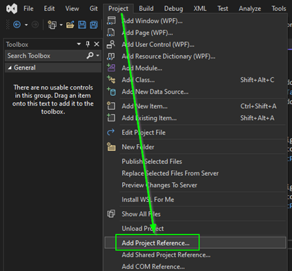
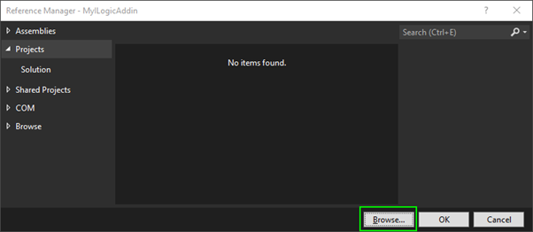

# What Is a Reference?

In Visual Studio, a **reference** is a way to tell your project that it needs to use code from another library (like a DLL). Without adding a reference, you can’t access the classes or functions in that DLL.

For example, if you’ve created a class library and want to use it in another project or from iLogic, you must first add a reference to it.

In this example we will add a refrence to `Autodesk.Inventor.Interop.dll`. That is needed to acces the inventor API 

## How to Add a Reference

Go to the “Add Project Reference...” screen.

Browse and select the following files:

C:\Program Files\Autodesk\Inventor [VERSION]\Bin\Autodesk.Inventor.Interop.dll
> ⚠️ Replace the text [VERSION] with your inventor version number.

## Embed Interop Types/Copy Local

I need you to write a in a few lines explaining what Embed Interop Types are and what the option "Copy Local" means. And proceed wit some thing like this:
For the Autodesk.Inventor.Interop.dll reference you need to set the properties “Embed Interop Types” to "No", “Copy Local” to "True".

## Embed Interop Types / Copy Local

When you reference a DLL, Visual Studio gives you a few options that control how that reference is handled when building and running your project.

- **Embed Interop Types**:  
  When set to **Yes**, Visual Studio tries to include only the parts of the DLL that your code uses. This is mainly for use with simple COM libraries, but it doesn't work well with complex APIs like Inventor's.  
  ➜ For Inventor, this should always be **set to No**.

- **Copy Local**:  
  When set to **True**, Visual Studio will copy the referenced DLL into your build output folder (e.g. `bin\Debug`). This ensures the DLL is available when the program runs.  
  ➜ This is usually **set to True** unless the DLL is already available in the target environment (like Inventor’s own folder).

### Required Settings

For the `Autodesk.Inventor.Interop.dll` reference, make sure to set:

- **Embed Interop Types** = `No`
- **Copy Local** = `True`

