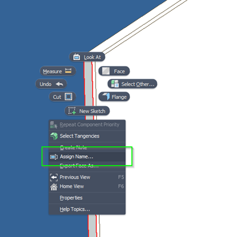
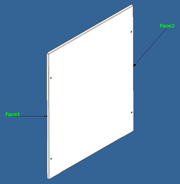
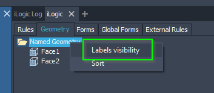
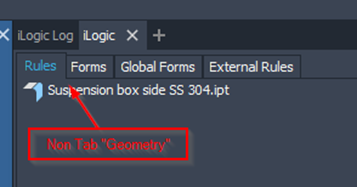
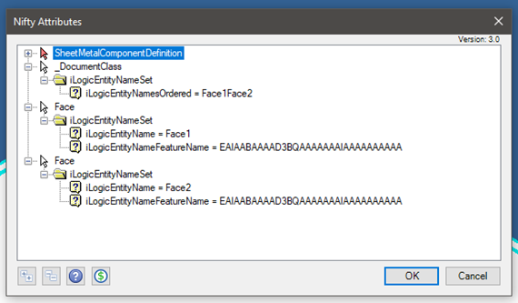
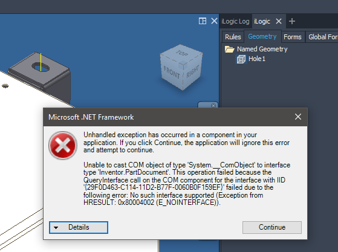
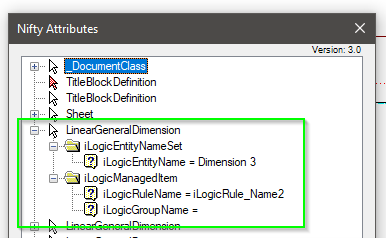
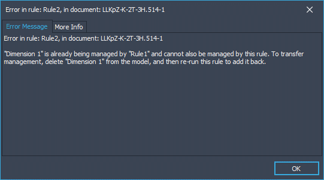
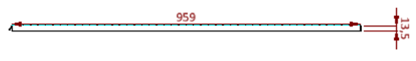

# iLogic add dimensions to drawings

At my job dimensions, on drawings, often get detached after and update by our configurator. One of the solutions would be creating the dimensions after the configurator finished. But creating dimensions with the Inventor API is difficult. Last November we upgraded to Inventor 2021 and I did read about the new iLogic functions. Last week I did have time to dive deeper in those new iLogic functions. This blog is about what I found.

At the Autodesk university 2020 you could follow the class “[Drawing Automation with API and New iLogic Snippets in Inventor 2021](https://www.autodesk.com/autodesk-university/class/Drawing-Automation-API-and-New-iLogic-Snippets-Inventor-2021-2020)” (by Sergio Duran) If you want the presentation is still online and you can watch it. It's a useful lesson that was my starting point.

## Model preparation

Before you can create any dimension on a drawing you need to tell iLogic which faces or edges you want to use in your drawing. This is done by assign a name to face or edge. In a part right click on a face or edge and give a name in the dialog. You will see labels on the edge/face that you have named.




It’s possible to show or hide those labels in the “Geometry” tab of you iLogic panel. (Be aware that this tab does not exists until you add your first named geometry.)




To make this all possible attributes are used. (if you are not familiar with attributes have a look at [this](https://blog.autodesk.io/introduction-to-attributes/) post by Brian Ekins.) You can view those with an attribute viewer like [Nifty attributes](https://ekinssolutions.com/nifty_attributes/) it looks like this:



This can be very interesting. This means that it is possible to create, manipulate and/or check named geometry by code. (You can also add those attribute in older versions of Inventor.)

For each name geometry there is an attribute set: “iLogicEntityNameSet” with the attributes: “iLogicEntityName”, “iLogicEntityNameFeatureName”

For the Geometry tab in the iLogic panel there is an attribute set: “iLogicEntityNameSet” with the attribute: “iLogicEntityNamesOrdered” Also there is a set: “iLogicEntityNameSetTransient” with the attribute: “iLogicEntityNamesVisible”

To my surprise I found that these functions are not available for assemblies. But I tried to add the above attributes to an assembly any way. That works only to some point. The tab “Geometry” in the iLogic panel is created. But as soon as you start interacting with it, exceptions are thrown. I also tried if the drawing api would pick those attributes up but it didn’t….



## Drawing

In a drawing a rule like this will create 3 linear dimensions.

```vb.net
Dim Sheet_1 = ThisDrawing.Sheets.ItemByName("Sheet1:1")
Dim VIEW1 = Sheet_1.DrawingViews.ItemByName("VIEW1")

Dim namedGeometry1 = VIEW1.GetIntent("Face1")
Dim namedGeometry2 = VIEW1.GetIntent("Face2")

Dim genDims = Sheet_1.DrawingDimensions.GeneralDimensions

ThisDrawing.BeginManage()
If True Then 
	Dim linDim1 = genDims.AddLinear("Dimension 1", VIEW1.SheetPoint(-0.1, 0.5), namedGeometry1)
	Dim linDim2 = genDims.AddLinear("Dimension 2", VIEW1.SheetPoint(1.1, 0.5), namedGeometry2)
	Dim linDim3 = genDims.AddLinear("Dimension 3", VIEW1.SheetPoint(0.5, 1.2), namedGeometry1, namedGeometry2)
End If
ThisDrawing.EndManage()
```

**The line** “Dim Sheet_1 = ThisDrawing.Sheets.ItemByName("Sheet1:1")” Will give you an object of the type “IManagedSheet”. Not the type Sheet. (maybe obvious for some but I was surprised later more on that topic)

**The function** “VIEW1.GetIntent("Face1")” is not available in the standard Inventor api and is new with Inventor 2021/iLogic. This is also where the magic happens. Getting the intent with standard API is difficult.

**The function** “genDims.AddLinear(………)” has the same name as in the standard api. But needs an extra parameters!. This function also does more than creating a dimension. It adds an attribute to the dimensions. With the given name. That attribute is used for:


- Checking if the dimension already exists.
  - There for running the code 2 or more times will not create more dimensions.
  - Also if the dimension already exists properties (like text place) will be reset.
  - The function will not only act as a **create** function but also as a **get** function if the dimension already exists.
- The “ThisDrawing.BeginManage()” / ”ThisDrawing.BeginManage()” function use these attributes.

The attributes will look something like this:



**The functione** “ThisDrawing.BeginManage()” / ”ThisDrawing.BeginManage()” keep track of components (like the dimensions here) that get added and will delete any component that is not be added in the rule (that have been added by the rule in a previous run). This means that you only have to write code to add components not to delete them. (for example If you change the line “If True Then” in “If False Then”  and rerun the rule. Then the example code above will delete the dimensions)

There is a downside to managing (modified, (re)created or deleted) components with this iLogic functions. Components managed in rule “x” can’t be managed by rule “y”. This will lead to and exception and warning screen.



**The function** ”VIEW1.SheetPoint(-0.1, 0.5), namedGeometry1)” is not available in the standard Inventor api. Explanation acc. to iLogic help: “Gets a point in sheet space, given normalized view coordinates in the range 0 to 1. x=0, y=0 is at the bottom left corner of the view x=1, y=1 is at the top right corner of the view” (getting those coordinates is also possible with the api but you will need more lines of code.)

There is a downside to using this normalized coordinates. The absolute values can differ in x and y direction. For example, the following image is created with this code.

```vb.net
genDims.AddLinear("Dimension 6", VIEW1.SheetPoint(0.5, 1.1), namedGeometry1)
genDims.AddLinear("Dimension 7", VIEW1.SheetPoint(-0.1, 0.5), namedGeometry2)
```


_(image is rotated 90 degree)_

Both dimensions are created on 0.1 normalized units from the view. Because this is a very thin part the normalized units are different in x and y direction.

Solving this problem can be done by getting the absolute coordinates of the edge of the view and translating it by some vector. Code for this solution is out of scope of this document.
If you are going to do that you should also consider to using standard api calls all the way. It might prove code that is cleaner. Be aware the sheetpoints are of the type “DocumentUnitsPoint2d” and can’t be casted directly to Inventor api type “Point2d”. (there might be a function to do that DocumentUnitsPoint2d.InDatabaseUnits())

## Rounding up.

Where im used to work with the standard api to manipulate the drawing there is now a new set iLogic functions for drawings. All new iLogic functions can be accessed by the (global) object ThisDrawing. That object was already present in older versions of iLogic but did not have many iLogic functions. (There for it was not used by me)
Also the type of the (global) variable “ThisDrawing” is changed from ICadDrawing to IManagedDrawing.  It seems that many objects have gone through this transformation. Object types where generally called ICad……. And are now called IManaged……

This can be confusing when reading old iLogic code. For example If you properly defined your variable like this:

```vb.net
Dim sheet As ICadDrawingSheet = ThisDrawing.Sheets.ItemByName("Sheet1:1")
```

Now the variable sheet is of the old iLogic type “ICadDrawingSheet”. But if you wrote:

```vb.net
Dim sheet = ThisDrawing.Sheets.ItemByName("Sheet1:1")
```

Now the variable “sheet” is of the new iLogic type “IManagedSheet”.

It seems that the object type “IManagedSheet” is a child of the type “ICadDrawingSheet” (or at least vb.net will cast a “IManagedSheet” to a “IManagedSheet” if asked for) therefore I hope that old code will not break. But if code breaks have a look at the types and what the differences are between the old and new types!

While searching for information that was already out there I found this post that can be useful if you working on ad addin or external program.

## Conclusion

The new iLogic api has been changed a lot (in the background at least) but seems backwards compatible. Lots of new great functions are added for drawings. For many users this is probably a great improvement. Also, I’m very happy to see that they use attributes for all this. If I was asked to create this kind of functionality I would have gone in the same direction. (with the attributes.)

But it’s not a finished product. For example, I’m disappointed that they implemented functions to automate the creation of dimensions for parts but not for assemblies!

Also, I wonder why they don't extended the “Inventor api” instead. They created great new functions that I would like to use in my addons. But that is complicated as I need to reference extra (iLogic) dll’s. The automation object that I get from the iLogic addin has only the type object. That makes using it in strongly typed languages like C# difficult. That breaks IntelliSense in visual studio. (you don’t get a properties and function list when you type a “.” Afther an object.) If all this newly added functions where part of the inventor api I would not have those issues.

## affix

On a project where I wanted to use these techniques, I did run into some problems. The dimensions were not inline and the X value of the sheet point was ignored. The disscusion and solution can be found on [this forum thread](https://forums.autodesk.com/t5/inventor-programming-forum/unexpected-dimension-text-place/m-p/12227806/highlight/false#M157424).