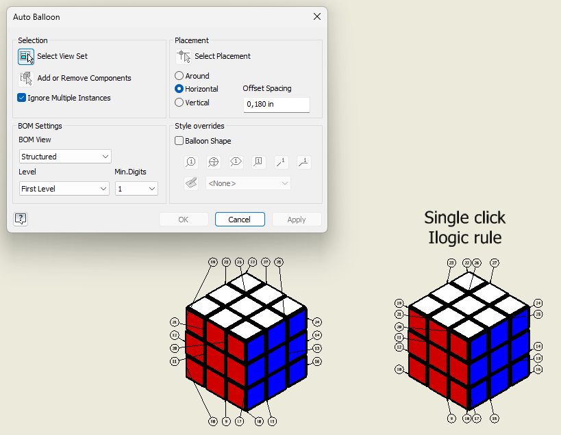

# Auto balloon
Inventor’s Auto Balloon tool is useful for generating balloons, but it is primarily designed as an interactive feature. In practice, this means working through a dialog, adjusting settings, and repeating those steps when you want consistent results across multiple drawings.

For many workflows, that is where friction starts to build.
To reduce that friction, I built a iLogic rule that focuses on a different approach: a fast, single‑click action that produces a clean, predictable result without any dialog or manual tuning.

This makes it practical not only for day‑to‑day work, but also for automated processes, where repeatability and zero user interaction are essential. Since the built‑in Auto Balloon function is not exposed through the API, having a scriptable alternative becomes especially useful in those scenarios.

The generated layout follows the same general idea as the default tool, with a few small adjustments to keep balloons closer to their parts and to maintain a structured result.

The individual improvements are modest. The main benefit is usability: a reliable, one‑click workflow that fits naturally into both manual use and automation.



Using the rule
 1. Copy the code into an external iLogic rule.
 2. (Optional) Add a ribbon button or shortcut to run it. Autodesk’s guide:
    - [How to create a add the rule to Ribbon.](https://www.autodesk.com/support/technical/article/caas/sfdcarticles/sfdcarticles/How-to-create-a-keyboard-shortcut-to-an-iLogic-rule-or-add-the-rule-to-Ribbon.html)
 3. Run the rule
 4. select a drawing view, and wait for placement to complete.

Notes: Drawings with a large number of drawing curves may take longer because the rule evaluates candidate edges to find a clean attachment point per part. 

A much more detailed explanation about the rule can be found under the iLogic rule.

```vb.net
Public Class ThisRule

    Private Enum Edge
        Top
        Bottom
        Left
        Right
    End Enum

    Sub Main()
        Dim doc As DrawingDocument = ThisDoc.Document
        Dim sheet As Sheet = doc.ActiveSheet
        Dim view As DrawingView = ThisApplication.CommandManager.Pick(SelectionFilterEnum.kDrawingViewFilter, "Select a drawing view.")

        Dim tagCurves = CollectClosestCurvePerFile(view)
        PlaceBalloons(doc, sheet, view, tagCurves)
    End Sub

    Private Function CollectClosestCurvePerFile(view As DrawingView) As List(Of TagCurve)
        Dim viewTop = view.Top
        Dim viewBottom = view.Top - view.Height
        Dim viewLeft = view.Left
        Dim viewRight = view.Left + view.Width

        Dim byFile As New Dictionary(Of String, TagCurve)

        For Each curve As DrawingCurve In view.DrawingCurves.Cast(Of DrawingCurve)()
            'This only works with edges
            If TypeOf curve.ModelGeometry IsNot EdgeProxy Then Continue For

            Dim tagCurve As New TagCurve(curve)
            If tagCurve.Occ.OccurrencePath.Count > 2 Then Continue For

            ' Closed curves (circles, ellipses) have no midpoint — fall back to the center.
            Dim midPoint As Point2d = curve.MidPoint
            If midPoint Is Nothing Then midPoint = curve.CenterPoint

            tagCurve.DistanceToNearestViewEdge = MinDistanceToViewEdge(midPoint, viewTop, viewBottom, viewLeft, viewRight)

            Dim existing As TagCurve = Nothing
            If Not byFile.TryGetValue(tagCurve.FileName, existing) OrElse tagCurve.DistanceToNearestViewEdge < existing.DistanceToNearestViewEdge Then
                byFile(tagCurve.FileName) = tagCurve
            End If
        Next

        Return byFile.Values.ToList()
    End Function

    Private Shared Function MinDistanceToViewEdge(midPoint As Point2d, top As Double, bottom As Double, left As Double, right As Double) As Double
        Return Math.Min(
            Math.Min(Math.Abs(top - midPoint.Y), Math.Abs(bottom - midPoint.Y)),
            Math.Min(Math.Abs(left - midPoint.X), Math.Abs(right - midPoint.X))
        )
    End Function

    Private Sub PlaceBalloons(doc As DrawingDocument, sheet As Sheet, view As DrawingView, tagCurves As List(Of TagCurve))
        Dim transientGeom = ThisApplication.TransientGeometry
        Dim balloonDiameter = doc.StylesManager.ActiveStandardStyle.ActiveObjectDefaults.BalloonStyle.BalloonDiameter
        Dim minimalDistanceBetweenBaloons = balloonDiameter + 0.1

        Dim viewTop = view.Top
        Dim viewBottom = view.Top - view.Height
        Dim viewLeft = view.Left
        Dim viewRight = view.Left + view.Width

        ' Phase 1: assign each curve to its closest edge and compute the desired leader endpoint.
        Dim placements As New List(Of Placement)
        For Each tagCurve As TagCurve In tagCurves
            ' Closed curves (circles, ellipses) have no midpoint — fall back to the center.
            Dim midPoint As Point2d = tagCurve.Curve.MidPoint
            If midPoint Is Nothing Then midPoint = tagCurve.Curve.CenterPoint

            Dim chosenEdge = ChooseClosestEdge(midPoint, viewTop, viewBottom, viewLeft, viewRight)
            Dim leader = ComputeLeaderPoint(chosenEdge, midPoint, viewTop, viewBottom, viewLeft, viewRight, balloonDiameter)
            placements.Add(New Placement With {
                .TagCurve = tagCurve,
                .MidPoint = midPoint,
                .ChosenEdge = chosenEdge,
                .LeaderX = leader.X,
                .LeaderY = leader.Y
            })
        Next

        ' Phase 2: per edge, sort by position along that edge, sweep forward to
        ' enforce minimum spacing, then center each tight cluster so the cluster's
        ' centroid matches the centroid of its desired positions. Order along the
        ' edge is preserved either way, so leaders still don't cross.
        For Each edgeGroup In placements.GroupBy(Function(p) p.ChosenEdge)
            Dim isHorizontal = (edgeGroup.Key = Edge.Top OrElse edgeGroup.Key = Edge.Bottom)
            Dim ordered = If(isHorizontal,
                             edgeGroup.OrderBy(Function(p) p.LeaderX).ToList(),
                             edgeGroup.OrderBy(Function(p) p.LeaderY).ToList())

            Dim desired(ordered.Count - 1) As Double
            For i = 0 To ordered.Count - 1
                desired(i) = If(isHorizontal, ordered(i).LeaderX, ordered(i).LeaderY)
            Next

            Dim actual(ordered.Count - 1) As Double
            Dim lastPlaced As Double = Double.MinValue
            For i = 0 To ordered.Count - 1
                actual(i) = Math.Max(desired(i), lastPlaced + minimalDistanceBetweenBaloons)
                lastPlaced = actual(i)
            Next

            ' Walk forward and close out each cluster (consecutive balloons in tight
            ' contact) by shifting it back so sum(actual) = sum(desired) within the
            ' cluster.
            Dim clusterStart = 0
            For i = 1 To ordered.Count
                If i = ordered.Count OrElse actual(i) - actual(i - 1) > minimalDistanceBetweenBaloons + 0.001 Then
                    Dim sumActual As Double = 0
                    Dim sumDesired As Double = 0
                    For j = clusterStart To i - 1
                        sumActual += actual(j)
                        sumDesired += desired(j)
                    Next
                    Dim shift = (sumActual - sumDesired) / (i - clusterStart)
                    For j = clusterStart To i - 1
                        actual(j) -= shift
                    Next
                    clusterStart = i
                End If
            Next

            For i = 0 To ordered.Count - 1
                If isHorizontal Then
                    ordered(i).LeaderX = actual(i)
                Else
                    ordered(i).LeaderY = actual(i)
                End If
            Next
        Next

        ' Phase 3: create balloons at the final positions.
        For Each p In placements
            Dim leaderPoints = ThisApplication.TransientObjects.CreateObjectCollection()
            leaderPoints.Add(transientGeom.CreatePoint2d(p.LeaderX, p.LeaderY))
            leaderPoints.Add(sheet.CreateGeometryIntent(p.TagCurve.Curve, p.MidPoint))
            sheet.Balloons.Add(leaderPoints)
        Next
    End Sub

    Private Shared Function ChooseClosestEdge(midPoint As Point2d, top As Double, bottom As Double, left As Double, right As Double) As Edge
        Dim distTop = Math.Abs(top - midPoint.Y)
        Dim distBottom = Math.Abs(bottom - midPoint.Y)
        Dim distLeft = Math.Abs(left - midPoint.X)
        Dim distRight = Math.Abs(right - midPoint.X)

        Dim horizontalEdge As Edge = If(distTop <= distBottom, Edge.Top, Edge.Bottom)
        Dim horizontalDist = Math.Min(distTop, distBottom)
        Dim verticalEdge As Edge = If(distLeft <= distRight, Edge.Left, Edge.Right)
        Dim verticalDist = Math.Min(distLeft, distRight)

        ' Tie goes to vertical edge to preserve original behavior
        Return If(horizontalDist < verticalDist, horizontalEdge, verticalEdge)
    End Function

    Private Shared Function ComputeLeaderPoint(edge As Edge, midPoint As Point2d, top As Double, bottom As Double, left As Double, right As Double, balloonDiameter As Double) As (X As Double, Y As Double)
        Select Case edge
            Case Edge.Top
                Return (midPoint.X + balloonDiameter / 2, top + balloonDiameter)
            Case Edge.Bottom
                Return (midPoint.X + balloonDiameter / 2, bottom - balloonDiameter)
            Case Edge.Left
                Return (left - balloonDiameter, midPoint.Y + balloonDiameter / 2)
            Case Else ' Edge.Right
                Return (right + balloonDiameter, midPoint.Y + balloonDiameter / 2)
        End Select
    End Function

    Private Class Placement
        Public Property TagCurve As TagCurve
        Public Property MidPoint As Point2d
        Public Property ChosenEdge As Edge
        Public Property LeaderX As Double
        Public Property LeaderY As Double
    End Class

    Public Class TagCurve

        Public Sub New(drawingCurve As DrawingCurve)
            Curve = drawingCurve

            EdgeProxy = drawingCurve.ModelGeometry
            Occ = EdgeProxy.ContainingOccurrence.OccurrencePath.Item(1)
            FileName = Occ.ReferencedFileDescriptor.FullFileName
        End Sub

        Public Property FileName As String
        Public ReadOnly Property Curve As DrawingCurve
        Public Property DistanceToNearestViewEdge As Double

        Private ReadOnly EdgeProxy As EdgeProxy
        Public Occ As ComponentOccurrence
    End Class

End Class
```

# How it works

The entry point "Main()" grabs the active drawing, the active sheet, and lets you select the drawing view. It asks `CollectClosestCurvePerFile` for the list of curves to tag, and hands that to `PlaceBalloons` for layout and creation.

## `CollectClosestCurvePerFile`

Loops over every drawing curve in the view and keeps **one** curve per unique referenced file.

- Curves whose `ModelGeometry` is not an `EdgeProxy` are skipped. Only real model edges can be tagged.
- Occurrences deeper than the first level of the assembly are skipped (`OccurrencePath.Count > 2`), so parts inside sub-assemblies are not balloon-tagged on their own.
- For every candidate, the midpoint (or the center point for closed curves like circles) is measured against the four view edges. The shortest distance is stored on the `TagCurve` as `DistanceToNearestViewEdge`.
- If a file has multiple candidate curves, the one closest to a view edge wins. That curve is the easiest to reach with a short, clean leader.

## `MinDistanceToViewEdge`

A small helper that returns the minimum of the four perpendicular distances from a point to the top, bottom, left, and right edges of the view.

## `PlaceBalloons`: three phases

This is the heart of the layout logic.

**Phase 1: pick an edge and compute a desired leader endpoint.** For each tag curve, `ChooseClosestEdge` decides which of the four view edges is closest to the curve's midpoint. `ComputeLeaderPoint` then returns the desired leader endpoint just outside that edge, offset by one balloon diameter so the balloon clears the view. The chosen edge and desired endpoint are stored in a `Placement` record so they can be revisited in phase 2.

**Phase 2: deconflict balloons along each edge.** Within each edge group, placements are sorted along the edge (by X for top/bottom, by Y for left/right). A forward sweep enforces the minimum spacing: every balloon is moved forward to at least `minimalDistanceBetweenBaloons` past the previous one if needed.

The code then identifies *clusters*, runs of consecutive balloons that ended up tightly packed at the minimum spacing. For each cluster the whole run is shifted as a unit so the average actual position matches the average desired position. The order along the edge is preserved, so leader lines still do not cross, but the cluster stays centred over the parts it points to instead of drifting forward.

**Phase 3: create the balloons.** For each `Placement`, an `ObjectCollection` is built containing the final leader endpoint and a `GeometryIntent` on the chosen drawing curve. `sheet.Balloons.Add(leaderPoints)` then creates the actual balloon on the sheet.

> 💡 Building the leader as a collection of points and a `GeometryIntent` is the standard way to attach a balloon to model geometry rather than to a free point on the sheet. The balloon stays linked to the curve if the view is later moved.

## `ChooseClosestEdge`

Compares the four perpendicular distances from the curve midpoint to each edge of the view. It picks the better horizontal candidate (top vs. bottom) and the better vertical candidate (left vs. right), then returns whichever of those two is closer overall. Ties are resolved in favour of the vertical edge.

## `ComputeLeaderPoint`

Returns the point where the leader should terminate, just outside the chosen edge:

- For top and bottom edges, the leader sits one full balloon diameter above or below the edge, with a small horizontal offset (`balloonDiameter / 2`) so the leader line is angled rather than perfectly vertical.
- For left and right edges, the leader sits one full balloon diameter to the side of the edge, with a small vertical offset for the same reason.

## `Placement` and `TagCurve`

`Placement` is a private helper class that ties a tag curve together with its computed midpoint, chosen edge, and current leader position. It exists so phase 2 can mutate `LeaderX` and `LeaderY` while sorting and clustering without losing the link back to the original curve.

`TagCurve` wraps a `DrawingCurve`, pulls out the first-level component occurrence and its referenced file name in the constructor, and exposes `DistanceToNearestViewEdge` so the collection step can compare candidate curves by how reachable they are.

