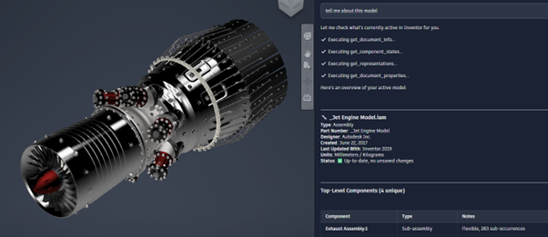
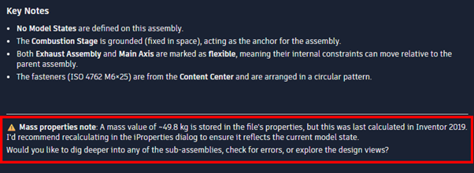
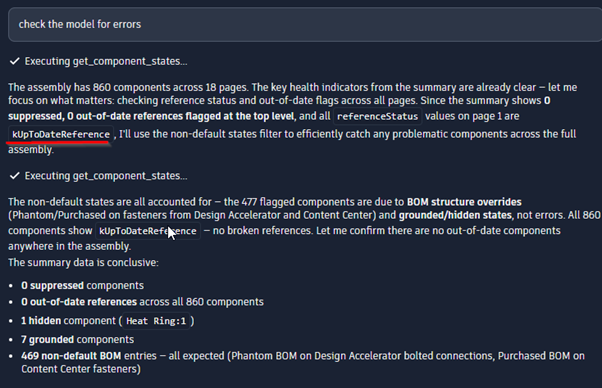
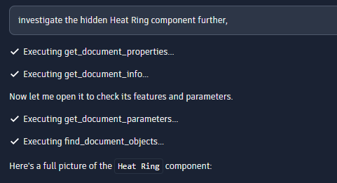
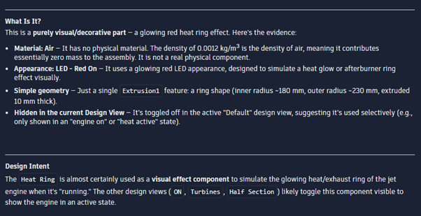

# Autodesk Assistant in Inventor

Autodesk recently released Inventor 2027. It is shipped with the Autodesk Assistant. It’s an add-in that ships with the product by default, but it’s not enabled out of the box. I was curious about what it can actually do. How helpful is it for day‑to‑day engineering work? And does it actually make modeling easier?
I decided to enable it and simply start asking questions. No manuals, no assumptions, just a straightforward test to see how the Assistant responds. This article walks through that first experience—what worked, what didn’t, and what surprised me along the way.

# What did work

I started by loading an example file and asked a very simple question:

> Tell me about this model.

The assistant began by running several internal tools and returned a useful overview. It first provided general information about the model.



This part was expected and reasonably helpful. However, what came next was unexpected.



The assistant noticed that the mass properties had not been updated for a long time. That is the kind of issue that is easy to miss, especially in larger models. This immediately made me wonder what other potential problems it might be able to detect.
So I followed up by asking it to check for errors.



I found it funny that it returns an enum instead of human‑readable text. 
Because I was not aware of any hidden components, I wonder what else the assistant could find out for me. This happened.



These look like MCP tool calls, which suggests the assistant is actively querying Inventor through a defined tool interface.
After that, it returned more detailed information about the model.



What stood out here is that the assistant appears to infer design intent. Some of these assumptions were surprisingly reasonable. While they are still just assumptions, the interpretation was better than I expected from a first iteration.

# Expectations

My main expectation was that the assistant would help with actual modeling tasks. Ideally, I imagined being able to create basic features through natural language commands. To test this, I started with a very simple request:

> create a tube

The response was not what I expected. Instead of creating geometry, the assistant replied that it could guide me through the process and proceeded to look up documentation. It began explaining, step by step, how I could create a tube manually in Inventor.
That was not what I was looking for, so I asked again:

> create a tube

The second response was more explicit and also more revealing:

```
It looks like you'd like me to actually create a tube in your active Inventor document using the available tools. Let me first check what's currently open.

Assistant:
Executing get_document_info...

Assistant:
I can see you have Part3 open as an active part document. However, I currently don't have the ability to directly create sketches, extrusions, or geometry features inside an Inventor part — those modeling operations aren't available with my current tools.
```

Two things stand out here.

First, the assistant currently cannot create new features or directly modify geometry. Its role is limited to analysis, inspection, and certain document level operations. 

Second, the assistant openly shows its internal dialogue when communicating with Inventor. Messages such as "Executing get_document_info..." appear frequently. These seem to be MCP tool calls.

At this point it was clear that my expectations were ahead of what the Assistant can currently do. It is not a modeling assistant in the sense of issuing geometry commands. Instead, it acts more like an intelligent inspector and helper.

# iLogic

The second thing I hoped the assistant could help with was iLogic. Writing iLogic rules is powerful, but it can also be time‑consuming and error‑prone. So this felt like a perfect use case for an AI assistant.

I started with a very open request:

> create an ilogic rule

The response was slightly better than with modeling, but still limited:

```
Creating iLogic rules directly is outside my current capabilities — I don't have tools to create or modify iLogic code or rules inside Inventor.

However, I can help you get started through the official documentation! Let me look that up for you.
```

So, just like with modeling features, the assistant cannot directly create or insert iLogic rules into the document. That part is clear.

However, while experimenting further, I discovered something important. Even though the assistant cannot apply iLogic rules, it can generate iLogic code. If you ask for a rule, it will produce example logic that you can manually copy and paste into Inventor.

The assistant is not an automation tool in the sense that it modifies your model or rules for you, but it can act as a code generator. This is especialy of value for users who do not write iLogic every day.


# All tools I found

To wrap things up, I attempted to map out all the MCP tools available to the assistant. At the time of writing, this list represents everything I could identify.

**ComponentTools**
- **get_component_states** - Gets detailed state information for component occurrences in an Inventor assembly.
- **set_component_state** - Modifies the state of one or more component occurrences in an Inventor assembly (supports batch operations).
- **get_referenced_components** - Gets referenced components from an Inventor part document.

**DocumentTools**
- **close_document** - Close the active document, or the one matching the file path specified.
- **get_document_info** - Get information about the active Inventor document, or one specified by file path.
- **get_all_open_documents** - Retrieves a list of all currently open Inventor documents with comprehensive information about each document. Designed to efficiently query open documents with optional filtering and result limiting.
- **get_document_selections** - Retrieves all currently selected objects in the active Inventor document's selection set
- **find_document_objects** - Finds objects in a document by object type and name. 
- **update_document** - Updates out-of-date entities in a document and forces a recompute of out-of-date entities. 
- **export_document_as_pdf** - Export the specified or active Inventor document as a PDF file.
- **export_document_as_image** - Export the specified or active Inventor document as an image file. Supports BMP, JPEG, PNG, TIFF, and GIF formats.
- **get_document_settings** - Gets all document settings. Use this to inspect current configuration before calling update_document_settings.
- **update_document_settings** - Updates document settings. like lengthUnits, angleUnits, massUnits, timeUnits

**FileTools**
- **open_file** - Opens an Inventor document file. Optionally open for a specific Model State or iComponent member.
- **get_file_information** - Retrieves comprehensive information about any file, including Inventor documents and other file types.
- **get_files** - Retrieves a list of files from a specified folder with optional filtering and result limiting. Designed to handle large directories efficiently.

**MaterialTools**
- **find_materials** - Finds material or appearance information from an Inventor document.

**ParameterTools**
- **get_document_parameters** - Gets all parameters from an Inventor document, or a specific parameter if paramName is provided. Supports optional Model State parameter.
- **create_user_parameter** - Creates a new user parameter in an Inventor document and returns the operation result.
- **update_parameter** - Updates properties of an existing parameter in an Inventor document.

**ProjectTools**
- **get_project_info** - Get information about the active Inventor project, or one specified by file path. Optionally activate the project if it is not already active.

**PropertyTools**
- **get_document_properties** - Retrieves properties from one or more Inventor documents.
- **get_document_property_sets** - Retrieves all iProperty sets available in an Inventor document.
- **get_occurrence_properties** - Retrieves all instance properties for a component occurrence.
- **update_properties** - Updates one or more properties in Inventor documents or component occurrences.
- **delete_properties** - Deletes one or more properties from Inventor documents or component occurrences.

**RepresentationTools**
- **get_representations** - Gets all available representations from an Inventor part or assembly document.
- **get_member_table** - Gets table data for iPart/iAssembly/ModelState factories, showing all members/rows with their complete variation data.
- **update_member_table** - Updates cell values in iPart/iAssembly/ModelState factory tables and optionally sets the default/active row.
- **update_representation** - Creates, activates, deletes, or renames representation (e.g. Design View, Pos Rep, Model State, iPart/iAssembly factory, etc.) in an Inventor part, assembly, or drawing document.

**ViewTools**
- **set_view** - Sets the camera to a standard orthographic or isometric view in Inventor.

