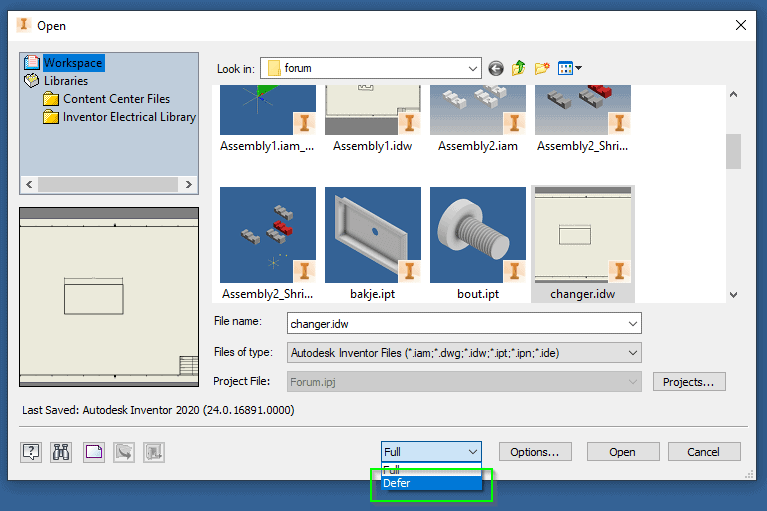

# Show Changed Dimensions

The other day I had a look at the “Inventor Ideas” forum.  I came a cross the following topic “Show Changed Dimensions when Opening Drawings”. ([link](https://forums.autodesk.com/t5/inventor-ideas/show-quot-changed-dimensions-quot-when-opening-drawings/idi-p/9509059)) Last week someone requested this function in inventor but as it turns out that exactly the same function was also requested in 2017. ([link](https://forums.autodesk.com/t5/inventor-ideas/show-quot-changed-dimensions-quot-when-opening-drawings/idi-p/7201138)) But it is still “Gathering Support”. Personally I never needed this but I can see that it could be useful in some situations.

I realised that you can do this manually. When you open a drawing there is the option to defer updates.



According to the Inventor help page: “When you set a drawing to defer its updates, it no longer responds to changes in the model file. Drawing views, **annotations**, and dependent iProperties remain static.” (Source: [Inventor help](https://knowledge.autodesk.com/support/inventor/learn-explore/caas/CloudHelp/cloudhelp/2019/ENU/Inventor-Help/files/GUID-1CC7D2D1-DCF6-4E0A-9B3C-1F88D9F880CE-htm.html)).  Therefor you can check the original values of all dimensions if you open a drawing with the defer update option set. After updating (and turning “Defer update” off) you can look at all dimensions again and see if they are changed. Doing that manually is not a great task. 

But coding this is a nice a nice challenge.  Also it makes a nice iLogic rule for others. So I came up with the following iLogic rule that will automate the process.

Probably it would also be possible to add revision tags to all dimensions that are changed.  But I was not sure if that is needed functionality and what would be the best way to implement that? Also you could track what parts where changed/deleted form an assembly.  If you want to upgrade the rule your self but you run into problems. Then post your question to the “[Inventor Customization Forum](https://forums.autodesk.com/t5/inventor-customization/bd-p/120)”. Probably I will see it (or someone else) and will try help you. (but if you want to be sure I see it add the text “@JelteDeJong” to you post.)

```vb.net
' Code written by: Jelte de Jong
' www.hjalte.nl

' Get file name
Dim oDLG As Inventor.FileDialog = Nothing
ThisApplication.CreateFileDialog(oDLG)
oDLG.Filter = "Inventor Files (*.idw;*.dwg)|*.idw;*.dwg"
oDLG.OptionsEnabled = False
oDLG.ShowOpen()

' Defer updates while opening file
Dim oNVM As NameValueMap = ThisApplication.TransientObjects.CreateNameValueMap
oNVM.Add("DeferUpdates", True)
ThisApplication.SilentOperation = True
Dim doc As DrawingDocument = 
	ThisApplication.Documents.OpenWithOptions(oDLG.FileName, oNVM)
ThisApplication.SilentOperation = False

' create a dictionary with the original values
Dim dims As Dictionary(Of DrawingDimension, String) = 
	New Dictionary(Of DrawingDimension, String)()
For Each drawingDim As DrawingDimension In doc.ActiveSheet.DrawingDimensions
    dims.Add(drawingDim, drawingDim.Text.Text)
Next

' update the drawing
ThisApplication.CommandManager.ControlDefinitions.Item("AppZoomallCmd").Execute
MsgBox("Going to update drawing now.")
doc.DrawingSettings.DeferUpdates = False

' Check all dimension and add text if it changed
For Each item As KeyValuePair(Of DrawingDimension, String) In dims
	Try
		Dim drawingDim = item.Key
	    If (drawingDim.Text.Text.Equals(item.Value) = False) Then
	        Dim text = drawingDim.Text.FormattedText
	        drawingDim.Text.FormattedText = String.Format(
		"{0} <StyleOverride>(Original: {1})</StyleOverride>",
	            text, item.Value)
	    End If
	Catch ex As Exception
	End Try
Next
```