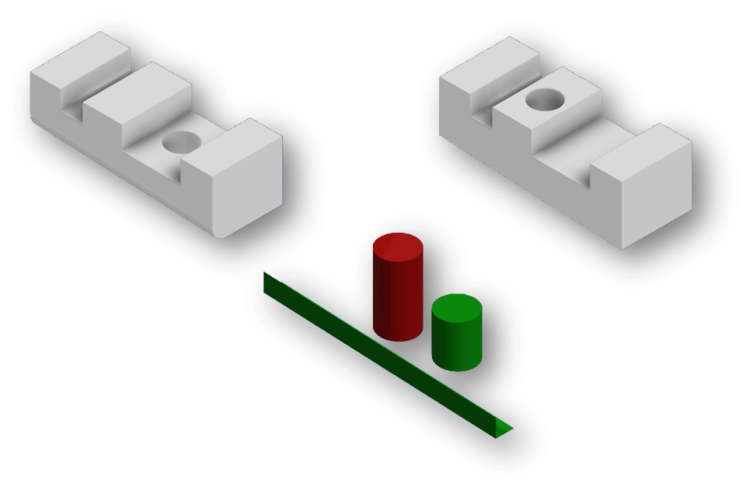

# Compare Part Geometry with iLogic

Maybe you know the situation, you have 2 versions of a part. You changed something but can’t find what it was.  In those situations I spend a lot of time looking for the difference. Just to find the hole that was moved 1mm. Should I have this problem more often, then maybe my boss would let me spend time on creating a tool to help me. But I don’t have this problem often.

As it tuns out I frequently check out the “Inventor Customisation Forum”. Not that I have so many questions but I like to find solutions for problems that I didn’t have before. But some times there are no interesting problems to solve. So once in a while I have a look at the “Inventor Ideas forum”. There I found an idea that I would like to see implemented in Inventor. Namely the option to [compare 2 parts files](https://forums.autodesk.com/t5/inventor-ideas/possibility-to-compare-parts/idi-p/6758039). That would save me time with the problem I described above.

It seems I’m not the only one with this problem. So I challenged myself to write an iLogic rule that will show the difference between 2 part files. The rule that I propose here will not only show you what is the difference between 2 parts. But it will also show what needs to be added (in green) and subtracted (in red)  to create the second part from the first.

In the picture below the left part is used to create the right part. To do so material was added to remove the radius and remove the hole. Shown here in green. Also an other hole was created by removing material. Shown here in red.



```vb.net
Public Class ThisRule
    ' Code written by: Jelte de Jong
    ' www.hjalte.nl    
    Sub Main()

        Dim partName1 As String = getFileName()
        Dim partName2 As String = getFileName()

        Dim added As String = createDiff(partName2, partName1, True)
        Dim substarcted As String = createDiff(partName1, partName2, False)

        Dim doc As PartDocument = ThisApplication.Documents.Add(DocumentTypeEnum.kPartDocumentObject)


        Dim derivedPartComponents = doc.ComponentDefinition.ReferenceComponents.DerivedPartComponents
        Dim derivedPartDef As DerivedPartUniformScaleDef
        derivedPartDef = derivedPartComponents.CreateUniformScaleDef(added)
        derivedPartComponents.Add(derivedPartDef)

        derivedPartDef = derivedPartComponents.CreateUniformScaleDef(substarcted)
        derivedPartComponents.Add(derivedPartDef)
    End Sub

    Public Function createDiff(fileName1 As String, fileName2 As String, isAdded As Boolean) As String
        Dim doc As PartDocument = ThisApplication.Documents.Open(fileName1, True)
        Dim fileInfo As IO.FileInfo = New IO.FileInfo(doc.FullFileName)
        Dim newFileName = IO.Path.Combine(
            fileInfo.DirectoryName,
            fileInfo.Name.Replace(fileInfo.Extension, "") +
            "_dif" +
            fileInfo.Extension)
        doc.SaveAs(newFileName, False)


        Dim derivedPartDef As DerivedPartUniformScaleDef
        derivedPartDef = doc.ComponentDefinition.ReferenceComponents.DerivedPartComponents.CreateUniformScaleDef(fileName2)

        derivedPartDef.BodyAsSolidBody = False

        Dim derivedPart As DerivedPartComponent
        derivedPart = doc.ComponentDefinition.ReferenceComponents.DerivedPartComponents.Add(derivedPartDef)
        derivedPart.BreakLinkToFile()

        Dim splitTool As SurfaceBody = doc.ComponentDefinition.WorkSurfaces.Item(1)._SurfaceBody
        splitTool.Visible = False

        Dim body As SurfaceBody = doc.ComponentDefinition.SurfaceBodies.Item(1)
        Try
            doc.ComponentDefinition.Features.SplitFeatures.TrimSolid(splitTool, body, False)
        Catch ex As Exception
            doc.ComponentDefinition.Features.SplitFeatures.TrimSolid(splitTool, body, True)
        End Try

        If (isAdded) Then
            doc.ActiveRenderStyle = doc.RenderStyles.Item("Green")
        Else
            doc.ActiveRenderStyle = doc.RenderStyles.Item("Smooth - Red")
        End If

        ThisApplication.ActiveView.Update()

        doc.Save()
        doc.Close(True)
        Return newFileName
    End Function

    Private Function getFileName() As String

        Dim activeProject = ThisApplication.DesignProjectManager.ActiveDesignProject

        Dim fd As System.Windows.Forms.OpenFileDialog = New System.Windows.Forms.OpenFileDialog()
        fd.Title = "Select part file"
        fd.InitialDirectory = activeProject.WorkspacePath
        fd.Filter = "All files (*.*)|*.*|Part file (*.ipt)|*.ipt"
        fd.FilterIndex = 2
        fd.RestoreDirectory = True

        If fd.ShowDialog() = System.Windows.Forms.DialogResult.OK Then
            Return fd.FileName
        Else
            Throw New Exception("None file selected for diff")
        End If
    End Function
End Class
```