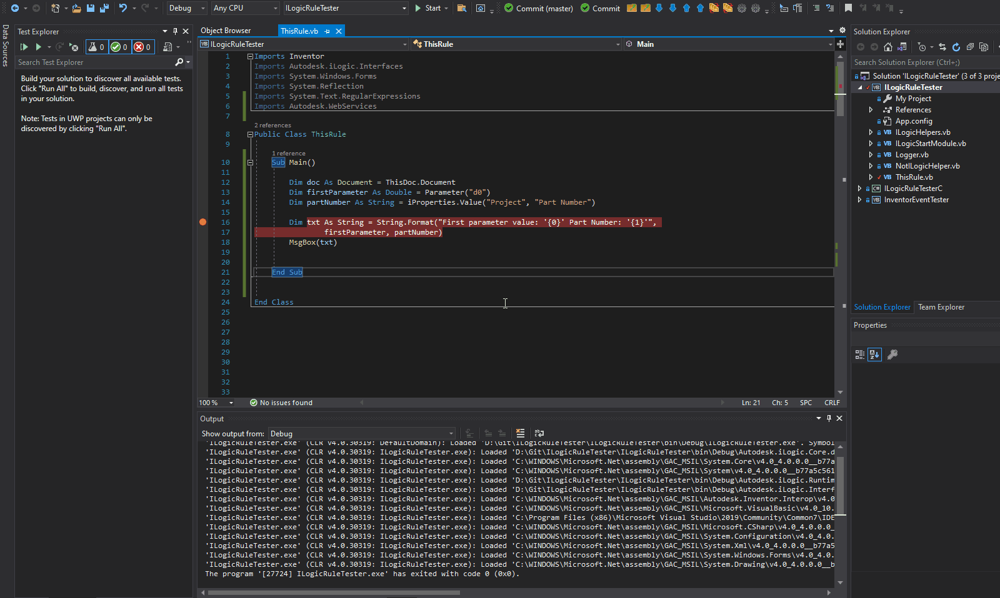
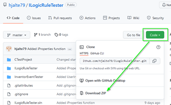
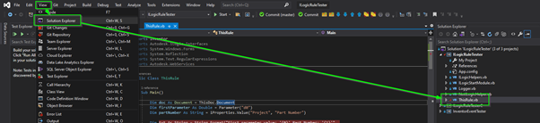
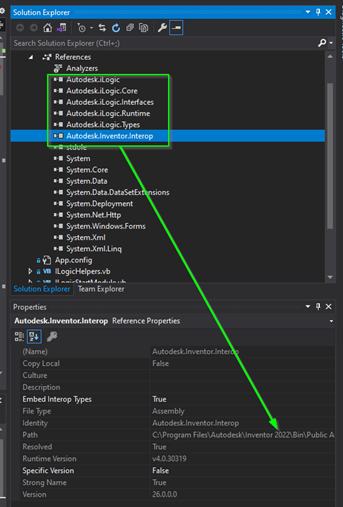

# Writing and debugging iLogic rules

Writing code means a lot of trial and error. Debugging involves figuring out what is happening (often that is not the same as what you think that is happening). The way to figure that out is by stopping the code at the point that everything fails and checking what your computer has in memory. When I started writing iLogic rules the only way I knew for debugging was to stop the code with a messagebox and display the content of a variable.

This is not very practical. What you want is what you get with the VBA editor. (But VBA is in my opinion [obsolete](./VbaIsObsolete.md). ) There you can step through the code line by line. Also, you check all variables while the code pauses on a line. That we will not get any time soon in the iLogic interface I think.

But there have been some improvements. In inventor 2019 the iLogic logger was introduced. That means that we can write variable content to the log without dealing with the messageboxes. This has the advantage that we don’t have to remove all code involving messageboxes when we stop debugging. If you want to know more then you can have a look at the site of Clint Brown. He wrote an article ”[Support for iLogic Logging and Rule Tracing](https://clintbrown.co.uk/2018/07/19/updates-to-ilogic-in-inventor-2019-1/)”.

That is cool if you write a couple of simple rules in a year. But if you want a little bit more then it’s also possible to debug your code with Visual Studio. Then you get all the features of the VBA editor while you are running your code. If you want to know how you can do that you should read “[Using Visual Studio to Debug iLogic Rules](https://modthemachine.typepad.com/my_weblog/2019/12/using-visual-studio-to-debug-ilogic-rules.html)”  That is very cool but while writing the code you still need to deal with the iLogic interface. To be honest I’m spoiled with the IntelliSense of Visual Studio. (IntelliSense is a general term for various code editing features including code completion, parameter info, quick info, and member lists.) Therefore I created a Visual Studio project to help me.

That looks like this:

As you can see you can use native illogic functions in Visual studio. (Not all functions are available but I think the most important ones are in there.) You get the functions to inspect variables while stepping through your rule. Because you write your code in Visual Studio you also get all benefits of Visual Studio (including IntelliSense). And when you are ready just copy and paste your code in the iLogic interface.

If you came this far I would not be surprised that you already have installed Visual Studio. But if you didn’t you can download it here: [https://visualstudio.microsoft.com/downloads/](https://visualstudio.microsoft.com/downloads/) (make sure you get Visual Studio not visual code. Visual Code is also very good but it doesn’t allow you to create VB.net projects and we need that.)

You can download my project from [Github](https://github.com/hjalte79/ILogicRuleTester). This is not a direct link but you have to click a bit to get the zip with the project. By doing it this way you will always get the latest version of the project.

When you have downloaded the zip, then unpack it and open the file “ILogicRuleTester.sln”. Now you can start writing your rules in the file “ThisRule.vb”.

The rest of the process is clear in the screen capture above I think.

There are a few things you need to be aware of. This project used to work for Inventor 2018 till 2022. But recently I updated the solution for Inventor 2022. (With that I could add some new features to my solution.) Therefore I’m not sure if it still works if you don’t have Inventor 2022 installed. If you don’t have Inventor 2022 and it does not work then you can do a couple of things. Older versions of the project are also on GitHub and those did work with older Inventor versions. Or you can try to set the references to older dll versions of Inventor. (I'm not sure that that will work)

Another problem could be that this project is for Visual Studio 2019. Visual Studio 2022 is released last week and maybe this project will give you some unexpected results. I just have not tested it jet.

Anyway, there are also some other tools in the project that you might find interesting. Like a subproject for writing rules in C#. That is not useful for iLogic but I use it to test code when I write addins in c# 😉 Also there is an event watcher. That can be useful. But that could be a completely new post…

Last but not least, there are also others that found other solutions to write/debug code in visual studio. For example, have a look at this or this Youtube tutorial.