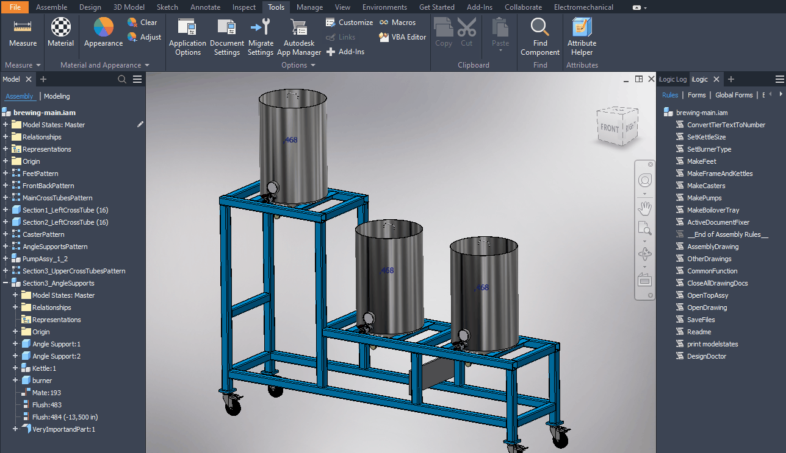

# Design doctor second opinion

I think that many people have a hate-love relationship with the design doctor. Of course, you never want to see that red cross at the top of your screen. But stuff breaks and you need to know about it and solve it. This is where the design doctor should shine. It should help you identify all problems and help you to solve them.

 If you have a look at the "Inventor idea forum" you will find a lot of improvement ideas. (I found 39 ideas.) Lots of those ideas come down to the same problems. But these 2 I want to highlight:

- Clicking through the problem tree to see the actual problem is annoying.  I just want to see the problems directly!
- Finding the feature, occurrence or ... can be a pain. I want to be able to see the problem in the model browser.

Therefore my thoughts would be to create my own "Design Doctor" based on the original. But [Brian Ekins wrote](https://forums.autodesk.com/t5/inventor-programming-forum/design-doctor/m-p/8101040/highlight/true#M85964):
"There were plans at one point to expose the Design Doctor through the API but it never happened.  However, you can still get some failure or error information by interrogating the model."

So I needed to get the health information of objects in another way. lucky for me it seems that many objects in Inventor API have the property "HealthStatus". In the help, I found more than 400 objects with this property. I guess their use is quite self-explanatory. The problem is finding and feeding them, in an efficient way, to some function that checks the property and saves problems to a list. I managed to do that but I'm don't think I got all objects. I guess that I managed to get around 80% of the objects.

The next problem is creating a window. As you might know, there is an iLogic function to create listed windows. In this rule, I used that function to create a window that shows you a list of all problems. If you select 1 of them and click on "OK" the document containing the problem will be opened and the feature, occurrence or ... will be selected.

The whole look is a bit rough. I don't like how the window looks like. Also, the error text could be much clearer. If this would have been an addon I would definitely improve this. But for now, I will leave this up to you. However, I know of some recourse that might help you. Creating a new window from scratch is a nice challenge (but will make this code probably twice as long). more information you can find on this page "[Create a Windows Form, from one iLogic Rule](https://knowledge.autodesk.com/support/inventor/learn-explore/caas/simplecontent/content/create-windows-form-display-it-get-instant-feedback-your-choices-all-one-ilogic-rule.html)". If you want to change the text in the list you just need to change the "HealtProblem.ToString()" (This is the last function of the rule.)



```vb.net
Public Class ThisRule
    Public Sub Main()
              
               Dim doc As Document = ThisDoc.Document
              
        Dim problemFinder As New ProblemFinder(doc)
 
        Dim problems As List(Of HealtProblem) = problemFinder.Problems
 
               If (problems.Count = 0) Then
                       MsgBox("No problems found!")
                       return
               End If
                      
               Dim selectedProblem As HealtProblem = InputListBox(
                               "Select the problem that you want to solve today.",
                               problems, problems.Item(1),
                               Title := "Design Doctor",
                               ListName := "Problems",
                               Width := 600,
                               Height := 400)
              
               If selectedProblem Is Nothing Then Return
                      
               ThisApplication.Documents.Open(selectedProblem.Document.FullFileName)
              
               HiglightInBrowser(selectedProblem)           
    End Sub
       
    Public Sub HiglightInBrowser(problem As HealtProblem)
        Try
            Dim oNativeBrowserNodeDef As NativeBrowserNodeDefinition = problem.Document.BrowserPanes.
            GetNativeBrowserNodeDefinition(problem.ProblemObject)
            Dim oTopBrowserNode As BrowserNode = problem.Document.BrowserPanes.ActivePane.TopNode
            Dim oWorkPlaneNode As BrowserNode = oTopBrowserNode.AllReferencedNodes(oNativeBrowserNodeDef).Item(1)
            oWorkPlaneNode.Expanded = True
                       oWorkPlaneNode.Expanded = False
                      
                       problem.Document.SelectSet.Clear()
                       problem.Document.SelectSet.Select(problem.ProblemObject)
        Catch ex As Exception
            Dim msg = String.Format("Could not select problem node in document: " & problem.Document.DisplayName)
        End Try
    End Sub
End Class
 
Public Class ProblemFinder
    Public Property Problems As New List(Of HealtProblem)
    Sub New(doc As Document)
              
        If (doc.DocumentType = DocumentTypeEnum.kPartDocumentObject) Then
            FindPartProblems(doc)
        ElseIf (doc.DocumentType = DocumentTypeEnum.kAssemblyDocumentObject) Then
            FindAssemblyProblems(doc)
        End If
 
        Dim partDocs = doc.AllReferencedDocuments.Cast(Of Document).
            Where(Function(d) d.DocumentType = DocumentTypeEnum.kPartDocumentObject).ToList()
        For Each partDoc As PartDocument In partDocs
            FindPartProblems(partDoc)
        Next
 
        Dim assemblyDocs = doc.AllReferencedDocuments.Cast(Of Document).
            Where(Function(d) d.DocumentType = DocumentTypeEnum.kAssemblyDocumentObject).ToList()
        For Each assemblyDoc As AssemblyDocument In assemblyDocs
            FindAssemblyProblems(assemblyDoc)
        Next
    End Sub
 
    Public Sub FindAssemblyProblems(doc As AssemblyDocument)
        FindProblemsInList(doc, doc.ComponentDefinition.Constraints.Cast(Of AssemblyConstraint))
        FindProblemsInList(doc, doc.ComponentDefinition.Sketches.Cast(Of PlanarSketch))
        FindProblemsInList(doc, doc.ComponentDefinition.OccurrencePatterns.Cast(Of OccurrencePattern))
        FindProblemsInList(doc, doc.ComponentDefinition.WorkPlanes.Cast(Of WorkPlane))
        FindProblemsInList(doc, doc.ComponentDefinition.Parameters.Cast(Of Parameter))
    End Sub
    Public Sub FindPartProblems(doc As PartDocument)
        FindProblemsInList(doc, doc.ComponentDefinition.Features.Cast(Of PartFeature))
        FindProblemsInList(doc, doc.ComponentDefinition.Sketches.Cast(Of PlanarSketch))
        FindProblemsInList(doc, doc.ComponentDefinition.WorkPlanes.Cast(Of WorkPlane))
        FindProblemsInList(doc, doc.ComponentDefinition.Parameters.Cast(Of Parameter))
        FindProblemsInList(doc, doc.ComponentDefinition.ModelAnnotations.Cast(Of ModelAnnotation))
    End Sub
 
    Public Sub FindProblemsInList(doc As Document, list As IEnumerable(Of Object))
        Try
            For Each obj As Object In list
                If (obj.HealthStatus = HealthStatusEnum.kCannotComputeHealth Or
                    obj.HealthStatus = HealthStatusEnum.kDeletedHealth Or
                    obj.HealthStatus = HealthStatusEnum.kDriverLostHealth Or
                    obj.HealthStatus = HealthStatusEnum.kInconsistentHealth Or
                    obj.HealthStatus = HealthStatusEnum.kInErrorHealth Or
                    obj.HealthStatus = HealthStatusEnum.kInvalidLimitsHealth Or
                    obj.HealthStatus = HealthStatusEnum.kJointDOFLockedHealth Or
                    obj.HealthStatus = HealthStatusEnum.kNewlyAddedHealth Or
                    obj.HealthStatus = HealthStatusEnum.kOutOfDateHealth Or
                    obj.HealthStatus = HealthStatusEnum.kRedundantHealth Or
                    obj.HealthStatus = HealthStatusEnum.kUnknownHealth) Then
 
                    Problems.Add(New HealtProblem(doc, obj))
                End If                   
            Next
        Catch ex As Exception
            MsgBox("Problems while parisng problems in document: " & doc.DisplayName)
        End Try
    End Sub
 
End Class
    ' Copyright 2022
    '
    ' This code was written by Jelte de Jong, and published on www.hjalte.nl
    '
    ' Permission Is hereby granted, free of charge, to any person obtaining a copy of this
    ' software And associated documentation files (the "Software"), to deal in the Software
    ' without restriction, including without limitation the rights to use, copy, modify, merge,
    ' publish, distribute, sublicense, And/Or sell copies of the Software, And to permit persons
    ' to whom the Software Is furnished to do so, subject to the following conditions:
    '
    ' The above copyright notice And this permission notice shall be included In all copies Or
    ' substantial portions Of the Software.
    '
    ' THE SOFTWARE Is PROVIDED "AS IS", WITHOUT WARRANTY Of ANY KIND, EXPRESS Or IMPLIED,
    ' INCLUDING BUT Not LIMITED To THE WARRANTIES Of MERCHANTABILITY, FITNESS For A PARTICULAR
    ' PURPOSE And NONINFRINGEMENT. In NO Event SHALL THE AUTHORS Or COPYRIGHT HOLDERS BE LIABLE
    ' For ANY CLAIM, DAMAGES Or OTHER LIABILITY, WHETHER In AN ACTION Of CONTRACT, TORT Or
    ' OTHERWISE, ARISING FROM, OUT Of Or In CONNECTION With THE SOFTWARE Or THE USE Or OTHER
    ' DEALINGS In THE SOFTWARE.
 
Public Class HealtProblem
    Public Sub New(doc As Document, problemObject As Object)
        Me.Document = doc
        Me.ProblemObject = problemObject
    End Sub
    Public Property Document As Document
    Public Property ProblemObject As Object
       
    Public Overrides Function ToString() As String
        Return String.Format("{0}: {1} ({2})",
            Document.DisplayName, ProblemObject.Name,
                       CType(ProblemObject.HealthStatus, HealthStatusEnum).ToString())
    End Function
End Class
```

## Edit:
On LinkedIn I did get the following comment from [Felix Rodermund](https://r-kon.de/):

_"Sad that the HealthEnum does not at least have a common name that can be returned with TypeName like e. g. partfeatures in the ObjectTypeEnum. On the other hand the HealthStatusEnum is not too big, just looked it up. ... Okay here we go, just wrote it. Wasn't as much pain as I suspected."_

And in my mail, I found the following class. You can use it to replace the HealthProblem class in my rule. This replacement class will give you a better description text than my class.

```vb.net
Public Class HealtProblem
    Public Sub New(doc As Document, problemObject As Object)
        Me.Document = doc
        Me.ProblemObject = problemObject
    End Sub

    Public Property Document As Document
    Public Property ProblemObject As Object

    Public Overrides Function ToString() As String

        ' Change this function if you want to see other texts in you list
        Dim ErrorMsg As String = ""

        Select Case ProblemObject.HealthStatus
            Case HealthStatusEnum.kBeyondStopNodeHealth
                ErrorMsg = "Object is beyond stop node in the browser."

            Case HealthStatusEnum.kCannotComputeHealth
                ErrorMsg = "Object cannot be evaluated."

            Case HealthStatusEnum.kDeletedHealth
                ErrorMsg = "Object has been destroyed. You may be holding on to an empty 'shell' of the Object."

            Case HealthStatusEnum.kDriverLostHealth
                ErrorMsg = "Object is driven by data from other Object(s), and one or more of them have been disconnected."

            Case HealthStatusEnum.kInconsistentHealth
                ErrorMsg = "Object is inconsistent with another object."

            Case HealthStatusEnum.kInErrorHealth
                ErrorMsg = "Object's internal state is in error."

            Case HealthStatusEnum.kInvalidLimitsHealth
                ErrorMsg = "Object has bad limits. e.g. max < min."

            Case HealthStatusEnum.kJointDOFLockedHealth
                ErrorMsg = "Object is locked Joint."

            Case HealthStatusEnum.kNewlyAddedHealth
                ErrorMsg = "Object is newly added or unsuppressed and has not been solved yet."

            Case HealthStatusEnum.kOutOfDateHealth
                ErrorMsg = "Object needs to be recomputed with respect to its 'driver(s)'."

            Case HealthStatusEnum.kRedundantHealth
                ErrorMsg = "Object's solution is redundant with another object."

            Case HealthStatusEnum.kSuppressedHealth
                ErrorMsg = "Object has been suppressed."

            Case HealthStatusEnum.kUnknownHealth
                ErrorMsg = "Object's status is not known."

            Case HealthStatusEnum.kUpToDateHealth
                ErrorMsg = "Object is up to date."

        End Select

        Return String.Format("{0} ==> {1}: '{2}' ({3})",
        Document.DisplayName, ProblemObject.Name, ErrorMsg,
        System.Enum.GetName(GetType(HealthStatusEnum), ProblemObject.HealthStatus))

    End Function

End Class
```