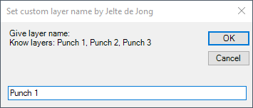

# Setting Extra Layers In DXF Exports

Have you ever wanted assign specific profiles in your flat pattern to a custom layer before exporting them to DXF? I have been working on updating an Inventor add-on which we use at work. The tool exports sheet metal flat patterns to our CAM software.

I did not write the add-on, but while working on updates to it, I discovered that it first exports the flat pattern as a DXF and then opens it up in the CAM software. I was surprised to learn that some contours/edges are exported on custom/extra layers. These layers are not available as standard in the Inventor export.

I’ve seen questions about controlling layers in flat pattern exports on the Inventor customisation forum, and have spent some time looking though the Inventor API/help files. At first, I assumed that this was not possible, but found an [old blog post](https://modthemachine.typepad.com/my_weblog/2009/04/controlling-layers-in-your-flat-pattern-export.html) by Brian Ekins (from 2009) explaining the concept, with a basic example. I thought it would be a good idea to write a more extensive example to showcase this “undocumented” functionality. In addition I could showcase how to use “[Attributes](https://modthemachine.typepad.com/my_weblog/2009/07/introduction-to-attributes.html)” and “[highlightSets](https://adndevblog.typepad.com/manufacturing/2015/01/highlightset-does-not-work.html)“. (You can find more extensive information in the links).

The attribute functionality in Inventor is only available through the API. It does not have a user-interface. It is frequently used by Autodesk to save data in your models. For example, iLogic rules can be found in the attributes of a model. And the new functionality of named geometry in iLogic depends greatly on attributes.

For this blog post, it is interesting to see that the DXF export function checks for certain attributes.  The values of these attributes are used to create the extra custom layers. To be more specific, in creating an extra custom layer an edge needs the attribute set “FlatPatternAttributes”. In that set an attribute called “LayerName” is needed.

“Highlight Sets” are a great if you want to show/highlight geometry (to the user). In this example I use a highlight set to show the user which edges have an attribute for defining a layer.

That brings me to what this code does. (Because it is a bit long, I split it up into several subs/functions. In the code below I refer back to these functions).

Before you run the code, it is possible to select edges that you want to assign a layer name to. If you do not it will ask you which edge you want to use. Using (“**getSelectedEdges()**”)  the code will also show/highlight the edges that already have been assigned a layer name. Next, using (“**initialize()**”)  it will ask you which layer name should be assigned to the selected edge(s). Using (“**getNewLayerName()**”), If you select just 1 edge, it shows you which layer name it was already assigned. But in any case, it will show you which layer names are already used in the part. If you do not specify a name it will remove the previous assigned names (and delete the attributes).



Lastly the code will create and assign values to the attribute of each selected edge. Now you can export the flat pattern.

You may run into some problems exporting DXF’s with the standard Inventor interface. Some renamed edges are removed when exporting through the interface. I would advise that you use Clint’s [DXF export script](https://clintbrown.co.uk/2018/12/09/dxf/), to save out your DXF’s, it worked for me.

Here’s the iLogic code:

```vb.net
Public Class ThisRule
' Code written by: Jelte de Jong
' www.hjalte.nl
Private setName As String = "FlatPatternAttributes"
Private attName As String = "LayerName"

Public Sub main()

    Dim doc As PartDocument = ThisDoc.Document
    initialize(doc)

    Dim selectedEdges As List(Of Edge) = getSelectedEdges(doc)
    If (selectedEdges.Count = 0) Then
        MsgBox("None edges selected")
        Return
    End If

    Dim layerName As String = getNewLayerName(doc, selectedEdges)

    For Each edge As Edge In selectedEdges
        Dim edgeAttribute = getAttribute(Edge)

        If (String.IsNullOrEmpty(layerName)) Then
            edgeAttribute.Parent.Delete()
            'AttributeSet.Delete()
        Else
            edgeAttribute.Value = layerName
        End If
    Next
End Sub

Private Function getNewLayerName(doc As PartDocument, selectedEdges As List(Of Edge)) As String
    Dim layerName As String = ""
    Dim inputBoxText = createInputBoxText(doc)
    Dim header As String = "Set custom layer name by Jelte de Jong"
    Dim defaultValue = ""
    If (selectedEdges.Count = 1) Then
        Dim edgeAttribute = getAttribute(selectedEdges(0))
        defaultValue = edgeAttribute.Value
    End If
    Return InputBox(inputBoxText, header, defaultValue)
End Function
Private Function getSelectedEdges(doc As PartDocument) As List(Of Edge)
    Dim selectedEdges As List(Of Edge) = New List(Of Edge)()
    If (doc.SelectSet.Count = 0) Then
        Dim edge As Edge = ThisApplication.CommandManager.Pick(
            SelectionFilterEnum.kPartEdgeFilter, "Select an edge")
        selectedEdges.Add(edge)
    Else
        For Each item As Object In doc.SelectSet
            If (TypeOf item Is Edge) Then
                selectedEdges.Add(item)
            End If
        Next
    End If
    Return selectedEdges
End Function
Private Sub initialize(doc As PartDocument)
    Dim comDef As SheetMetalComponentDefinition = doc.ComponentDefinition
    If (comDef.HasFlatPattern) Then
        comDef.FlatPattern.Edit()
    Else
        comDef.Unfold()
    End If
    Try
        doc.AttributeManager.PurgeAttributeSets(setName)
    Catch ex As Exception
    End Try
    Dim edges As ObjectCollection = doc.AttributeManager.FindObjects(setName)
    Dim highlightSet As HighlightSet = doc.HighlightSets.Add()
    highlightSet.Color = ThisApplication.TransientObjects.CreateColor(0, 255, 0)
    highlightSet.AddMultipleItems(edges)
End Sub

Private Function getAttribute(edge As Edge) As Attribute
    Dim attributeSet As AttributeSet = Nothing
    If (edge.AttributeSets.NameIsUsed(setName)) Then
        attributeSet = edge.AttributeSets.Item(setName)
    Else
        attributeSet = edge.AttributeSets.Add(setName)
    End If

    If (attributeSet.NameIsUsed(attName)) Then
        Return attributeSet.Item(attName)
    Else
        Return attributeSet.Add(attName, ValueTypeEnum.kStringType, "")
    End If
End Function

Private Function createInputBoxText(doc As PartDocument) As String
    Dim inputBoxText = "Give layer name:" & System.Environment.NewLine & "Know layers: "
    Dim atts As AttributesEnumerator = doc.AttributeManager.FindAttributes(setName, attName)
    Dim names As List(Of String) = New List(Of String)()
    For Each att As Attribute In atts
        If (names.Contains(att.Value) = False) Then
            names.Add(att.Value)
        End If
    Next
    Dim namesString As String = String.Join(", ", names)
    Return inputBoxText & namesString
End Function

End Class
```