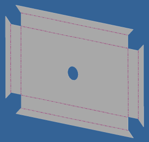
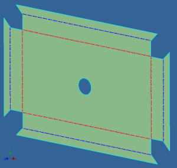

# Show Flat Pattern Orientation

At the company that I work for, we make products that are almost entirely composed of sheet metal parts. We cut and bend our products ourselves, we export our flat patterns out, to be used in our CAM software. When preparing flat patterns for export, I sometimes get confused, as it can be difficult to see which faces is the top side is of a sheet, or which bends are up or down.



For example see the sheet in the picture above. It looks like this sheet is symmetric and it would not matter how the sheet is orientated. But the hole is not in the middle of the sheet. For example adding “Cosmetic centerlines” can be difficult in this situation. (I need to tell if the new bends are up or down.)

This iLogic rule helps me see the orientation of the sheet. This is done in the following manner. It colours the top side of the sheet green. It colours “down” bends red and “up” bends  blue. (To remember what is up: The blue arrow of the “Coordinate system symbol” is pointing in the direction blue bends are set to.)



```vb.net
' Code written by: Jelte de Jong
' www.hjalte.nl
Dim doc As PartDocument = ThisDoc.Document
Dim def As SheetMetalComponentDefinition = doc.ComponentDefinition
Dim oTr As TransientObjects = ThisApplication.TransientObjects

If (def.HasFlatPattern = False) Then Return
def.FlatPattern.Edit()

Dim topFace As HighlightSet = doc.HighlightSets.Add()
topFace.Color = oTr.CreateColor(0, 255, 0, 0.1)
topFace.AddItem(def.FlatPattern.TopFace)

Dim upBendEdges As HighlightSet = doc.HighlightSets.Add()
upBendEdges.Color = oTr.CreateColor(0, 0, 255)

Dim downBendEdges As HighlightSet = doc.HighlightSets.Add()
downBendEdges.Color = oTr.CreateColor(255, 0, 0)

For Each res As FlatBendResult In def.FlatPattern.FlatBendResults
    If (res.IsDirectionUp) Then
        upBendEdges.AddItem(res.Edge)
    Else
        downBendEdges.AddItem(res.Edge)
    End If
Next

ThisApplication.CommandManager.Pick(
	SelectionFilterEnum.kAllEntitiesFilter,
        "Press esc or select anything.")
topFace.Clear()
upBendEdges.Clear()
downBendEdges.Clear()
```