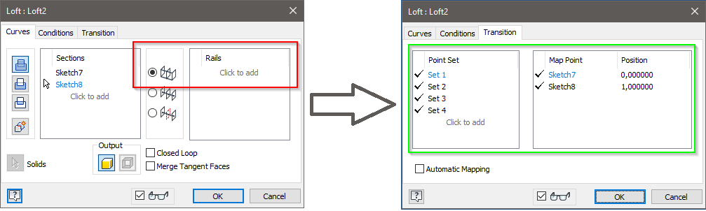

# Best Wishes & A Loft Feature

I wish you all the best for 2021. I hope that we can go back to normal life this year. Today I have a iLogic rule for you that creates an “I” similar to the Inventor logo. 

Nothing that you can’t find anywhere else on the internet. Just some profiles on a sketch that are extruded. Except for the loft in the Inventor logo. While I was creating this model, I discovered that you will find examples for creating loft features. I found posts with examples for creating lofts that uses rail. But none examples for using transitions.



Of course, I would like to use those transitions. After some digging around, I found how to do it. All the transitions are saved in a “**MapPointCurves**” object that you need to create. Default this object is not set in the “**LoftDefinition**” object. That made it hard to find and edit the transitions.

The first function in the iLogic rule below shows how to create the loft with transitions.

Here’s the iLogic code:
```vb.net
Public Class ThisRule
    ' Code written by: Jelte de Jong
    ' www.hjalte.nl
    Private Sub createLoft()
        ' find 2 faces for the loft
        Dim objColl As ObjectCollection
		Try
			objColl = ThisApplication.TransientObjects.CreateObjectCollection()
	        For Each face As Face In def.SurfaceBodies.Item(1).Faces
	            If (Face.GeometryForm = 9) Then
	                If (DoubleForEquals.IsEqual( Face.Evaluator.Area, 100)) Then

	                    Dim s As PlanarSketch = def.Sketches.Add(Face, True)
	                    Dim p As Profile = s.Profiles.AddForSolid()
	                    objColl.Add(p)
	                End If
	            End If
	        Next
		Catch ex As Exception
			MsgBox("Exception was thrown while searching for faces")
			Return
		End Try
	
		If (objColl.Count <> 2) Then
			Throw New Exception("Did not find the 2 faces for creating the Loft")
		End If
		
		' create a LoftDefinition object
	    Dim loftDef As LoftDefinition = def.Features.LoftFeatures.CreateLoftDefinition(objColl, PartFeatureOperationEnum.kJoinOperation)

		Try	
	        ' create an object for the mapping of the points
	        Dim curves As MapPointCurves = def.Features.LoftFeatures.CreateMapCurves(objColl)

	        ' create a curve and and give posistion of start and end point
	        Dim curve1 = curves.AddMapCurve()
	        curve1.SetPositionUsingPoint(2, oTg.CreatePoint(0, 0, 0))
	        curve1.SetPositionUsingPoint(1, oTg.CreatePoint(10, 20, 0))

	        Dim curve2 = curves.AddMapCurve()
	        curve2.SetPositionUsingPoint(2, oTg.CreatePoint(10, 0, 0))
	        curve2.SetPositionUsingPoint(1, oTg.CreatePoint(10, 20, -10))

	        Dim curve3 = curves.AddMapCurve()
	        curve3.SetPositionUsingPoint(2, oTg.CreatePoint(10, 0, -10))
	        curve3.SetPositionUsingPoint(1, oTg.CreatePoint(0, 20, -10))

	        Dim curve4 = curves.AddMapCurve()
	        curve4.SetPositionUsingPoint(2, oTg.CreatePoint(0, 0, -10))
	        curve4.SetPositionUsingPoint(1, oTg.CreatePoint(0, 20, 0))

	        loftDef.MapPointCurves = curves
			
			
		Catch ex As Exception
			MsgBox("Unable to create transitions")
		End Try
        Dim loftFeature As LoftFeature = def.Features.LoftFeatures.Add(loftDef)
    End Sub

    Private lastPoint2D As SketchPoint
    Private currentSketch As PlanarSketch
    Private oTg As TransientGeometry
    Private def As PartComponentDefinition
    Private doc As PartDocument
    Private view As Inventor.View

    Sub Main()

        oTg = ThisApplication.TransientGeometry
        doc = ThisApplication.Documents.Add(DocumentTypeEnum.kPartDocumentObject)
        def = doc.ComponentDefinition
        view = ThisApplication.ActiveView

        Dim oAssets As Assets = doc.Assets
        Dim assetOrrange As Asset = doc.ActiveAppearance
        Dim generic_color As ColorAssetValue = assetOrrange.Item("generic_diffuse")
        generic_color.Value = ThisApplication.TransientObjects.CreateColor(236, 164, 74)
        generic_color.HasConnectedTexture = True

        Dim trans As Transaction = ThisApplication.TransactionManager.StartTransaction(doc, "create")
        Try


            Dim wp1 As WorkPlane = createWorkplane(oTg.CreatePoint(0, 0, 0), oTg.CreatePoint(1, 0, 0), oTg.CreatePoint(0, 1, 0))
            drawLogo(doc, wp1)
            createLoft()
            view.Fit()
            addLogoText(wp1)
            view.Fit()
            wishText(wp1)
            view.Fit()

            Dim camera As Camera = ThisApplication.ActiveView.Camera
            camera.Perspective = True
            camera.Eye = oTg.CreatePoint(-8.9, 90.7, 169.9)
            camera.Target = oTg.CreatePoint(39.2, -3.7, -5)
            camera.UpVector = oTg.CreateUnitVector(0.126, 0.887, -0.444)
            camera.Animating = True
            camera.Apply()

            view.Fit()


        Catch ex As Exception
            MsgBox(ex.Message)
        Finally
            trans.End()

        End Try

    End Sub
    Private Sub wishText(WorkPlane As WorkPlane)
        Dim sketch As PlanarSketch = def.Sketches.Add(WorkPlane)

        Dim text As String = "<StyleOverride FontSize='6'>We wish you the best for</StyleOverride><Br/><StyleOverride FontSize='11,'>2021</StyleOverride>"
        
        Dim textBox As Inventor.TextBox = sketch.TextBoxes.AddFitted(oTg.CreatePoint2d(39, -10), text)
        textBox.HorizontalJustification = HorizontalTextAlignmentEnum.kAlignTextCenter

        extrudeText(sketch)
    End Sub

    Private Sub addLogoText(workPlane As WorkPlane)
        Dim sketch As PlanarSketch = def.Sketches.Add(workPlane)
        Dim text As String = "<StyleOverride FontSize='11,'>Unofficial</StyleOverride><Br/><StyleOverride FontSize='11,'>Inventor</StyleOverride>"

        sketch.TextBoxes.AddFitted(oTg.CreatePoint2d(18, 26), text)

        extrudeText(sketch)
    End Sub

    Private Sub extrudeText(sketch As PlanarSketch)
        Dim oProfile As Profile = sketch.Profiles.AddForSolid()
        Dim oExtrudeDef As ExtrudeDefinition = def.Features.ExtrudeFeatures.CreateExtrudeDefinition(oProfile, PartFeatureOperationEnum.kJoinOperation)
        oExtrudeDef.SetDistanceExtent(1, PartFeatureExtentDirectionEnum.kNegativeExtentDirection)
        Dim oExtrude As ExtrudeFeature = def.Features.ExtrudeFeatures.Add(oExtrudeDef)
    End Sub

    Private Function createWorkplane(point1 As Point, point2 As Point, point3 As Point)
        Dim p1 = def.WorkPoints.AddFixed(point1)
        Dim p2 = def.WorkPoints.AddFixed(point2)
        Dim p3 = def.WorkPoints.AddFixed(point3)
        Dim wp As WorkPlane = def.WorkPlanes.AddByThreePoints(p1, p2, p3)
        p1.Visible = False
        p2.Visible = False
        p3.Visible = False
        wp.Visible = False
        Return wp
    End Function


    Private Sub drawLogo(doc As PartDocument, wp1 As WorkPlane)
		Try
	        currentSketch = def.Sketches.Add(wp1)
	        lastPoint2D = currentSketch.SketchPoints.Add(oTg.CreatePoint2d(0, 0))
	        Dim startPoint As SketchPoint = lastPoint2D

	        Dim ls = arcTo(oTg.CreatePoint2d(-2, 0), oTg.CreatePoint2d(-2, -2))
	        lineTo(oTg.CreatePoint2d(-5, -2))
	        lineTo(oTg.CreatePoint2d(-5, -6))
	        arcTo(oTg.CreatePoint2d(5, -86), oTg.CreatePoint2d(15, -6))
	        lineTo(oTg.CreatePoint2d(15, -2))
	        lineTo(oTg.CreatePoint2d(12, -2))
	        arcTo(oTg.CreatePoint2d(12, 0), oTg.CreatePoint2d(10, 0))
	        lineTo(startPoint)
	        view.Fit()

	        lastPoint2D = currentSketch.SketchPoints.Add(oTg.CreatePoint2d(0, 20))
	        startPoint = lastPoint2D
	        arcTo(oTg.CreatePoint2d(-2, 20), oTg.CreatePoint2d(-2, 22), True)
	        lineTo(oTg.CreatePoint2d(-5, 22))
	        lineTo(oTg.CreatePoint2d(-5, 26))
	        arcTo(oTg.CreatePoint2d(5, 106), oTg.CreatePoint2d(15, 26), True)
	        lineTo(oTg.CreatePoint2d(15, 22))
	        lineTo(oTg.CreatePoint2d(12, 22))
	        arcTo(oTg.CreatePoint2d(12, 20), oTg.CreatePoint2d(10, 20), True)
	        lineTo(startPoint)
	        view.Fit()

	        Dim oProfile As Profile = currentSketch.Profiles.AddForSolid()
	        Dim oExtrudeDef As ExtrudeDefinition = def.Features.ExtrudeFeatures.CreateExtrudeDefinition(oProfile, PartFeatureOperationEnum.kJoinOperation)
	        Call oExtrudeDef.SetDistanceExtent(10, PartFeatureExtentDirectionEnum.kNegativeExtentDirection)
	        Dim oExtrude As ExtrudeFeature = def.Features.ExtrudeFeatures.Add(oExtrudeDef)
		Catch
			MsgBox("Exception was thrown while creating logo")
		End Try
    End Sub


    Private Function arcTo(centerPoint As Point2d, EndPoint As Point2d, Optional CounterClockwise As Boolean = False)
        Dim l = currentSketch.SketchArcs.AddByCenterStartEndPoint(centerPoint, lastPoint2D, EndPoint, CounterClockwise)
        If (CounterClockwise) Then
            lastPoint2D = l.EndSketchPoint
        Else
            lastPoint2D = l.StartSketchPoint
        End If
        Return l
    End Function
    Private Function lineTo(EndPoint)
        Dim l As SketchLine = currentSketch.SketchLines.AddByTwoPoints(lastPoint2D, EndPoint)
        lastPoint2D = l.EndSketchPoint
        Return l
    End Function

End Class
```