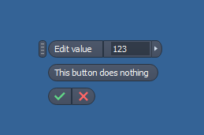

# Creating a mini toolbar

In some situations, you might want information from the user but a complete form is too much. In that case, you might want to look at the mini toolbar. Here you will find an example code.



```vb.net
Public Class ThisRule

    Sub Main()
        Dim miniToolBar As New MiniToolbarWrapper(ThisApplication)

        miniToolBar.Pick()
    End Sub

End Class

Public Class MiniToolbarWrapper

    Private _interactEvents As InteractionEvents
    Private _stillSelecting As Boolean
    Private _inventor As Inventor.Application
    Private _toolBar As MiniToolbar
    Private _valueEditor As MiniToolbarValueEditor

    Public Sub New(ThisApplication As Inventor.Application)
        _inventor = ThisApplication
    End Sub

    Public Sub Pick()
        _stillSelecting = True

        _interactEvents = _inventor.CommandManager.CreateInteractionEvents
        _interactEvents.InteractionDisabled = False

        _toolBar = _interactEvents.CreateMiniToolbar()

        AddHandler _toolBar.OnOK, AddressOf OkPressed

        _toolBar.Controls.AddLabel("MyLabel1", "Edit value", "")
        _valueEditor = _toolBar.Controls.AddValueEditor("MyValueControl", "", ValueUnitsTypeEnum.kLengthUnits, "123")
        _toolBar.Controls.AddNewLine()
        Dim button = _toolBar.Controls.AddButton("MyButton1", "This button does nothing", "")

        _toolBar.ShowApply = False
        _toolBar.ShowOptionBox = False
        _toolBar.Visible = True

        _interactEvents.Start()
        Do While _stillSelecting
            _inventor.UserInterfaceManager.DoEvents()
        Loop
        _interactEvents.Stop()

        _inventor.CommandManager.StopActiveCommand()

        _toolBar.Delete()
    End Sub

    Private Sub OkPressed()
        MsgBox(String.Format("value={0} - Expresion={1}", _valueEditor.Value, _valueEditor.Expression))
        _stillSelecting = False
    End Sub
End Class
```