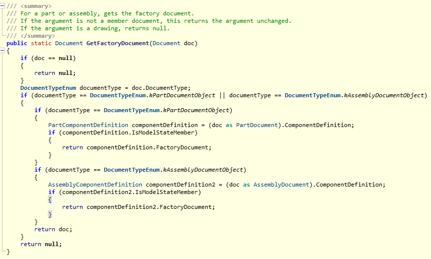

# Deep dive in model states and parameters API

In January (2021) I started reading about the Inventor update 2022. On the "Autodesk Inventor Customization forum" there was a topic by Adam Nagy warning us. The new feature "Modelstate" could affect some of the "Level Of Details" related functions. Till now I did not give it much thought. Probably I will not update for some years so I did not have to look at it.

But on the forum, someone did have a problem related to this. He did have a script that copied all parameters from an assembly to all referenced parts. But it crashed as soon as he started using "Model states". I have quite a lot of code that involves updating parameters in models. I guessed that this would be a good time to start looking at the problems. The forum topic with all the details (and original script) can be found [here](https://forums.autodesk.com/t5/inventor-programming-forum/copy-user-parameters-from-assembly-to-parts/m-p/10513802/highlight/false#M127090).

As usual, I tried running the script posted by the topic starter. I discovered that there are no problems to start with. To be more precise there is no problem as long as you don't create new "Model states". And because my test assembly did not contain any parts with more than 1 "Model states" the script worked just fine. The first thing to remember, from this post, when testing code for Inventor 2022 (or later):

**"Probably you don't have models with more than 1 ' Model state'', but for testing purposes, you need to create it!"**

Anyway, I discovered that I could reproduce the problem (and how). The challenge is: When you have more than 1 "Model state" you also have more than 1 set of parameters but how do you set them with the Inventor API. Normally changing a parameter can be done like this:

```vb.net
Dim doc As PartDocument = ThisDoc.Document
Dim params As UserParameters = doc.ComponentDefinition.Parameters.UserParameters
Dim param As UserParameter = params.Item("test")
param.Expression = "123 mm"
```

Nothing complicated but no options for selecting parameters of another "Model state". While researching I found the new property "ModelStates" of the "PartComponentDefinition" object. That looks like a very interesting object. It's a list of all "Model states" and each "Model state" has a property called "Document". I expect that would be the part document that belongs to the model state. But I could not use it for changing parameters... (Altough you can read parameters from this document in some cases, but I always got unexpected results. So better not to use it.)

But Google pointed me to this post. (Just a small piece of advice: If you have a problem, Google really knows a lot if you know which buttons to push.) This is how I found the new property "FactoryDocument" of the "PartComponentDefinition" object. Maybe I did overlook this property because of its name. It's very easy to confuse it with the property "iPartFactory". (I guess a better name would have been "ModelStateDocument"...)  This "FactoryDocument" is a part document in the part document. But there is only 1 "FactoryDocument" but many model states. I figured out that this "FactoryDocument" is the document that belongs to the active "Model state". But this is the part document that you can use to update parameters.

I changed the rule from the topic so I could update the parameters and tried it. And worked great ... until I removed all the model states except for the last. It crashed again. This time I discovered that the new property "FactoryDocument" returns "Nothing" if there is only 1 "Model state". So, you cant use this new API if there is only 1 "Model state" and you have to use the main document. Therefore I adjusted my code and did post the result back to the [forum](https://forums.autodesk.com/t5/inventor-programming-forum/copy-user-parameters-from-assembly-to-parts/m-p/10520951/highlight/true#M127176).

## ILogic

At this point, I could have called it a day. But I was not satisfied with the result. I realised that the creator of the iLogic function Parameter(..) also did have this problem and that he/she solved it. While researching the iLogic code I found this (C#) function. (Yes I went full nerd on this one and decompiled the iLogic DLL's)



This is a function of the class: "Autodesk.iLogic.Runtime.ModelStateUtils" (C:\Program Files\Autodesk\Inventor 2022\Bin\Autodesk.iLogic.Runtime.dll) This function is great! It works both for parts and assemblies and gives us always a document that we can use for updating parameters. Using this function I was able to create a rule that is easy to read and just a half of the lines of code used in the forum. Check this rule, it will copy all user parameters from the assembly to all parts:

```vb.net
Dim modelStateUtil As ModelStateUtils = New ModelStateUtils()

Dim asmDoc As AssemblyDocument = ThisDoc.Document
Dim asmParams As UserParameters = asmDoc.ComponentDefinition.Parameters.UserParameters

For Each refDoc As Document In asmDoc.AllReferencedDocuments
	If refDoc.DocumentType <> Inventor.DocumentTypeEnum.kPartDocumentObject Then Continue For
	
	Dim facDoc As PartDocument = modelStateUtil.GetFactoryDocument(refDoc)
	Dim modelStates As ModelStates = facDoc.ComponentDefinition.ModelStates
	For Each ModelState As ModelState In ModelStates
		ModelState.Activate()
		Dim partParams As UserParameters = facDoc.ComponentDefinition.Parameters.UserParameters
		For Each asmUserParam As UserParameter In asmParams
			Try
				Dim checkParam As UserParameter = partParams.Item(asmUserParam.Name)
				checkParam.Expression = asmUserParam.Expression
			Catch ex As Exception
				partParams.AddByExpression(asmUserParam.Name, asmUserParam.Expression, asmUserParam.Units)
			End Try
		Next
		
	Next
Next
```

If you are going to use this code then be aware that I'm not sure that Autodesk ever wanted you to use the "ModelStateUtils.GetFactoryDocument()" function. I checked the [online help](https://help.autodesk.com/view/INVNTOR/2022/ENU/?guid=110f3019-404c-4fc4-8b5d-7a3143f129da) page and I could not find it. So If your life depends on this function then I would advise you to create your own function instead of using "modelStateUtil.GetFactoryDocument(refDoc)". (See the function in the conclusion)

## Conclusion

For updating parameters it's important to use the correct document within the main document. This document is called the "Factory document". (Using the wrong documents will most likely give unexpected results.) You can use the following function to select the factory document. Also, it looks like you can only change the parameters in the active model state (using the factory document). 

```vb.net
Public Function GetFactoryDocument(doc As Document)
	If (doc Is Nothing) Then Return Nothing
	
	Dim documentType As DocumentTypeEnum = doc.DocumentType
	If (documentType = DocumentTypeEnum.kPartDocumentObject Or 
		documentType = DocumentTypeEnum.kAssemblyDocumentObject) Then
		
		If (documentType = DocumentTypeEnum.kPartDocumentObject) Then
			Dim def As PartComponentDefinition = doc.ComponentDefinition
			If (def.IsModelStateMember) Then
				Return def.FactoryDocument
			End If			
		End If
		If (documentType = DocumentTypeEnum.kAssemblyDocumentObject) Then
			Dim def As AssemblyComponentDefinition = doc.ComponentDefinition
			If (def.IsModelStateMember) Then
				Return def.FactoryDocument
			End If			
		End If
		Return doc
	End If
	Return Nothing
End Function
```

## Edit:

The post "Working with PropertySets and Model States." is also noteworthy:
[https://adndevblog.typepad.com/manufacturing/2022/01/working-with-propertysets-and-model-states.html](https://adndevblog.typepad.com/manufacturing/2022/01/working-with-propertysets-and-model-states.html)