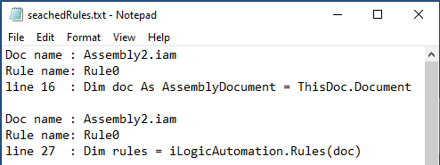

# 
One Rule to Search Them All

Over the years, I have created several assemblies containing many parts with various iLogic rules, generally they work perfectly. But sometimes for seemingly no reason, an edge case will not work as expected, and is usually discovered by a colleague. The challenge is that I then need to find the rule that is responsible for the problem. Often I know more or less what to look for, but out of the box, there is no iLogic search command that will look through all of the parts and all of the rules in an assembly.

Lately I have been playing around with the Inventor API in iLogic. iLogic has some nice functions that can help a lot if you’re making configurators. For example the possibility to run rules in SilentOperation mode and later read out the exceptions that were thrown. But that is for another blog post. Using iLogic, I can loop through all of the rules in a document and get the text contained in the rule. This helped me to write an iLogic utility that solves the previously described problem.

I created a rule that that can search all rules in each part in an assembly (or just in a part). **To use this iLogic utility, just save it as a external rule**. Check that the variable “outputFile” is pointing to a file location that you have write access to. (it’s not necessary to create the file. It will be created if its not there.)


When you run the rule you will see an input box. Fill in a text that you are looking for.  Notepad will be stared with the search results. It will look something like this:

Note that this external rule searches the content of all internal rules.



```vb.net
Public Class ThisRule
    ' Code written by: Jelte de Jong
    ' www.hjalte.nl
    Private searchText As String
    Private iLogicAddinGuid As String = "{3BDD8D79-2179-4B11-8A5A-257B1C0263AC}"
    Private iLogicAddin As ApplicationAddIn = Nothing
    Private iLogicAutomation = Nothing
    Private outputFile As String = "c:\TEMP\seachedRules.txt"

    Sub Main()
        If (IO.File.Exists(outputFile)) Then
            IO.File.Delete(outputFile)
        End If
        searchText = InputBox("Text to search for", "Search")

        iLogicAddin = ThisApplication.ApplicationAddIns.ItemById(
			"{3bdd8d79-2179-4b11-8a5a-257b1c0263ac}")
        iLogicAutomation = iLogicAddin.Automation
        Dim doc As AssemblyDocument = ThisDoc.Document

        searchDoc(doc)
        For Each refDoc As Document In doc.AllReferencedDocuments
            searchDoc(refDoc)
        Next

        Process.Start("notepad.exe", outputFile)
    End Sub

    Private Sub searchDoc(doc As Document)
        Dim rules = iLogicAutomation.Rules(doc)
        If (rules Is Nothing) Then Return
        For Each rule In rules
            Dim strReader As IO.StringReader = New IO.StringReader(rule.Text)
            Dim i As Integer = 1

            Do While (True)
                Dim line As String
                line = strReader.ReadLine()
                If line Is Nothing Then Exit Do
                If (line.ToUpper().Contains(searchText.ToUpper())) Then
                    Dim nl = System.Environment.NewLine
                    IO.File.AppendAllText(outputFile,
                        "Doc name : " & doc.DisplayName & nl &
                        "Rule name: " & rule.Name & nl &
                        "line " & i & "  : " & line.Trim() & nl & nl)
                End If
                i = i + 1
            Loop
        Next
    End Sub
End Class
```