# Connecting Power Automate to the Vault REST API.
With the release of Vault 2025.2, Autodesk introduced [a new REST API](https://aps.autodesk.com/blog/become-early-adopter-new-vault-data-apis) for Vault. You can use Power Automate Desktop to interact with Vault through this API. In this post, I’ll walk you through how to trigger a custom job in the Vault job queue using Power Automate.

To get started, you’ll need the Vault server address. This is typically something like:
> http://{yourvaultserver}/

Replace {yourvaultserver} with the actual server name shown on the Vault login screen.

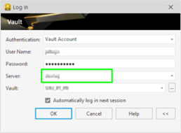

(You might also be able to use the Vault Gateway address instead.)

To begin working with the Vault REST API, every request must include a Bearer token for authentication. This means you’ll first need to authenticate with Vault to obtain that token.

The best place to start is the “[Reference Guide](https://aps.autodesk.com/en/docs/vaultdataapi/v2/reference/http/ )”, which outlines the required steps and endpoints.
To authenticate, send a POST request to the following endpoint:

> {VaultServerAddress}/AutodeskDM/Services/api/vault/v2/sessions

Replace **{VaultServerAddress}** with your actual Vault server. The request should include your credentials and any required headers as described in the documentation.
‘Content-Type’ and ‘Accept’ should be ‘application/json’
The body should look like this.
```json
{
    "input": {
      "vault": "YourVaultName",
      "userName": "TestAccount",
      "password": "Test123456!",
      "appCode": "TC"
    }
 }
 ```
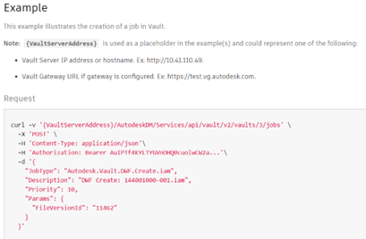

To make the authentication request work in Power Automate Desktop, follow these steps: 

Create a new flow ([More information on Microsoft site.](https://learn.microsoft.com/en-us/power-automate/desktop-flows/create-flow))
 
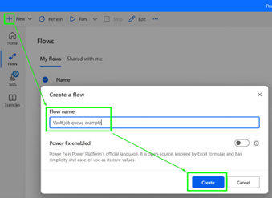

Add a 'Invoke Web Service' action.


Set all parameters:

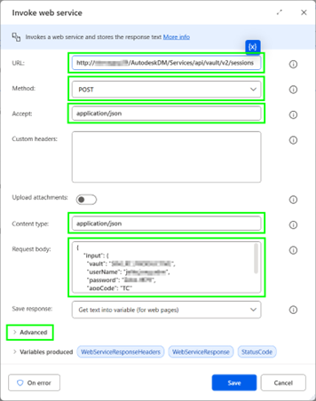

Under the advanced options you also need to set parameters

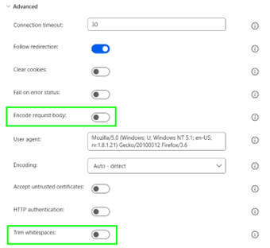
 
Once the Invoke Web Service action runs, it creates a variable called WebServiceResponse. This variable contains the full JSON response from the Vault API, including the Bearer token we need for future requests.

To extract the token, add the action: “Convert JSON to custom object”. And set the parameter “JSON” to %WebServiceResponse%


 
After converting the JSON response to a custom object, the next step is to store the token in a dedicated variable for later use. 

Add the action: “Set Variable” and set the parameters 

 - Variable: BearerToken
 - Value: %JsonAsCustomObject['accessToken']% 

This ensures your token is stored cleanly and can be reused in subsequent API calls

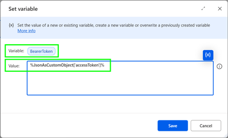
 
Now that we have a valid Bearer token, we can start sending authenticated requests to the Vault REST API.

In this example, we’ll create a job in the job queue. According to the “Reference Guide” (POST Create a job | Vault Data API | Autodesk Platform Services) , we need to send a POST request like this.
 
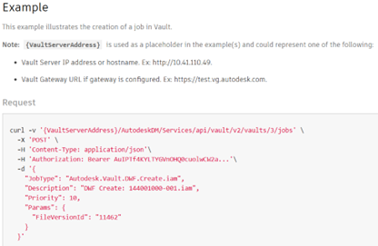
I would like to chang the body to something like this:
```json
{
    "JobType": "Job.Example",
    "Description": "Created with Power automate",
    "Priority": 10,
    "Params": {
      "param1": "123456",
      "param2": "www.hjalte.nl",
    }
}
``` 
To create a job in the job queue, the API endpoint requires the Vault ID:

> {VaultServerAddress}/AutodeskDM/Services/api/vault/v2/vaults/{vaultId}/jobs

If you don’t know the vaultId, don’t worry, you can easily retrieve it using the REST API.

According to the “[Reference Guide](https://aps.autodesk.com/en/docs/vaultdataapi/v2/reference/http/vaults/)” , you can send a GET request to:

> {VaultServerAddress}/AutodeskDM/Services/api/vault/v2/vaults

This endpoint returns a list of available Vaults along with their IDs. You can test this in a browser.  

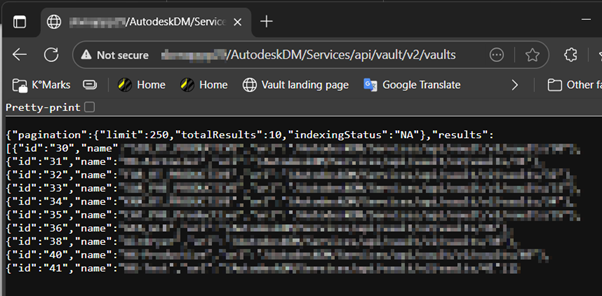

Once you have the vaultId, you can proceed to construct the full job creation URL.

Add (another) action “Invoke Web Service” and set the parameters like this:

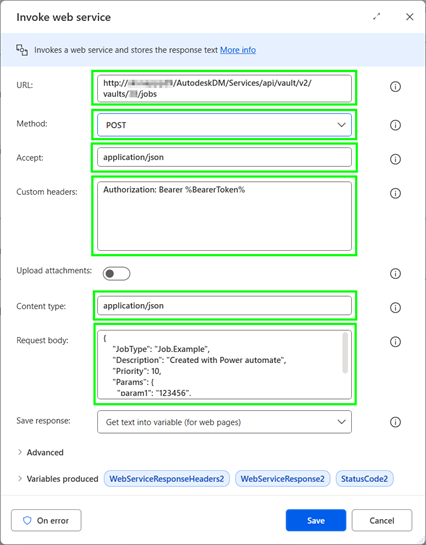
 
Here you also will need to set the same advanced options like in the first “Invoke Web Service” action.

Now you can test/run the “Flow”. 

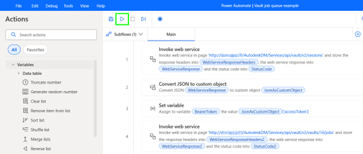 

Last you can find the job in the job queue.

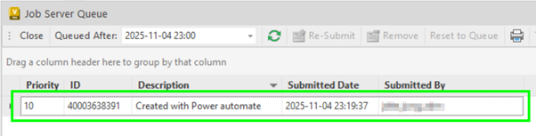 