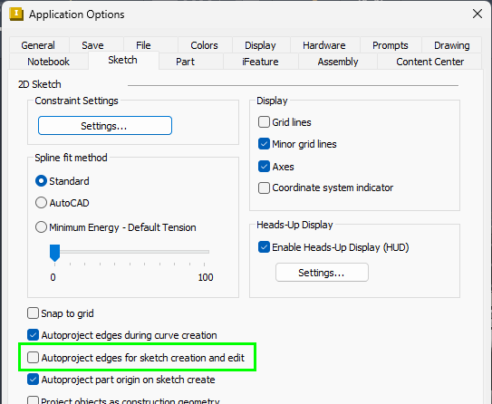
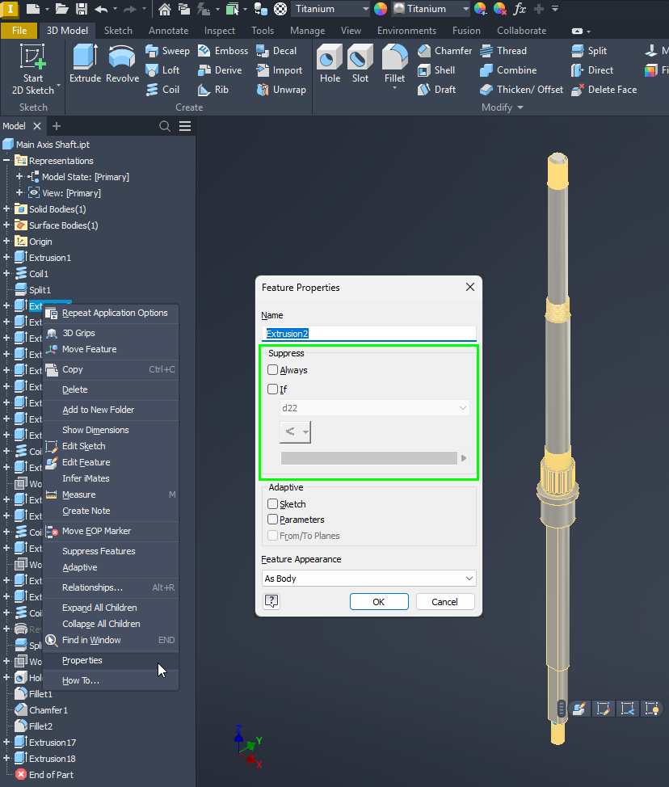
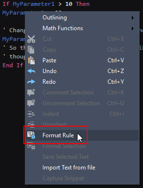
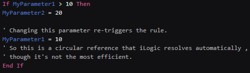
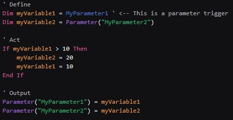

# preparing models for automation

---

# Modeling
 - Start with base geometry, then add features like holes, cuts, fillets, etc.
 - Think in terms of design intent: what should stay aligned if a size changes?
 - consider skelet modeling or a variation of that.
  - Create a translucent reference object that allows all components in an assembly to be constrained to.

# Assemblies
 - always use the first hole of hole patterns to constraint.
 - use minimal amout of  constraints. The best is to have none constraints or only to the origin (planes). In practice that never seems to work for me. 
   - consider skelet modeling or a variation of that.
     - Create a translucent reference object that allows all
 - Priority for fully constraining parts using bolt holes. Form bad to better
   - 2 insert constraints
   - 1 insert and 1 mate constraint
   - 1 insert and a angle to a orign plane constraint.

# Parameters
- Give parameters a meaningful name for clarity.
- Add descriptions to parameters for clarity.
- Create user-parameters and use those in your model parameters
- Create a list of parameters (in excel?) that you use for **all your models**.
     - This is useful for your self but gets very useful when you start using other tools to update parameters.
          - We have for example a tool that updates all parameters with the same name in the complete assembly
          - When you start using generators this is also very useful.

# Sketches
  - Sketches should be fully constraint
  - Apply geometric constraints (e.g. parallel, concentric) and dimension constraints.
  - Use projected geometry sparingly; prefer construction lines for references.
  - Use planes, axes, and origin point for symmetry and alignment.
  - Avoid “floating” sketches that are only constrained to edges or faces—these are more fragile.
  - Disable Autoproject edges

# iLogic
 - KISS [(KISS principle - Wikipedia)](https://en.wikipedia.org/wiki/KISS_principle)
 - DRY [(Don't repeat yourself - Wikipedia)](https://en.wikipedia.org/wiki/Don%27t_repeat_yourself)
   - Functions (Sub) can be very powerful. You can use them in iLogic however how you can use them is not be obvious.
 - Use iLogic sparingly.
   - that might sound strange. But iLogic can get complicated fast. If you make many long rules.
   - use feature properties if posissible to suppress features.
     
 - Consider creating a dll for your logic or create an addin for generating models when your rules get complex
     - [Extending iLogic functions with a dll](https://github.com/hjalte79/InventorAutomationWiki/blob/master/DllForIlogic.md)
     - [Creating an addin](http://hjalte.nl/tutorials/80-creating-an-addin-inventor-2025-and-later)
 - Keep rules as short as possible
   - Create 1 rule that trigger other (smaller) rules
 - divide rules in 3 parts for clarity and overview
   - **Define**: Define variables, for parameters that you use
   - **Act**: Add domain logic. preform calculation.
   - **Output**: write calculated values to parameters, suppress parts/features
 - Avoid using parameter triggers
 - Do not use “ThisApplication.ActiveDocument” to get the document object. Instead use “ThisDoc.Document”.
   - [Run “Before Save” Rule Only Once in Assemblies](http://hjalte.nl/14-run-before-save-rule-only-once-in-assemblies)
 - Format rule
   - Indent code blocks to make clear where a block starts and end.
   - The Format rule option in the rule editor is not perfect but is a good starting point
   
## Naming conventions
      - Use camelCase notation for names: Writing phrases without spaces or punctuation and with capitalized words. Wikipedia (This is the industry naming convention for .Net languages)
      - Start variable names with a lower letter
      - Start classes with a capital letter (Advanced iLogic only)
      - Prefix global variable with _ (Advanced iLogic only)
      - In many examples on the internet you will see ‘Hungarian notation’. It’s discouraged to use this notation. (It used to be the standard pushed by Microsoft)
           - You can recognize this notation if all variable names start with an ”o”. Like “oMyVariable”
           - Hungarian notation - Wikipedia
  
## Examples
Example Working rule:

Improved rule with same functionality:

 - Only 1 trigger instead of 2 (or 3)
 - No circular references
 - Used parameters are clear for anyone who start reading the rule
 - Output is clear in the bottom of the rule
 - The code block in the if statement is indented. 

(for small rules like this rule it looks like you write more. For large rules this makes the difference between understandable/maintainable rules and a rule that you need to rewrite each time you need to update it.)

# Considerations/General
 - Create libraries of standard parts.
   - models of parts that are used in different designs
   - example wiring boxes.
   - models that are **not** copied when a design is copied.
 - remove parts before you do any thing else 
   - especially updating parameters. updating parameters in parts is slow. less parts is more time efficient
 - Inventor tends to forget internal names of line, edges and faces when geometry changes because of parameter changes.
   - Use orign planes
   - use line, edges and faces that do not change

# interesting blog posts:
 - [Unexpected Results](http://hjalte.nl/17-unexpected-results)
 - [Unexpected Results 1.5](http://hjalte.nl/105-unexpected-results-1-5)
  - [Iproperties](http://hjalte.nl/98-accessing-iproperties)

