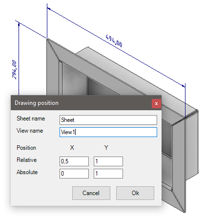
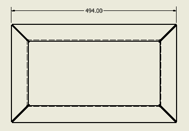

# Retrieve model annotation 2.0

On my job, I came across a VBa program that consisted of 2 parts. The second part would add dimensions to your drawing. The first part would let you select faces/edges and add properties to it. Pairs of faces/edges are used to create dimensions on a drawing. Those properties included things like the position of the dimension text and to which view the dimension belongs.

This program came across my desk because no one knew how it worked and it stopped working when we migrated to a new version of Inventor. I usually have an opinion on how to improve things. And that was also here the case. In my opinion, there were 3 problems:

- Although there was a user interface it was not user-friendly. There was no way of knowing which face where used for a dimension.
- It was written in VBa and we should not be using VBa any more. ([Is VBA in Inventor obsolete?](./VbaIsObsolete.md))
- It's not very flexible.

All those issues could be solved if they would just use iLogic/named entities. ([iLogic add dimensions to drawings](./AddDimension.md)) I think creating an iLogic rule is not that complicated but a colleague pointed out to me that this might not be true for everyone. So as a challenge to myself, I created the 2 ilogic rules below that have the same function as the VBa code. But with one big difference. Instead of selecting faces/edges and adding properties to those it makes use of 3D annotations and you can add properties to those. 



With the first rule, you can set up the part for use in the drawing. After you start the rule start by selecting 3D dimension (in a part file). After you select a 3D dimension you will presented with a window. This is a bit special because the window is not native to iLogic. (Credits to Wesley Crihfield for showing off this technique.) In this window, you need to set the sheet and view the name that belongs to the dimension. Also, you need to set the X and Y coordinates on the sheet. The first set is an "iLogic sheet point" coordinate. SheetPoint are normalized view coordinates in the range 0 to 1. x=0, y=0 is at the bottom left corner of the view x=1, y=1 is at the top right corner of the view. So these are relative coordinates to the view. The second set of coordinates are absolute coordinates relative to the first set. 



The second rule is doing all the work. All dimensions are placed by this rule.

You could argue that this rule is not much more than the standard "Retrieve model annotations" but I guess it is more flexible. You can place the dimension text anywhere you like. On the other hand in my experience, if you want to automatically add dimensions then you probably also want to automate other things. In that case, you probably need ilogic anyway and then I think the default iLogic features are easier to maintain.

The first (external) rule is to set up the part.

```vb.net
AddReference "System.Drawing"
Imports System.ComponentModel
Imports System.Drawing
Imports System.Windows.Forms
imports System.Windows
Public Sub Main()

    Dim sheetName As String = String.Empty
    Dim viewName As String = String.Empty

    Dim relativeX, relativeY, absoluteX, absoluteY As Double

    Dim annotation As ModelAnnotation = ThisApplication.CommandManager.Pick(SelectionFilterEnum.kModelAnnotationFilter, "Select a dimension")
    If (annotation.AttributeSets.NameIsUsed("hjalte.AutoDraw")) Then
        Dim attSet = annotation.AttributeSets.Item("hjalte.AutoDraw")

        Dim completViewName = "Sheet name:View name"
        If (attSet.NameIsUsed("ViewName")) Then completViewName = attSet.Item("ViewName").Value
        sheetName = completViewName.Split(":")(0)
        viewName = completViewName.Split(":")(1)

        If (attSet.NameIsUsed("Text.RelativePosition.X")) Then relativeX = attSet.Item("Text.RelativePosition.X").Value
        If (attSet.NameIsUsed("Text.RelativePosition.Y")) Then relativeY = attSet.Item("Text.RelativePosition.Y").Value
        If (attSet.NameIsUsed("Text.Position.X")) Then absoluteX = attSet.Item("Text.Position.X").Value
        If (attSet.NameIsUsed("Text.Position.Y")) Then absoluteY = attSet.Item("Text.Position.Y").Value
    End If

    Dim form As New WinForm()
    form.TbSheetName.Text = sheetName
    form.TbViewtName.Text = viewName

    form.TbRelativeX.Text = relativeX
    form.TbRelativeY.Text = relativeY
    form.TbAbsoluteX.Text = absoluteX
    form.TbAbsoluteY.Text = absoluteY
    Dim result = form.ShowDialog()


    If (result = DialogResult.OK) Then
        Dim autoDrawSet As AttributeSet = Nothing
        If (annotation.AttributeSets.NameIsUsed("hjalte.AutoDraw")) Then
            autoDrawSet = annotation.AttributeSets.Item("hjalte.AutoDraw")
        Else
            autoDrawSet = annotation.AttributeSets.Add("hjalte.AutoDraw")
        End If

        SetAttributeValue(autoDrawSet, "ViewName", ValueTypeEnum.kStringType,
                          String.Format("{0}:{1}", form.TbSheetName.Text, form.TbViewtName.Text))
        SetAttributeValue(autoDrawSet, "Text.RelativePosition.X", ValueTypeEnum.kStringType, form.TbRelativeX.Text)
        SetAttributeValue(autoDrawSet, "Text.RelativePosition.Y", ValueTypeEnum.kStringType, form.TbRelativeY.Text)
        SetAttributeValue(autoDrawSet, "Text.Position.X", ValueTypeEnum.kStringType, form.TbAbsoluteX.Text)
        SetAttributeValue(autoDrawSet, "Text.Position.Y", ValueTypeEnum.kStringType, form.TbAbsoluteY.Text)

    End If

End Sub

Public Sub SetAttributeValue(attributeSet As AttributeSet, attributeName As String, valueType As ValueTypeEnum, value As Object)
    If (attributeSet.NameIsUsed(attributeName)) Then
        attributeSet.Item(attributeName).Value = value
    Else
        attributeSet.Add(attributeName, valueType, value)
    End If
End Sub

Public Class WinForm
    Inherits System.Windows.Forms.Form

    Private _btnOK As Forms.Button = New Forms.Button()
    Private _btnCancel As Forms.Button = New Forms.Button()

    Public Sub New()
        SetupControls()
    End Sub

    Public Property TbSheetName As Forms.TextBox = New Forms.TextBox()
    Public Property TbViewtName As Forms.TextBox = New Forms.TextBox()

    Public Property TbRelativeX As Forms.TextBox = New Forms.TextBox()
    Public Property TbRelativeY As Forms.TextBox = New Forms.TextBox()
    Public Property TbAbsoluteX As Forms.TextBox = New Forms.TextBox()
    Public Property TbAbsoluteY As Forms.TextBox = New Forms.TextBox()


    Private Sub btnCancel_Click(sender As Object, e As EventArgs)
        Me.DialogResult = DialogResult.Cancel
        Me.Close()
    End Sub
    Private Sub btnOK_Click(sender As Object, e As EventArgs)
        Me.DialogResult = DialogResult.OK
        Me.Close()
    End Sub

    Private Sub SetupControls()
        With Me
            .FormBorderStyle = FormBorderStyle.FixedToolWindow
            .StartPosition = FormStartPosition.CenterScreen
            .Width = 325
            .Height = 235
            .TopMost = True
            .Text = "Drawing position"
            .Name = "Drawing position"
        End With

        ' Sheet name controls
        CreateLabel(10, 10, 90, 20, "Sheet name")
        CreateTextBox(TbSheetName, 10, 100, 200, 20)

        ' View name controls
        CreateLabel(35, 10, 90, 20, "View name")
        CreateTextBox(TbViewtName, 35, 100, 200, 20)

        ' Position controls
        CreateLabel(70, 10, 60, 20, "Position")
        CreateLabel(70, 120, 60, 20, "X")
        CreateLabel(70, 190, 60, 20, "Y")

        CreateLabel(95, 10, 90, 20, "Relative")
        CreateTextBox(TbRelativeX, 95, 100, 60, 20)
        CreateTextBox(TbRelativeY, 95, 170, 60, 20)

        CreateLabel(120, 10, 90, 20, "Absolute")
        CreateTextBox(TbAbsoluteX, 120, 100, 60, 20)
        CreateTextBox(TbAbsoluteY, 120, 170, 60, 20)


        ' Buttons
        With _btnCancel
            .Text = "Cancel"
            .Top = Me.Height - 80
            .Left = Me.Width - 200
            .Width = 80
            .Height = 30
            .Enabled = True
        End With
        Me.Controls.Add(_btnCancel)
        AddHandler _btnCancel.Click, AddressOf btnCancel_Click
        With _btnOK
            .Text = "Ok"
            .Top = Me.Height - 80
            .Left = Me.Width - 110
            .Width = 80
            .Height = 30
            .Enabled = True
        End With
        Me.Controls.Add(_btnOK)
        AddHandler _btnOK.Click, AddressOf btnOK_Click
    End Sub

    Public Sub CreateLabel(top As Integer, left As Integer, width As Integer, height As Integer, text As String)
        Dim label As New Forms.Label()
        With label
            .Top = top
            .Left = left
            .Width = width
            .Height = height
            .Text = text
        End With
        Me.Controls.Add(label)
    End Sub
    Public Sub CreateTextBox(textBox As Forms.TextBox, top As Integer, left As Integer, width As Integer, height As Integer)
        With textBox
            .Top = top
            .Left = left
            .Width = width
            .Height = height
        End With
        Me.Controls.Add(textBox)
    End Sub
End Class
```

The second rule is to add the dimensions.

```vb.net
Public Sub Main()
	Dim doc As DrawingDocument = ThisDoc.Document
	ThisDrawing.BeginManage
	For Each sheet As Sheet In doc.Sheets
		Dim managedSheet As IManagedSheet = ThisDrawing.Sheets.ManagedItem(Sheet)
		Dim dimensions As IManagedDrawingDimensions = managedSheet.DrawingDimensions
		
	    For Each view As DrawingView In Sheet.DrawingViews
			Dim managedView As IManagedDrawingView = managedSheet.DrawingViews.ManagedItem(View)			
			Dim refDoc As Document = managedView.ModelDocument

			Dim sheetName = Sheet.Name.Split(":")(0)			
			Dim possibleDimensions = refDoc.AttributeManager.FindObjects("hjalte.AutoDraw", "ViewName", String.Format("{0}:{1}",sheetName,View.Name))

			For Each possibleDimension As Object In possibleDimensions
		        If (TypeOf possibleDimension Is LinearModelDimension) Then
		            	Dim dimension As LinearModelDimension = possibleDimension
						
						Dim def As LinearModelDimensionDefinition = dimension.Definition
						
					    Dim curve1 = View.DrawingCurves(def.IntentOne.Geometry).Item(1)
					    Dim curve2 = View.DrawingCurves(def.IntentTwo.Geometry).Item(1)
					
					    Dim intent1 = View.Parent.CreateGeometryIntent(curve1, Nothing)
					    Dim intent2 = View.Parent.CreateGeometryIntent(curve2, Nothing)
	
						Dim x = GetAttributeValue(dimension, "Text.Position.X")
					    Dim y = GetAttributeValue(dimension, "Text.Position.Y")
					    Dim xR = GetAttributeValue(dimension, "Text.RelativePosition.X")
					    Dim yR = GetAttributeValue(dimension, "Text.RelativePosition.Y")
						
						Dim name = String.Format("{0}/{1}", refDoc.DisplayName, dimension.Name)
						
						Dim textPoint = managedView.SheetPoint(xR, yR)
						textPoint.X += x
						textPoint.Y += y
	
						dimensions.GeneralDimensions.AddLinear(name, textPoint, intent1, intent2)
		        End If		
		    Next
	    Next
	Next
	ThisDrawing.EndManage
End Sub

Public Function GetAttributeValue(annotation As ModelAnnotation, name As String) As Double
    Return annotation.AttributeSets.Item("hjalte.AutoDraw").Item(name).Value
End Function
```

This is a variation on the second rule. It also adds the dimensions to the drawing. But it does not use any iLogic API. That could be good news for any one who wants to make an addin out of this code ;-)

```vb.net
Public Sub Main()

    Dim doc As DrawingDocument = ThisDoc.Document

    For Each sheet As Sheet In doc.Sheets
        For Each view As DrawingView In Sheet.DrawingViews
            CreateDimensionsForView(View)
        Next
    Next

End Sub

Public Sub CreateDimensionsForView(view As DrawingView)
    Dim refDoc As Document = view.ReferencedDocumentDescriptor.ReferencedDocument

    Dim sheet As Sheet = view.Parent
    Dim sheetName = sheet.Name.Split(":")(0)

    Dim possibleDimensions = refDoc.AttributeManager.FindObjects("hjalte.AutoDraw", "ViewName", String.Format("{0}:{1}",sheetName,view.Name))

    For Each item As Object In possibleDimensions
        If (TypeOf item Is LinearModelDimension) Then
            CreateLinearModelDimension(view, item)
        End If

    Next
End Sub

Public Sub CreateLinearModelDimension(view As DrawingView, dimension As LinearModelDimension)
    Dim sheet As Sheet = view.Parent
    Dim def As LinearModelDimensionDefinition = dimension.Definition

    Dim curve1 = view.DrawingCurves(def.IntentOne.Geometry).Item(1)
    Dim curve2 = view.DrawingCurves(def.IntentTwo.Geometry).Item(1)

    Dim intent1 = view.Parent.CreateGeometryIntent(curve1, Nothing)
    Dim intent2 = view.Parent.CreateGeometryIntent(curve2, Nothing)

    Dim x = GetAttributeValue(dimension, "Text.Position.X")
    Dim y = GetAttributeValue(dimension, "Text.Position.Y")
    Dim xR = GetAttributeValue(dimension, "Text.RelativePosition.X")
    Dim yR = GetAttributeValue(dimension, "Text.RelativePosition.Y")

    Dim posX = view.Position.X - (view.Width / 2) + (view.Width * xR) + x
    Dim posY = view.Position.Y - (view.Height / 2) + view.Height * yR + y
    Dim TextOrigin As Point2d = ThisApplication.TransientGeometry.CreatePoint2d(posX, posY)

    sheet.DrawingDimensions.GeneralDimensions.AddLinear(TextOrigin, intent1, intent2)
End Sub

Public Function GetAttributeValue(annotation As ModelAnnotation, name As String) As Double
    Return annotation.AttributeSets.Item("hjalte.AutoDraw").Item(name).Value
End Function
```