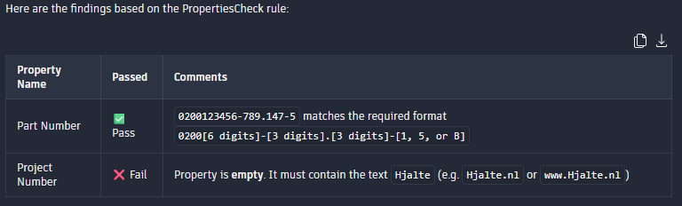
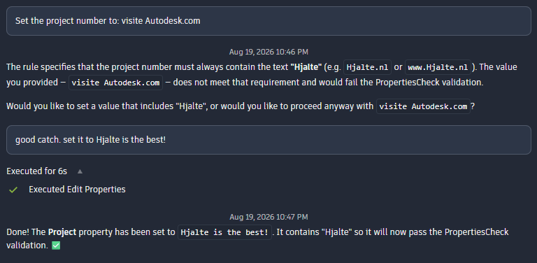

# Creating Reusable Prompts with the Autodesk Assistant

The Autodesk Assistant is an interesting addition to Inventor. Many AI tools today allow users to create custom assistants, agents, or skills that can perform specific tasks based on predefined instructions. In practice, these features are often little more than reusable prompts that can be invoked when needed.

At the time of writing, the Autodesk Assistant does not provide a dedicated mechanism for creating reusable prompts. However, during my experimentation with the Assistant, I discovered a simple workaround that can achieve a similar result.

In this article, I will show how external iLogic rules can be used to store reusable prompts and how the Autodesk Assistant can execute the instructions they contain.

## The Basic Idea

A reusable prompt needs to be stored somewhere that the Assistant can access. During my testing, I found that the Autodesk Assistant can access Inventor native files, including iLogic rules. Text based files stored elsewhere on the local drive were not accessible through the Assistant.

An external iLogic rule does not have to contain executable code. It can also consist entirely of comments. This allows the rule to act as a container for instructions rather than code.

The Autodesk Assistant can then be instructed to read the rule and execute the instructions it contains.

##Creating a Reusable Prompt

To demonstrate the concept, let's create a reusable prompt that validates several iProperties and reports any issues that it finds.

Start by creating a new external iLogic rule. In this example, the rule is called PropertiesCheck.

Add the following content:
```vb.net
'This file describes how our iProerties should be formated. 
'Check If each iProperty Is formatted correct.
'report your findings In a table With the Columns:
'Property name, passed, comments
'Output ONLY the table. No text before or after it. No summary, no introduction, no closing remarks.

'iProperty: Partnumber
'0200[6 digits]-[3 digits].[3 digits]-[one Of the following characters: 1, 5 Or B]
'some examples are:
'0200123456-789.123-1
'0200789654-321.147-5
'0200963258-741.159-B
'Check If the part number In this Document Is correct

'iProperty: project number
'the project numer should always contain the text Hjalte.
'Hjalte.nl
'Visite www.hjalte.nl
'www.Hjalte.nl
```

Notice that every line starts with an apostrophe (').

This causes the iLogic editor to interpret the content as comments. While this is not strictly required, it prevents validation errors when saving the rule. Since the content is intended to be read by the Assistant rather than executed by iLogic, using comments provides a convenient way to store prompt instructions inside a rule file.

## Executing the Prompt

Once the rule has been created, ask the Autodesk Assistant:
> Read external rule PropertiesCheck and execute the prompt.

In my testing, the Assistant read the contents of the rule and executed the instructions contained within it.

For the example above, the Assistant validated the document's iProperties and returned the results in the requested table format.



I have only tested this approach with a limited number of examples, but the results have been consistent enough to suggest that external iLogic rules can be used as reusable prompt containers.

## Why Not Use iLogic Instead?

At this point, experienced Inventor users may ask:

> Why use the Autodesk Assistant for this at all? An iLogic rule could perform the same validation and would probably be faster and more reliable.

That is a fair observation.

For simple checks such as the example shown here, a traditional iLogic solution would likely be the better choice. However, I see several interesting advantages to the prompt based approach.

### Complex Logic Without Programming

The example shown in this article is intentionally simple.

The real value appears when validations become difficult to express in code or when the rules themselves change frequently. Instead of writing VB code, users can describe the desired behaviour in natural language.

This allows engineers to capture domain knowledge without requiring programming skills.

### Reusability

A second advantage is that the instructions are stored in a reusable form.

Instead of repeatedly typing the same prompt into every conversation, the prompt can be stored once in an external iLogic rule and executed whenever needed. This reduces repetition and allows prompt templates to be shared between users.

In effect, the external rule becomes a reusable piece of engineering knowledge rather than a traditional automation script.

### Interactive Problem Solving

Perhaps the most interesting difference is that the Assistant can help resolve issues that it identifies.

Traditional validation logic is often limited to reporting whether something is correct or incorrect. The Assistant can continue the conversation and assist the user in fixing the problem.

For example, after creating the validation prompt, I asked:

> Set the project number to: visite Autodesk.com

The Assistant responded that the value did not comply with the requirements defined in the prompt and asked whether I still wanted to proceed.

After i altered the text, it update the iProperty accordingly.



Validating free form user input and providing meaningful feedback can require significant effort when implemented in code. In this case, the Assistant was able to perform the validation using only the natural language instructions contained in the reusable prompt.

## Beyond This Example

The property validation example shown here is deliberately simple, but the underlying concept can be applied to many other situations.

A reusable prompt could be used to review modelling standards, check naming conventions, validate documentation, inspect drawing quality, or perform many other engineering related tasks. The instructions describing those checks could be stored in an external iLogic rule and reused whenever required.

More importantly, this approach allows engineering knowledge to be captured and shared without requiring users to develop custom software. Engineers who understand the process but have little programming experience can still create and maintain useful prompts.

The fact that this approach works also highlights an interesting possibility for the future. If reusable prompts can provide value through a simple workaround, there may be opportunities for more formal support in future AI assisted engineering workflows. Being able to create, manage, and share reusable prompts directly within Inventor could help organisations capture and apply engineering knowledge more consistently.

For now, however, external iLogic rules already provide a surprisingly practical way to experiment with the concept using functionality that is available today.