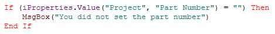
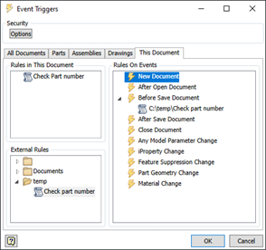

# Run “Before Save” Rule Only Once in Assemblies 

In some cases, you want to have a rule that is triggered by the “Before Save” event trigger. For example, to check if the iProperty “Part number” was set. You may get unexpected or unwanted results when you save an assembly with lots of parts that are changed. You could end up with many message boxes. One for each part that gets saved in the assembly. 

Maybe you have something like this:



You probably only need to check the part number of the file that you are trying to save.

You can solve this by checking if the active document is the same as the document that is running the rule. (in the example the active document would be the assembly. And the document that is running the rule would be the part document in the assembly). That would work like this;

```vb.net
' Add this to the start of your rule
 Dim activeDocName As String = ThisApplication.ActiveDocument.FullFileName
 Dim thisDocName As String = ThisDoc.Document.FullFileName
  
 If (activeDocName <> thisDocName) Then
     ' the script was not triggered by the active document
     Return
 End If 

```