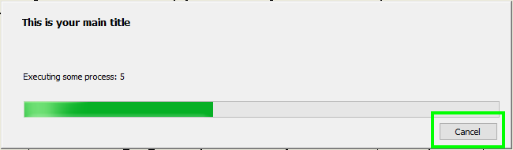

# Stop long running rule (with the progress bar). 

Just the other day someone on the "[Inventor iLogic and VB.net Forum](https://forums.autodesk.com/t5/inventor-programming-forum/ways-to-shorten-ilogic-running-time-amp-to-stop-while-ilogic-is/td-p/11293925)" asked if it's possible to stop a long-running iLogic rule. I guess, in some cases, you want to allow your users to stop an iLogic rule. Out of the box, this is not possible, but there are some functions in the Inventor API that make it possible.

Have a look at the following rule. You probably will notice that it does nothing. There are just a lot of delays but imagine that each delay is some long-running process.

```vb.net
' some process that cost 3 sec (3000 miliseconds)
System.Threading.Tasks.Task.Delay(3000).Wait()
For i = 2 To 10
	' some process that cost 1 sec (1000 miliseconds)
    System.Threading.Tasks.Task.Delay(1000).Wait()
Next
```

From a user's point of view, this is a terrible rule. If he/she runs the rule Inventor will just freeze for 12 seconds. The user does not know what is happening and how long it is going to run. We can improve this rule a lot by adding a progress bar. We can transform the rule like this to accomplish that.

```vb.net
Class ThisRule
    Private _progressBar As Inventor.ProgressBar
	
    Public Sub Main()

        _progressBar = ThisApplication.CreateProgressBar(False, 10, "This is your main title", True)

        UpDateProgress("Executing first process")
        System.Threading.Tasks.Task.Delay(3000).Wait()

        For i = 2 To 10
            UpDateProgress("Executing some process: " & i)
            System.Threading.Tasks.Task.Delay(1000).Wait()
        Next

        _progressBar.Close()
    End Sub

    Private Sub UpDateProgress(message As String)
        _progressBar.Message = message
        _progressBar.UpdateProgress()
    End Sub
End Class
```
When the user runs this rule he/she will get a nice progress bar with information like this.



Also, notice the cancel button. This option is documented in the help files but there is no example of it being used. And because it's an optional parameter it is by default turned off. On line 6 the progress bar is initialized with the cancel button but it doesn't do a thing. We need to write all the code to stop the rule ourselves.

To stop the program from running we need 2 mechanisms:

- Detect that the user wants to stop/cancel the rule and store that information
- check if the user wants to stop/cancel and act on it.

You might wonder why can't we stop the rule directly when we detect that the user wants to stop. The problem is in fact that code/functions are always read from top to bottom and only proceed to the next line if the current line is finished. Therefore if we create a line that tells the computer to wait for user input it will not finish. There is a solution to this problem. Creating multiple threads in our rule. One thread that runs the rule like we are used to. And one thread that listens for user input. The nice thing is that we already have created a second thread. Maybe it's not obvious but the progress bar runs on a new thread. But one thread can't interact with another thread directly. however, they can read from the same memory place/variable. Therefore we need to save user input on the tread with the progress bar and read it (and act on it) on the thread of the rule.

The complete script will look like this. Notice that I have added the event handler "OnCancel". (line 7) This is the function where we save the user input in the property "UserWantsToCancel". This does not stop the script therefore we read this property in a couple of places in the rule (lines 11 and 16) to check if we need to stop the script. Before I can stop the script I need to close the progress bar and maybe you want to do some more actions (like roling back some changes done to the model). Therefore I pushed all that code into 1 function "UserWantsToCancel".

```vb.net
Class ThisRule
    Private _progressBar As Inventor.ProgressBar
	
    Public Sub Main()

        _progressBar = ThisApplication.CreateProgressBar(False, 10, "This is your main title", True)
        AddHandler _progressBar.OnCancel, AddressOf OnCancel

        UpDateProgress("Executing first process")
        System.Threading.Tasks.Task.Delay(3000).Wait()
		If UserWantsToCancel Then Return
	
        For i = 2 To 10
            UpDateProgress("Executing some process: " & i)
            System.Threading.Tasks.Task.Delay(1000).Wait()
            If UserWantsToCancel Then Return
        Next

        _progressBar.Close()
    End Sub
	
	Private Sub UpDateProgress(message As String)
        _progressBar.Message = message
        _progressBar.UpdateProgress()
    End Sub
	
	' global property that can set and read by both threads.
    Private Property UserClickedOnCancel() As Boolean = False
		
	' This function is called from the main thread to check if 
	' the user clicked on the "Cancel" button
	Private Function UserWantsToCancel()
		If (UserClickedOnCancel) Then
            MsgBox("User clicked cancel and it has been detected now.")

            ' Add code here for clean exit of the rule.
			' If you work with transactions then this could be 
			' the place To role back any changes

            _progressBar.Close()
            Return True
        End If
		Return False
	End Function	

	' This sub is only called from the progress bar thread
    Private Sub OnCancel()
        MsgBox("OnCancel fired. Setting property UserClickedOnCancel.")
        UserClickedOnCancel = True
    End Sub
End Class
```