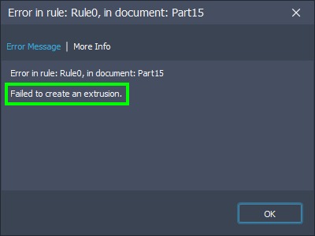
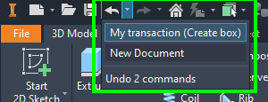

# Transactions for robust and fast rules

_"The transaction functionality is the means by which Inventor keeps track of the timeline of changes made during the course of an Inventor session. Transactions allow the user to perform Undo and Redo operations in Inventor." ([Autodesk Inventor help](https://help.autodesk.com/view/INVNTOR/2024/ENU/?guid=GUID-991ABB26-6113-4E27-83F8-1699F259772E))_  It's possible to create your own transaction. With those transactions, we can write more robust (and faster) rules.

First, what is a transaction? A transaction is a group of actions, and all actions in a transaction should be complete or all actions should be undone. A greater example of a transaction is a bank transaction. there are then 2 actions.

- Remove money from account A
- Add money to account B

A bank would get into big problems if 1 of those actions was done but not the other. If money is removed from account A and it's not added to account B then there is money lost. The customer would not be happy. Also if money isn't removed from account A but is added to account B then money was made. Probably the bank needs to pay then... So if one of the actions fails both actions should be undone.

In iLogic transactions have even more use cases:

- We can roll back to a previous state of our model. We could need that if
  - we have a line crashes in our rule.
  - if the user cancels a rule
- The user can Undo all actions done in a rule
- multiple actions grouped in 1 transaction run faster than the time needed to run all actions separately.
  - For more info see the article "[Improving Your Program’s Performance](../AddinPerformance.md)"

Now let's look at a more practical example. Have a look at the following rule. (If you want to test it run it while a part document is open.) It will create a new sketch and draws a rectangle. Also here I added some delays to mimic long-running processes. In the end, it fails to create an extrusion (it throws an exception).

```vb.net
Dim oTG As TransientGeometry = ThisApplication.TransientGeometry

Dim doc As PartDocument = ThisDoc.Document
Dim def As PartComponentDefinition = doc.ComponentDefinition

Dim plane As WorkPlane = def.WorkPlanes.Item(3)
Dim sketch As PlanarSketch = doc.ComponentDefinition.Sketches.Add(plane)
System.Threading.Tasks.Task.Delay(2000).Wait()

Dim points As New List(Of Point2d)
points.Add(oTG.CreatePoint2d(0, 0))
points.Add(oTG.CreatePoint2d(1, 0))
points.Add(oTG.CreatePoint2d(1, 1))
points.Add(oTG.CreatePoint2d(0, 1))
points.Add(oTG.CreatePoint2d(0, 0))

For i = 0 To points.Count - 2
    sketch.SketchLines.AddByTwoPoints(points(i), points(i + 1))
    System.Threading.Tasks.Task.Delay(2000).Wait()
Next

Throw New Exception("Failed to create an extrusion.")
```

The rules will fail. For this kind of situation, we have try/catch blocks. Those will make sure that the script will not crash with a nasty error warning. Like this one.



Probably you want a nice message box and in some cases, you want to roll back to the old situation as before we started the rule. For this, we can use transactions. and it would look like this:

```vb.net
Dim oTG As TransientGeometry = ThisApplication.TransientGeometry

Dim doc As PartDocument = ThisDoc.Document
Dim def As PartComponentDefinition = doc.ComponentDefinition

Dim MyTransaction As Transaction = ThisApplication.TransactionManager.StartTransaction(doc, "My transaction (Create box)")

Try
    Dim plane As WorkPlane = def.WorkPlanes.Item(3)
    Dim sketch As PlanarSketch = doc.ComponentDefinition.Sketches.Add(plane)
    System.Threading.Tasks.Task.Delay(2000).Wait()

    Dim points As New List(Of Point2d)
    points.Add(oTG.CreatePoint2d(0, 0))
    points.Add(oTG.CreatePoint2d(1, 0))
    points.Add(oTG.CreatePoint2d(1, 1))
    points.Add(oTG.CreatePoint2d(0, 1))
    points.Add(oTG.CreatePoint2d(0, 0))

    For i = 0 To points.Count - 2
        sketch.SketchLines.AddByTwoPoints(points(i), points(i + 1))
        System.Threading.Tasks.Task.Delay(2000).Wait()
    Next


    Throw New Exception("Failed to create an extrusion.")

    MyTransaction.End()
Catch ex As Exception
    MsgBox("Failed to complete MyRule. Message: " & ex.Message)
    MyTransaction.Abort()
End Try
```

Have a close look at the following lines:

|Line | Comments|
|---|---|
|6 | Here we create the transaction|
|28 | Here we end the transaction. We need to do that within the try/catch block. If we end a transaction that has been aborted we will get another exception. This will happen if there was an exception thrown inside the try/catch block.|
|31 |Here we abort the transaction. All actions will be after the start of the transaction (line 6) will be undone.|

In my previous post "[Stop long-running rule (with the progress bar)](./StopLongRunningRule.md)" I showed how you can stop a rule. It uses the cancel button on the process bar. Cancelling a process can mean more than stopping the process. It could also mean undoing any changes that were done during the process. Also for this, we can use the transactions. I have taken the result of my last post and incapsulated all logic for the progress bar, cancel button and the transaction in 1 class "Tracker". This class can be copied to any rule (If you put your rule code in a sub Main) Have a look at the example rule below and pay attention to the following.

|Line |Comments|
|---|---|
|1 ... 42 |Main sub with all normal iLogic code.|
|8 |Initialise the tracker.|
|9, 10, 11 |Settings that need to be set before the tracker is started.
|12 |Optional setting.|
|13 |Start tracker. At this point, the progress bar is created and the transaction is started.|
|17, 32 |The tracker updates the progress bar.|
|22, 35 |We check if the tracker has registered that the user wants to cancel, and stop the script if needed. The Tracker takes care of the rollback of all actions.|
|38 |Here we stop/end the tracking.|
|40 |In case of an exception that was caught the tracker aborts and rolls back all actions.|

By the way, this is what the user would see if he/she wanted to undo the action manually after the rule is finished.



```vb.net
Public Sub Main()

    Dim oTG As TransientGeometry = ThisApplication.TransientGeometry

    Dim doc As PartDocument = ThisDoc.Document
    Dim def As PartComponentDefinition = doc.ComponentDefinition

    Dim tracker As New Tracker()
    tracker.ProgressBarSteps = 5
    tracker.ProgressBarTitle = "This is your main title"
    tracker.TransactionTitle = "My transaction (Create box)"
    'tracker.MessageForUserOnCancel = "Stoped running the rule."
    tracker.Start(doc)

    Try

        tracker.Update("Create new sketch")
        Dim plane As WorkPlane = def.WorkPlanes.Item(3)
        Dim sketch As PlanarSketch = doc.ComponentDefinition.Sketches.Add(plane)
        System.Threading.Tasks.Task.Delay(2000).Wait()

        If tracker.UserWantsToCancel() Then Return

        Dim points As New List(Of Point2d)
        points.Add(oTG.CreatePoint2d(0, 0))
        points.Add(oTG.CreatePoint2d(1, 0))
        points.Add(oTG.CreatePoint2d(1, 1))
        points.Add(oTG.CreatePoint2d(0, 1))
        points.Add(oTG.CreatePoint2d(0, 0))

        For i = 0 To points.Count - 2
            tracker.Update(String.Format("Create line to point ({0}, {1})", points(i + 1).X, points(i + 1).Y))
            sketch.SketchLines.AddByTwoPoints(points(i), points(i + 1))
            System.Threading.Tasks.Task.Delay(2000).Wait()
            If tracker.UserWantsToCancel() Then Return
        Next
		
        tracker.EndTracker()
    Catch ex As Exception
        tracker.Abort("Failed to complete MyRule. Message: " & ex.Message)
    End Try
End Sub


Public Class Tracker

    Private _progressBar As Inventor.ProgressBar
    Private _transaction As Transaction

    Public Property ProgressBarTitle As String = "Don't forget to set your title"
    Public Property ProgressBarSteps As Integer = 10
    Public Property TransactionTitle As String = "Don't forget to set your transaction title"
    Public Property MessageForUserOnCancel As String = "Stoped running the rule."
    Public Property UserClickedOnCancel() As Boolean = False

    ' This sub initilizes the progress bar and the transaction
    Public Sub Start(doc As Document)
        Dim ThisApplication As Inventor.Application = doc.Parent
        _progressBar = ThisApplication.CreateProgressBar(False, ProgressBarSteps, ProgressBarTitle, True)
        AddHandler _progressBar.OnCancel, AddressOf OnCancel

        _transaction = ThisApplication.TransactionManager.StartTransaction(doc, TransactionTitle)
    End Sub

    ' This sub closes the progress bar and the transaction.
    Public Sub EndTracker()
        _transaction.End()
        _progressBar.Close()
    End Sub

    ' This sub closes the progress bar and aborts the transaction.
    Public Sub Abort(message As String)

        _transaction.Abort()
        _progressBar.Close()
        MsgBox(message)
    End Sub

    Public Sub Update(message As String)
        _progressBar.Message = message
        _progressBar.UpdateProgress()
    End Sub

    ' This function is called from the main thread to check if 
    ' the user clicked on the "Cancel" button
    Public Function UserWantsToCancel()
        If (UserClickedOnCancel) Then
            Abort(MessageForUserOnCancel)
            Return True
        End If
        Return False
    End Function

    ' This sub is only called from the progress bar thread
    Private Sub OnCancel()
        UserClickedOnCancel = True
    End Sub
		
    ' Copyright 2022
    ' 
    ' This code was written by Jelte de Jong, and published on www.hjalte.nl
    '
    ' Permission Is hereby granted, free of charge, to any person obtaining a copy of this 
    ' software And associated documentation files (the "Software"), to deal in the Software 
    ' without restriction, including without limitation the rights to use, copy, modify, merge, 
    ' publish, distribute, sublicense, And/Or sell copies of the Software, And to permit persons 
    ' to whom the Software Is furnished to do so, subject to the following conditions:
    '
    ' The above copyright notice And this permission notice shall be included In all copies Or
    ' substantial portions Of the Software.
    ' 
    ' THE SOFTWARE Is PROVIDED "AS IS", WITHOUT WARRANTY Of ANY KIND, EXPRESS Or IMPLIED, 
    ' INCLUDING BUT Not LIMITED To THE WARRANTIES Of MERCHANTABILITY, FITNESS For A PARTICULAR 
    ' PURPOSE And NONINFRINGEMENT. In NO Event SHALL THE AUTHORS Or COPYRIGHT HOLDERS BE LIABLE 
    ' For ANY CLAIM, DAMAGES Or OTHER LIABILITY, WHETHER In AN ACTION Of CONTRACT, TORT Or 
    ' OTHERWISE, ARISING FROM, OUT Of Or In CONNECTION With THE SOFTWARE Or THE USE Or OTHER 
    ' DEALINGS In THE SOFTWARE.
End Class
```