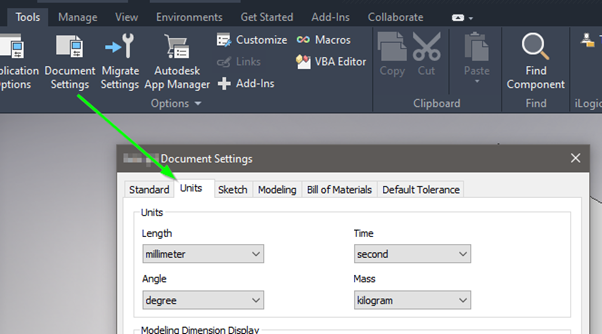
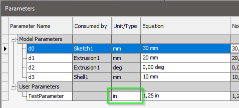
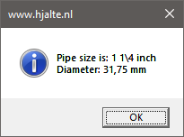

# Parameter, Document and Database Units

For a computer, a number is just that. Therefore we assign units to a parameter. But most Inventor API functions return values in internal database units. This can be confusing if you expect that all values are in the units of your document. It gets even more confusing when you have a parameter in another unit type... Let's have a look at those unit types and how to convert them to the units you need.

## Document units

These are the units that are usually set in your templates and are used in all of your documents.



## Parameter units

These are the units used in a parameter. These don’t have to be the same units as specified in your document.



## Database units

So as users we can use the units that we like but Internally, Inventor uses a consistent set of units regardless of what has been specified in the document or parameter. The internal units used by Inventor for the various types of units are listed below:

|Category |Unit|
|---|---|
|Mass |Kilogram|
|Length |Centimeter|
|Time |Seconds|
|Temperature |Kelvin|
|Angle |Radian|

These internal units are called: “Database units”. A regular user never has to deal with those  “Database units” but when we are creating iLogic rules and especially if we are using the Inventor API we get to deal with them.

## One class to convert them all

Using these “Database units” has the advantage that you never have to worry about the settings of the user. But the inventor API and especially iLogic doesn’t always return “Database units”. Also, you might want to display the result of a calculation to your user. For all those situations you need to convert your values.  Therefore it’s useful to be familiar with the “UnitsOfMeasure” class. This class helps can help you with all kinds of unit conversions.

Now we got that out of the way let’s have a look at an example. Let's imagine the following situation. You have a parameter for a pipe in [inch] the document units are [mm]. And you want to show the user a dialogue like this:



When we get the parameter, we directly run into problems. The parameter object has 3 properties that return a value. Have a look at the following rule:

```vb.net
Dim doc As PartDocument = ThisDoc.Document
Dim param As [Parameter] = doc.ComponentDefinition.Parameters.Item("TestParameter")
Logger.Info(param.Value & " < -- Value is in database units [cm]")
Logger.Info(param.ModelValue & " < -- ModelValue is in database units [cm]")
Logger.Info(param.Expression & " < -- Expression is a string that includes the units as specified in document [mm]")
```

My log shows me this:


All properties return decimal values but we would like values in fractions for the pipe size. The properties “Value” and “ModelValue” are in [cm] and need to be converted to [mm] and [inch]. The property “Expression” returns a string in a format that we don’t need and can't convert.

To solve all our problems I propose the following 2 functions.

The function “GetRealParameterValue()” will get the parameter value and by default convert it from database units to the units of the parameter. But you can also specify the units type that you need. Although these functions can be very useful on their own. I encourage you to have a look at how the function works. The functions used in the function on their own can also be very useful.

The function ” GetValueAsFractions()” will convert a given decimal value to a fractional value. The function will only consider the following values for the denominator: 2, 4 ,8 ,16, 32 and 64. (This value will be presented in a string so you can't do any calculations on it anymore.)

With those functions, we can create the following iLogic rule the get our dialogue. This rule on its own is probably not very useful. But I wanted to show how you can convert units using the Inventor API and display them as fractions. Also, have a look at the following constants of the enum "UnitsTypeEnum".

```vb.net
UnitsTypeEnum.kDefaultDisplayAngleUnits
UnitsTypeEnum.kDefaultDisplayLengthUnits
UnitsTypeEnum.kDefaultDisplayMassUnits
UnitsTypeEnum.kDefaultDisplayTemperatureUnits
UnitsTypeEnum.kDefaultDisplayTimeUnits
```

 When you use these constants inventor will use the default document units. For example, you can use these in the function: "UnitsOfMeasure.ConvertUnits()"

 ```vb.net
Public Sub Main()
	Dim doc As PartDocument = ThisDoc.Document
    Dim param As [Parameter] = doc.ComponentDefinition.Parameters.Item("TestParameter")
	
    Dim uom = doc.UnitsOfMeasure
    Dim valueInParameterUnits As Double = GetRealParameterValue(doc, param)
    Dim valueAsFration As String = GetValueAsFractions(valueInParameterUnits)
    Dim documentLengthUnit As UnitsTypeEnum = UnitsTypeEnum.kDefaultDisplayLengthUnits
    Dim valueInDocumetUnits As Double = GetRealParameterValue(doc, param, documentLengthUnit)
    Dim documentUnits As String = uom.GetStringFromType(documentLengthUnit)
	
	MsgBox("Pipe size is: " & valueAsFration & " " & param.Units & System.Environment.NewLine &
               "Diameter: " & valueInDocumetUnits & " " & documentUnits,
               MsgBoxStyle.Information, "www.hjalte.nl")
End Sub

Public Function GetRealParameterValue(doc As Document, 
            param As [Parameter], 
            Optional outputUnit As UnitsTypeEnum = Nothing) As Double
    Dim uom = doc.UnitsOfMeasure
    If (outputUnit = Nothing) Then
        outputUnit = uom.GetTypeFromString(param.Units)
    End If
    Dim databaseUnitStr As String = uom.GetDatabaseUnitsFromExpression(
            param.Expression, param.Units)
    Dim databaseUnit As UnitsTypeEnum = uom.GetTypeFromString(databaseUnitStr)
    Dim value As Double = uom.ConvertUnits(param.Value,
                    databaseUnit, outputUnit)
    Return value
End Function

Public Function GetValueAsFractions(value As Double) As String
    Dim precission As Double = 0.0000001


    Dim intValue As Integer = Convert.ToInt32(Math.Floor(value))
    Dim fraction As Double = value - intValue

    For i As Integer = 1 To 6
        Dim denominator As Integer = 2 ^ i
        Dim numerator As Double = denominator * fraction
        Dim numeratorInt As Integer = System.Convert.ToInt32(numerator)

        If (Math.Abs(numerator - numeratorInt) < precission) Then
            If (intValue > 0) Then '
                Return String.Format("{0} {1}\{2}", intValue, numeratorInt, denominator)
            Else
                Return String.Format("{0}/{1}", numeratorInt, denominator)
            End If


        End If
    Next

    Return value
End Function
 ```

 References

- [https://adndevblog.typepad.com/manufacturing/2012/06/get-the-display-value-of-the-parameter-in-inventor.html](https://adndevblog.typepad.com/manufacturing/2012/06/get-the-display-value-of-the-parameter-in-inventor.html)
- [https://help.autodesk.com/view/INVNTOR/2020/ENU/?guid=GUID-60CADB1E-DB85-4A7D-8380-7C4FFFE558D8](https://help.autodesk.com/view/INVNTOR/2020/ENU/?guid=GUID-60CADB1E-DB85-4A7D-8380-7C4FFFE558D8)

