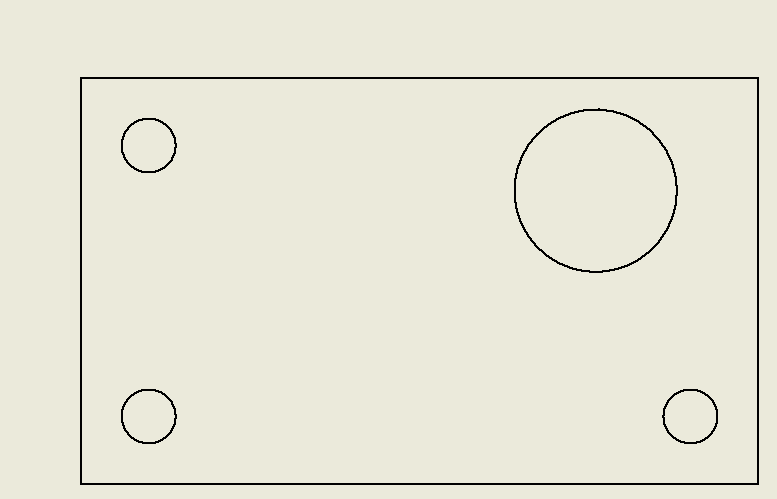
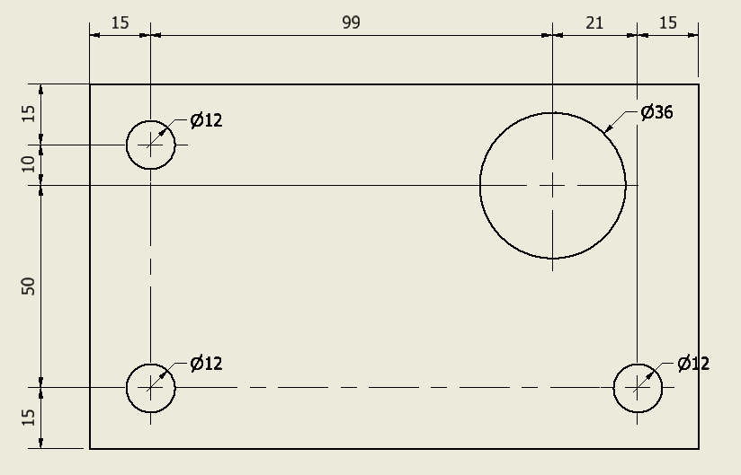
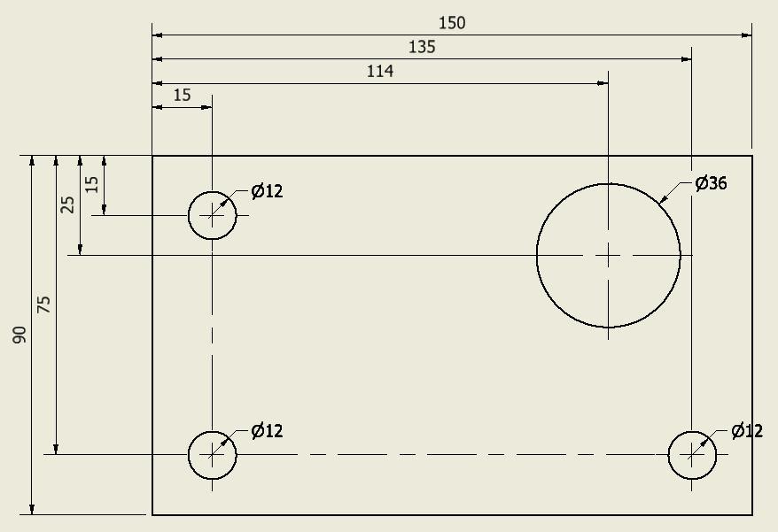

# Automatically generate hole position dimensions

In my last blog post, I proposed an iLogic rule that generated the overall dimensions. After that, I was contacted by someone on the "[Inventor iLogic, API & VBA Forum](https://forums.autodesk.com/t5/inventor-programming-forum/modification-of-overall-dimension-code/m-p/10583919#M128256)" about that post. He asked for some modifications. Someone else also joined in and after some drinks, I got challenged to write a new rule that could "mark the dimensions of the holes (in a drawing)".

I like a challenge and I accepted it. I thought I could do it with some small modifications to my [previous code](./generateOverallDimensions.md) but in the end, I needed to add quite a lot of code. But what I got was a nice general usages tool. Which doesn't only generate hole coordinate dimensions but can turn this:



into this:


or


This rule has the following features:

- Generating (vertical and horizontal) hole position dimensions. (Line 25, 26)
  - inline or stacked can be changed by setting the boolean "_stackedDimensions" to True/False (Line 10)
  -The distance from the view to the "dimension"-text can be set by the variable "_firstOffset" (Line 11)
  - The distance between dimensions can be set by the variable "_offsetDimension" (Line 12. Used for stacked dimensions)
- Generating center marks and centerlines between holes (Line 27)
- Generating hole diameter dimensions (Line 28)
- Generating (vertical and horizontal) outer dimensions (Line 28, 29. Disabled by default )

Because of the setup of the rule, you can easily adapt the rule to your needs by changing value's or by "commenting outlines". ("Commenting outlines" is done by putting a ' before the function call. Like I did on lines 28 and 29)

```vb.net
Public Class ThisRule

    Private _doc As DrawingDocument
    Private _sheet As Sheet
    Private _view As DrawingView
    Private _intents As List(Of GeometryIntent) = New List(Of GeometryIntent)()
    Private _centerPointIntents As List(Of GeometryIntent) = New List(Of GeometryIntent)()

    ' Some settings here for you to change. 
    Private _stackedDimensions As Boolean = False
    Private _firstOffset As Double = 1.2 'Cm
    Private _offsetDimension As Double = 0.6 'Cm

    Public Sub Main()
        _doc = ThisDoc.Document
        _sheet = _doc.ActiveSheet
        _view = ThisApplication.CommandManager.Pick(
                       SelectionFilterEnum.kDrawingViewFilter,
                       "Select a drawing view")

        Dim transaction As Transaction = ThisApplication.TransactionManager.StartTransaction(_doc, "Generate dimensions")
        CreateIntentList()

        ' Comment out features that you dont want/need!
        CreateHorizontalDimensions()
        CreateVerticalDimensions()
        CreateMarks()
        AddDiameterDimensionToCircles()
        ' createHorizontalOuterDimension()
        ' createVerticalOuterDimension()

        transaction.End()
    End Sub


    Public Sub CreateHorizontalDimensions()
        Dim orderedIntents = _intents.OrderBy(Function(s) s.PointOnSheet.X)
        Dim orderedCenterIntents = _centerPointIntents.OrderBy(Function(s) s.PointOnSheet.X)

        Dim pointLeft = orderedIntents.First
        Dim pointRight = Nothing
        Dim lastX = pointLeft.PointOnSheet.X
        Dim offset As Double = _firstOffset
        For Each intent As GeometryIntent In orderedCenterIntents
            pointRight = intent
            If (AreEqual(pointRight.PointOnSheet.X, lastX)) Then
                Continue For
            End If
            CreateHorizontalDimension(pointLeft, pointRight, offset)
            If _stackedDimensions Then
                offset = offset + _offsetDimension
            Else
                pointLeft = pointRight
            End If
            lastX = pointRight.PointOnSheet.X
        Next
        pointRight = orderedIntents.Last

        CreateHorizontalDimension(pointLeft, pointRight, offset)

    End Sub
    Private Sub CreateHorizontalDimension(pointLeft As GeometryIntent,
                                          pointRight As GeometryIntent,
                                          distanceFromView As Double)
        Dim textX = pointLeft.PointOnSheet.X +
                (pointRight.PointOnSheet.X - pointLeft.PointOnSheet.X) / 2
        Dim textY = _view.Position.Y + _view.Height / 2 + distanceFromView

        Dim pointText = ThisApplication.TransientGeometry.CreatePoint2d(textX, textY)
        _sheet.DrawingDimensions.GeneralDimensions.AddLinear(
            pointText, pointLeft, pointRight, DimensionTypeEnum.kHorizontalDimensionType)
    End Sub
    Private Sub CreateHorizontalOuterDimension()
        Dim orderedIntents = _intents.OrderByDescending(Function(s) s.PointOnSheet.X)

        Dim pointLeft = orderedIntents.First
        Dim pointRight = orderedIntents.Last

        CreateHorizontalDimension(pointLeft, pointRight, _firstOffset - _offsetDimension)
    End Sub

    Public Sub CreateVerticalDimensions()
        Dim orderedIntents = _intents.OrderByDescending(Function(s) s.PointOnSheet.Y)
        Dim orderedCenterIntents = _centerPointIntents.OrderByDescending(Function(s) s.PointOnSheet.Y)

        Dim pointLeft = orderedIntents.First
        Dim pointRight = Nothing
        Dim lastY = pointLeft.PointOnSheet.Y
        Dim offset As Double = _firstOffset
        For Each intent As GeometryIntent In orderedCenterIntents
            pointRight = intent
            If (AreEqual(pointRight.PointOnSheet.Y, lastY)) Then
                Continue For
            End If
            CreateVerticalDimension(pointLeft, pointRight, offset)
            If _stackedDimensions Then
                offset = offset + _offsetDimension
            Else
                pointLeft = pointRight
            End If
            lastY = pointRight.PointOnSheet.Y
        Next
        pointRight = orderedIntents.Last

        CreateVerticalDimension(pointLeft, pointRight, offset)

    End Sub

    Private Sub CreateMarks()
        Dim done As List(Of GeometryIntent) = New List(Of GeometryIntent)()
        Dim orderedCenterIntents = _centerPointIntents.OrderByDescending(Function(s) s.PointOnSheet.Y)
        Dim firstIntent = orderedCenterIntents(0)
        Dim secondIntent = Nothing
        For i = 1 To orderedCenterIntents.Count - 1
            secondIntent = orderedCenterIntents(i)
            If (AreEqual(firstIntent.PointOnSheet.Y, secondIntent.PointOnSheet.Y)) Then
                CreateCenterLine(firstIntent, secondIntent)
                done.Add(firstIntent)
                done.Add(secondIntent)
            End If
            firstIntent = secondIntent
        Next

        orderedCenterIntents = _centerPointIntents.OrderByDescending(Function(s) s.PointOnSheet.X)
        firstIntent = orderedCenterIntents(0)
        secondIntent = Nothing
        For i = 1 To orderedCenterIntents.Count - 1
            secondIntent = orderedCenterIntents(i)
            If (AreEqual(firstIntent.PointOnSheet.X, secondIntent.PointOnSheet.X)) Then
                CreateCenterLine(firstIntent, secondIntent)
                done.Add(firstIntent)
                done.Add(secondIntent)
            End If
            firstIntent = secondIntent
        Next

        For Each intent As GeometryIntent In orderedCenterIntents
            If (done.Contains(intent)) Then
                Continue For
            End If
            _sheet.Centermarks.Add(intent)
        Next

    End Sub
    Public Sub CreateCenterLine(pointLeft As GeometryIntent, pointRight As GeometryIntent)
        Dim collection = ThisApplication.TransientObjects.CreateObjectCollection()
        collection.Add(pointLeft)
        collection.Add(pointRight)
        _sheet.Centerlines.Add(collection)
    End Sub

    Private Sub CreateVerticalDimension(pointLeft As GeometryIntent,
                                        pointRight As GeometryIntent,
                                        distanceFromView As Double)

        Dim textY = pointLeft.PointOnSheet.Y +
                (pointRight.PointOnSheet.Y - pointLeft.PointOnSheet.Y) / 2
        Dim textX = _view.Position.X - _view.Width / 2 - distanceFromView

        Dim pointText = ThisApplication.TransientGeometry.CreatePoint2d(textX, textY)
        _sheet.DrawingDimensions.GeneralDimensions.AddLinear(
            pointText, pointLeft, pointRight, DimensionTypeEnum.kVerticalDimensionType)
    End Sub
    Private Sub CreateVerticalOuterDimension()
        Dim orderedIntents = _intents.OrderByDescending(Function(s) s.PointOnSheet.Y)

        Dim pointLeft = orderedIntents.Last
        Dim pointRight = orderedIntents.First

        CreateVerticalDimension(pointLeft, pointRight, _firstOffset - _offsetDimension)

    End Sub

    Private Sub AddIntent(Geometry As DrawingCurve, IntentPlace As Object, onLineCheck As Boolean)
        Dim intent As GeometryIntent = _sheet.CreateGeometryIntent(Geometry, IntentPlace)
        If intent.PointOnSheet Is Nothing Then Return

        If onLineCheck Then
            If (IntentIsOnCurve(intent)) Then
                _intents.Add(intent)
            End If
        Else
            _intents.Add(intent)
        End If
    End Sub

    Private Function IntentIsOnCurve(intent As GeometryIntent) As Boolean
        Dim Geometry As DrawingCurve = intent.Geometry
        Dim sp = intent.PointOnSheet

        Dim pts(1) As Double
        Dim gp() As Double = {}
        Dim md() As Double = {}
        Dim pm() As Double = {}
        Dim st() As SolutionNatureEnum = {}
        pts(0) = sp.X
        pts(1) = sp.Y

        Try
            Geometry.Evaluator2D.GetParamAtPoint(pts, gp, md, pm, st)
        Catch ex As Exception
            Return False
        End Try
        Return True
    End Function

    Private Sub CreateIntentList()

        For Each drawingCurve As DrawingCurve In _view.DrawingCurves
            Select Case DrawingCurve.ProjectedCurveType
                Case _
                        Curve2dTypeEnum.kCircleCurve2d,
                        Curve2dTypeEnum.kCircularArcCurve2d,
                        Curve2dTypeEnum.kEllipseFullCurve2d,
                        Curve2dTypeEnum.kEllipticalArcCurve2d

                    AddIntent(DrawingCurve, PointIntentEnum.kCircularTopPointIntent, True)
                    AddIntent(DrawingCurve, PointIntentEnum.kCircularBottomPointIntent, True)
                    AddIntent(DrawingCurve, PointIntentEnum.kCircularLeftPointIntent, True)
                    AddIntent(DrawingCurve, PointIntentEnum.kCircularRightPointIntent, True)

                    AddIntent(DrawingCurve, PointIntentEnum.kEndPointIntent, False)
                    AddIntent(DrawingCurve, PointIntentEnum.kStartPointIntent, False)

                    If (DrawingCurve.ProjectedCurveType = Curve2dTypeEnum.kCircleCurve2d) Then
                        Dim intent = _sheet.CreateGeometryIntent(DrawingCurve, PointIntentEnum.kCenterPointIntent)
                        _centerPointIntents.Add(intent)
                    End If
                Case _
                        Curve2dTypeEnum.kLineCurve2d,
                        Curve2dTypeEnum.kLineSegmentCurve2d

                    AddIntent(DrawingCurve, PointIntentEnum.kEndPointIntent, False)
                    AddIntent(DrawingCurve, PointIntentEnum.kStartPointIntent, False)

                Case _
                    Curve2dTypeEnum.kPolylineCurve2d,
                    Curve2dTypeEnum.kBSplineCurve2d,
                    Curve2dTypeEnum.kUnknownCurve2d

                    ' Unhandled curves types
                Case Else
            End Select
        Next
    End Sub


    Private Sub AddDiameterDimensionToCircles()
        For Each intent As GeometryIntent In _intents
            Dim geo = intent.Geometry
            If (geo.type <> ObjectTypeEnum.kDrawingCurveObject) Then
                Continue For
            End If
            Dim curve As DrawingCurve = geo
            If (curve.ProjectedCurveType <> Curve2dTypeEnum.kCircleCurve2d) Then
                Continue For
            End If
            Dim rangeBox = curve.Evaluator2D.RangeBox
            Dim radius = (rangeBox.MaxPoint.X - rangeBox.MinPoint.X) / 2
            Dim x = curve.CenterPoint.X + radius
            Dim y = curve.CenterPoint.Y + radius
            Dim textPoint = ThisApplication.TransientGeometry.CreatePoint2d(x, y)
            _sheet.DrawingDimensions.GeneralDimensions.AddDiameter(textPoint, intent)
        Next
    End Sub

    Private Function AreEqual(d1 As Double, d2 As Double)
        Return (Math.Abs(d1 - d2) < 0.000001)
    End Function

    ' Copyright 2021
    ' 
    ' This code was written by Jelte de Jong, and published on www.hjalte.nl
    '
    ' Permission Is hereby granted, free of charge, to any person obtaining a copy of this 
    ' software And associated documentation files (the "Software"), to deal in the Software 
    ' without restriction, including without limitation the rights to use, copy, modify, merge, 
    ' publish, distribute, sublicense, And/Or sell copies of the Software, And to permit persons 
    ' to whom the Software Is furnished to do so, subject to the following conditions:
    '
    ' The above copyright notice And this permission notice shall be included In all copies Or
    ' substantial portions Of the Software.
    ' 
    ' THE SOFTWARE Is PROVIDED "AS IS", WITHOUT WARRANTY Of ANY KIND, EXPRESS Or IMPLIED, 
    ' INCLUDING BUT Not LIMITED To THE WARRANTIES Of MERCHANTABILITY, FITNESS For A PARTICULAR 
    ' PURPOSE And NONINFRINGEMENT. In NO Event SHALL THE AUTHORS Or COPYRIGHT HOLDERS BE LIABLE 
    ' For ANY CLAIM, DAMAGES Or OTHER LIABILITY, WHETHER In AN ACTION Of CONTRACT, TORT Or 
    ' OTHERWISE, ARISING FROM, OUT Of Or In CONNECTION With THE SOFTWARE Or THE USE Or OTHER 
    ' DEALINGS In THE SOFTWARE.
End Class
```