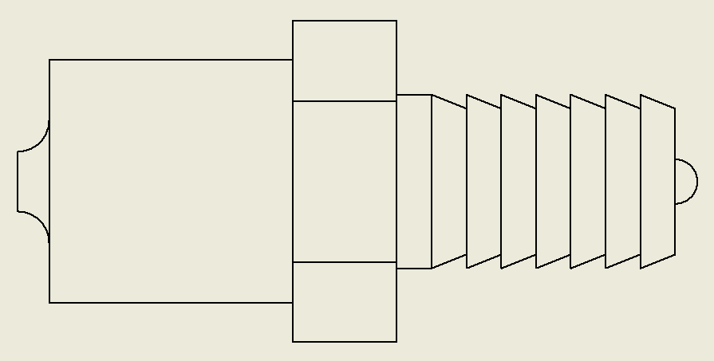
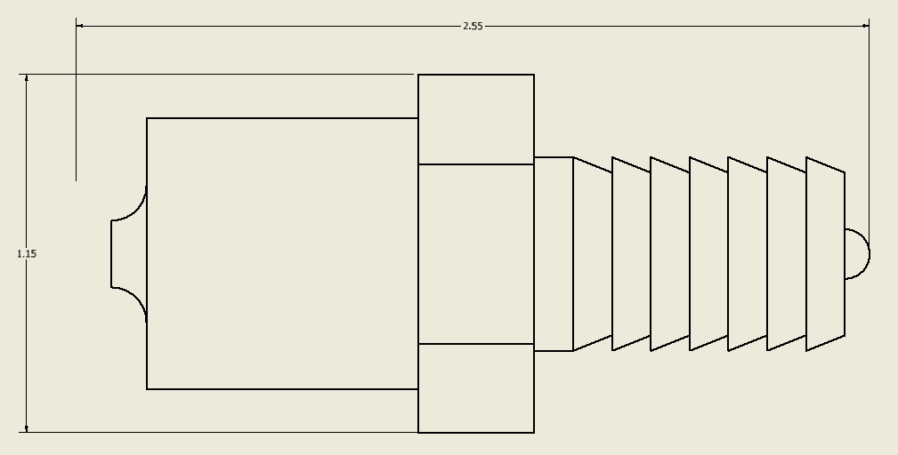
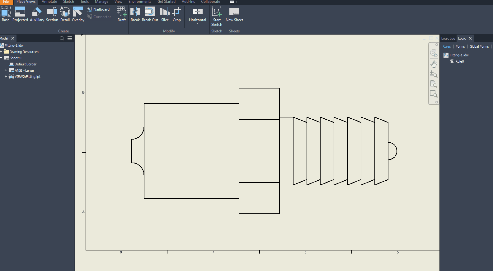

# Automatically generate overall dimensions

The company I work for has the policy that each drawing needs the overall dimensions of the part/assembly on the sheet. Years ago I created a tool that would generate the outer dimensions in a drawing view. It works okay, but I was not satisfied with the result. It is slow and there are edge cases in which you will get unexpected results. Last week I did have a new idea and wrote a new function. This new function works better!

Have a look at the following drawing view. (It's a side view of a fitting, but I added some features to make my points more clear.)



In my old code, I only use straight curves, because I could **only** find out how to get the start and endpoint of a line. As you can see in the view the most right point is a point on an arc curve. And the start and endpoint would not give new information over the straight lines. Therefore my old code only used straight lines.  But a few weeks ago I saw a post on the "Inventor iLogic, API & VBA Forum" in which someone created intents on the top, bottom, left and right points of an arc. Creating an intents list instead of a list of arcs and trying to figure out which can be used for the overall dimensions is more efficient. but I got a bit unexpected results.... (See the following drawing view.)



As you can see the right intent on the arc on the right side is found correct. but on the left side, an intent was found that is not on the arc curve. As you can see the function "Sheet.CreateGeometryIntent(Geometry, IntentPlace)" can create intents that are not on the curve. And Inventor is able to create dimensions using this intent. This is interesting because in normal use you would not be able to select this point for creating dimensions. This problem can be solved by checking if an intent is on the curve. The best function that i could think of is "Geometry.Evaluator2D.GetParamAtPoint()". This function takes a point and returns the Param but will throw an exception if the point is not on the curve. With this last addition, I got results that I'm happy with. Using the rules I created is easy just start the rule and select a drawing view.



And here is the complete code:

```vb.net
Public Class ThisRule
	' This code was written by Jelte de Jong
	' and published on www.hjalte.nl
    Private _doc As DrawingDocument
    Private _sheet As Sheet
    Private _view As DrawingView
    Private _intents As List(Of GeometryIntent) = New List(Of GeometryIntent)()

    Sub Main()
        _doc = ThisDoc.Document
        _sheet = _doc.ActiveSheet
        _view = ThisApplication.CommandManager.Pick(
                       SelectionFilterEnum.kDrawingViewFilter, 
                       "Select a drawing view")

        CreateIntentList()
        createHorizontalOuterDimension()
        createVerticalOuterDimension()
    End Sub

    Private Sub createHorizontalOuterDimension()
        Dim orderedIntents = _intents.OrderByDescending(Function(s) s.PointOnSheet.X)

        Dim pointLeft = orderedIntents.First
        Dim pointRight = orderedIntents.Last

        Dim textX = pointLeft.PointOnSheet.X +
                (pointRight.PointOnSheet.X - pointLeft.PointOnSheet.X) / 2
        Dim textY = _view.Position.Y + _view.Height / 2 + 2

        Dim pointText = ThisApplication.TransientGeometry.CreatePoint2d(textX, textY)
        _sheet.DrawingDimensions.GeneralDimensions.AddLinear(
            pointText, pointLeft, pointRight, DimensionTypeEnum.kHorizontalDimensionType)
    End Sub
    Private Sub createVerticalOuterDimension()
        Dim orderedIntents = _intents.OrderByDescending(Function(s) s.PointOnSheet.Y)

        Dim pointLeft = orderedIntents.Last
        Dim pointRight = orderedIntents.First

        Dim textY = pointLeft.PointOnSheet.Y +
                (pointRight.PointOnSheet.Y - pointLeft.PointOnSheet.Y) / 2
        Dim textX = _view.Position.X - _view.Width / 2 - 2

        Dim pointText = ThisApplication.TransientGeometry.CreatePoint2d(textX, textY)
        _sheet.DrawingDimensions.GeneralDimensions.AddLinear(
            pointText, pointLeft, pointRight, DimensionTypeEnum.kVerticalDimensionType)
    End Sub

    Private Sub addIntent(Geometry As DrawingCurve, IntentPlace As Object, onLineCheck As Boolean)
        Dim intent As GeometryIntent = _sheet.CreateGeometryIntent(Geometry, IntentPlace)
        If intent.PointOnSheet Is Nothing Then Return

        If onLineCheck Then
            If (IntentIsOnCurve(intent)) Then
                _intents.Add(intent)
            End If
        Else
            _intents.Add(intent)
        End If
    End Sub

    Private Function IntentIsOnCurve(intent As GeometryIntent) As Boolean
        Dim Geometry As DrawingCurve = intent.Geometry
        Dim sp = intent.PointOnSheet

        Dim pts(1) As Double
        Dim gp() As Double = {}
        Dim md() As Double = {}
        Dim pm() As Double = {}
        Dim st() As SolutionNatureEnum = {}
        pts(0) = sp.X
        pts(1) = sp.Y

        Try
            Geometry.Evaluator2D.GetParamAtPoint(pts, gp, md, pm, st)
        Catch ex As Exception
            Return False
        End Try
        Return True
    End Function

    Private Sub CreateIntentList()

        For Each oDrawingCurve As DrawingCurve In _view.DrawingCurves
            Select Case oDrawingCurve.ProjectedCurveType
                Case _
                        Curve2dTypeEnum.kCircleCurve2d,
                        Curve2dTypeEnum.kCircularArcCurve2d,
                        Curve2dTypeEnum.kEllipseFullCurve2d,
                        Curve2dTypeEnum.kEllipticalArcCurve2d

                    addIntent(oDrawingCurve, PointIntentEnum.kCircularTopPointIntent, True)
                    addIntent(oDrawingCurve, PointIntentEnum.kCircularBottomPointIntent, True)
                    addIntent(oDrawingCurve, PointIntentEnum.kCircularLeftPointIntent, True)
                    addIntent(oDrawingCurve, PointIntentEnum.kCircularRightPointIntent, True)

                    addIntent(oDrawingCurve, PointIntentEnum.kEndPointIntent, False)
                    addIntent(oDrawingCurve, PointIntentEnum.kStartPointIntent, False)

                Case _
                        Curve2dTypeEnum.kLineCurve2d,
                        Curve2dTypeEnum.kLineSegmentCurve2d

                    addIntent(oDrawingCurve, PointIntentEnum.kEndPointIntent, False)
                    addIntent(oDrawingCurve, PointIntentEnum.kStartPointIntent, False)

                Case _
                    Curve2dTypeEnum.kPolylineCurve2d,
                    Curve2dTypeEnum.kBSplineCurve2d,
                    Curve2dTypeEnum.kUnknownCurve2d

                    ' Unhandled curves types
                Case Else
            End Select
        Next
    End Sub

    ' Copyright 2021
    ' 
    ' This code was written by Jelte de Jong, and published on www.hjalte.nl
    '
    ' Permission Is hereby granted, free of charge, to any person obtaining a copy of this 
    ' software And associated documentation files (the "Software"), to deal in the Software 
    ' without restriction, including without limitation the rights to use, copy, modify, merge, 
    ' publish, distribute, sublicense, And/Or sell copies of the Software, And to permit persons 
    ' to whom the Software Is furnished to do so, subject to the following conditions:
    '
    ' The above copyright notice And this permission notice shall be included In all copies Or
    ' substantial portions Of the Software.
    ' 
    ' THE SOFTWARE Is PROVIDED "AS IS", WITHOUT WARRANTY Of ANY KIND, EXPRESS Or IMPLIED, 
    ' INCLUDING BUT Not LIMITED To THE WARRANTIES Of MERCHANTABILITY, FITNESS For A PARTICULAR 
    ' PURPOSE And NONINFRINGEMENT. In NO Event SHALL THE AUTHORS Or COPYRIGHT HOLDERS BE LIABLE 
    ' For ANY CLAIM, DAMAGES Or OTHER LIABILITY, WHETHER In AN ACTION Of CONTRACT, TORT Or 
    ' OTHERWISE, ARISING FROM, OUT Of Or In CONNECTION With THE SOFTWARE Or THE USE Or OTHER 
    ' DEALINGS In THE SOFTWARE.
End Class
```

Some last thoughts.

- This rule will still fail if you use polylines and splines.
- If you use Inventor 2021 or later you might want to consider using managed dimension. this will prevent dimensions that are stacked on top of each other if you run the rule multiple times.
