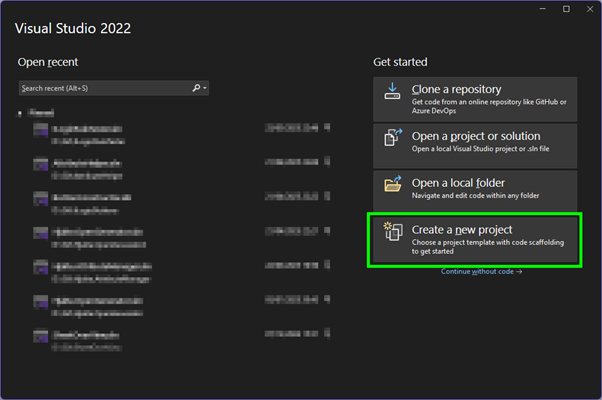
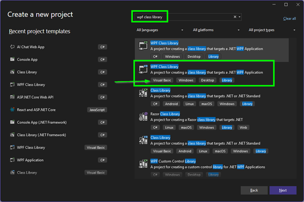
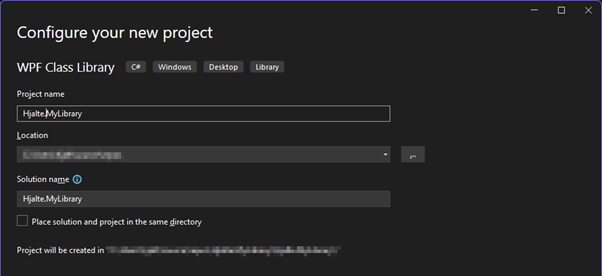
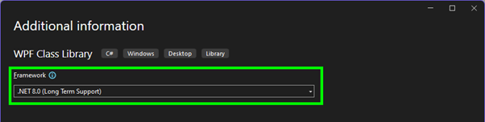
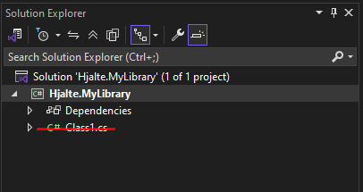

## Create a Project

Most tutorial assumes you have **Visual Studio 2022** installed. 
If not, you can find [installation instructions here](./installVS.md).

Start Visual Studio and create a new project.

### Choose the Right Template

Search for the "**WPF Class Library**" template and select it with **Visual Basic (VB)** as the language.

> 🛠️ Why Visual Basic?  
> The Inventor API is primarily documented in **VB.NET**, and iLogic rules are also written in VB. Using the same language makes it easier to copy and adapt code between your DLL and your rules.  
> 
> If you prefer **C#**, that’s also supported. C# (pronounced "C-sharp") is another .NET language developed by Microsoft. It’s more widely used in general software development and has a slightly different syntax than VB.  
> 
> All tutorials in this wiki focus on **VB.NET**, but the same concepts usually apply to C# as well.

We’re using a **WPF Class Library** because it lets you build custom user interfaces. If you're not planning to create UI elements (like dialogs or forms), a regular **Class Library** is enough.

> ⚠️ About WinForms  
> **WinForms** (Windows Forms) is an older technology for building desktop interfaces. It still works fine with Inventor versions up to **2024**, and might work in newer versions with some extra steps.  
>  
> However, **WPF** (Windows Presentation Foundation) is the modern alternative. It offers better support for newer .NET versions (like .NET 8 in Inventor 2025), and gives you more flexibility in designing user interfaces.  
>  
> In short:  
> - **WinForms** is simpler and more limited  
> - **WPF** is more powerful and future-proof  

Set the name for your project.

On the next screen, select the “.NET 8.0” framework, which matches Inventor 2025 and later.
If you don’t see this option, modify your Visual Studio installation to include the “.NET 8.0 runtime” component.

A new project is created, but it’s not finished yet. Delete the file “Class1.vb. (That probably means deleting all files in your solution explorer.)

