# Creating an addin (Inventor 2025 and later)
This tutorial is all about building your own Inventor add-in—completely from scratch. While there are plenty of tutorials out there (and even handy Visual Studio templates like the one from [Ekins Solutions](https://ekinssolutions.com/nifty_addin_template/). This guide takes a different approach.
We won’t be using templates or shortcuts. Instead, we’ll manually set up everything. Why? Because I want to show you all the settings and configurations involved. This way, you’re not tied to specific defaults, Inventor or Visual Studio versions, or even a particular programming language.
The goal is to give you a fully functional and useful add-in by the end of this tutorial. I also want you to be able to tweak and expand its functionality with ease. That said, I won’t spend too much time explaining what the add-in actually does. To keep things focused, I’ve chosen to convert my iLogic rule [“One Rule to Search Them All”](http://www.hjalte.nl/22-one-rule-to-search-them-all) 

into an add-in. If you're curious about the rule’s functionality, feel free to check out the blog post. Here, we’ll stay focused on the add-in creation process.
Now, you might be wondering: if iLogic already lets you create buttons for rules, why bother with add-ins?
Here’s when I usually go for an add-in:

 - The code is too large or complex for an iLogic rule
 - I need to present a more polished or custom user interface
 - I want Inventor to respond to events beyond just button clicks or the limited built-in iLogic triggers

In this tutorial, I’ll walk you through exactly where and how to write your code. If you get stuck—or just want to skip ahead and see the finished result—you can download the complete project from my GitHub page.
One last thing: this isn’t a beginner programming tutorial. I’m assuming you already have some experience, like writing iLogic rules. If that sounds like you, you’re in the right place.

# Setup the project
Start with [creating a new project.](./CreatNewProject.md)

Go to the “Add Project Reference...” screen.


Browse and select the following files:
 - C:\Program Files\Autodesk\Inventor [VERSION]\Bin\Autodesk.Inventor.Interop.dll
 
The following iLogic dll’s are only needed if you are going to use the iLogic function.
 - C:\Program Files\Autodesk\Inventor [VERSION]\Bin\Autodesk.iLogic.Interfaces.dll
 - C:\Program Files\Autodesk\Inventor [VERSION]\Bin\Autodesk.iLogic.Runtime.dll


For the **Autodesk.Inventor.Interop.dll** reference you need to set the properties “Embed Interop Types” to "False", “Copy Local” to "True".


For almost all addins you need the package **System.Drawing.Common**. (The only situation I can think of that you don't need it, is when you don't use any icons or forms in your addin...) Therefore select **Tools**, **NuGet package manager** and **Manage NuGet packages for solution...**

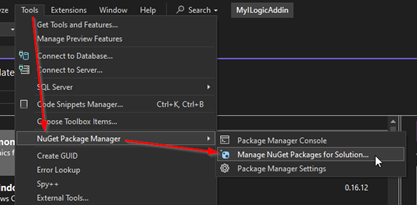

Search for the package **System.Drawing.Common** and install it for the projects in your solution.

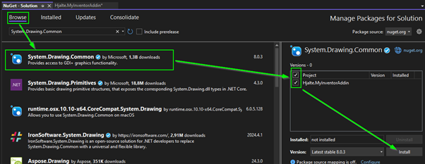

# Set compile events
When your addin is compiled then in needs to be installed so Inventor can use it. Go to the “Project Properties”.

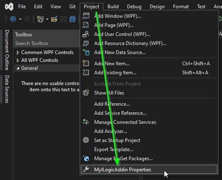

Most likely the following settings are set correctly but it’s good to double-check the following settings. 

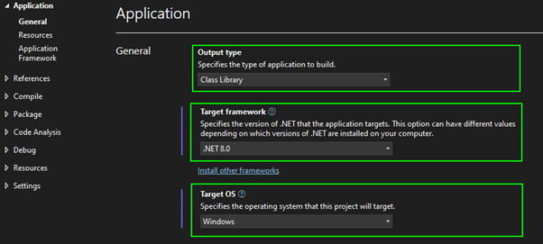

Next, we need to make sure that the addin files are copied to the correct location. Addin files can go in a couple of places.

 - All Users, Version Independent
   - %ALLUSERSPROFILE%\Autodesk\Inventor Addins\
 - All Users, Version Dependent
   - %PROGRAMFILES%\Autodesk\Inventor 20xx\Bin\Addins\
   - I noticed that you need local admin rights on your computer to write to this folder. If you don't have those "rights" then Visual Studio will stop the building process when you try to debug your addin!
 - Per User, Version Dependent
   - %APPDATA%\Autodesk\Inventor 20xx\Addins\
 - Per User, Version Independent
   - %APPDATA%\Autodesk\ApplicationPlugins

You need to copy at least the *.addin file and your addin dll file to one of these locations. You can do that by adding the following lines to the "Post-build events".

```vb
XCopy "$(TargetPath)" "[TARGET LOCATION]\$(TargetName)\" /Y /R
XCopy "$(ProjectDir)[YOUR ADDIN NAME].addin" "[TARGET LOCATION]\$(TargetName)\" /Y /R
```

Make sure you change the information between the **[square brackets]**.

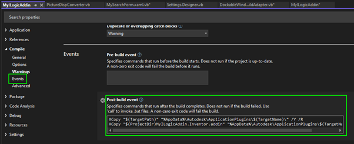

## Set compile events (alternative)

Instead of using “Compile events” to copy files, you can set the “Output path” directly. This approach automatically copies all files without needing to add a separate line for each one. However, there’s a downside: Visual Studio will always create an extra folder named net8.0-windows. There’s no option in the GUI to turn this off, but you can disable it by editing the project file manually.

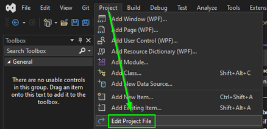

Now add the following lines after the first PropertyGroup

```xml
<PropertyGroup>
   <OutputPath>[TARGET LOCATION]\[YOUR ADDIN NAME]\</OutputPath>
   <AppendTargetFrameworkToOutputPath>false</AppendTargetFrameworkToOutputPath>
</PropertyGroup>
```

# Set Inventor as a startup program for debugging

Select **"Debug"** and then **[YOUR PROJECT]** Debug Properties" (Or do some clicking).


Delete the existing profile.

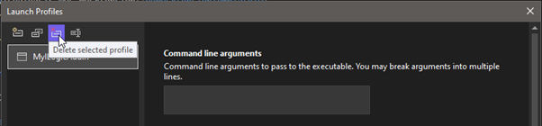

After that, you will need to add a new “Executable debug profile”.

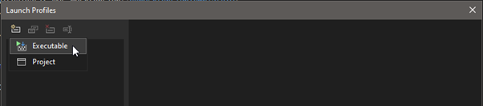

In this new profile, you can add the path to Inventor.

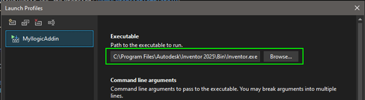

# GUID

For the next files, you will need a GUID. This is an identification string used by Inventor. Multiple sites and tools can generate it for you. I usually use this site: [https://www.guidgenerator.com/](https://www.guidgenerator.com/)

Save the string for later use.

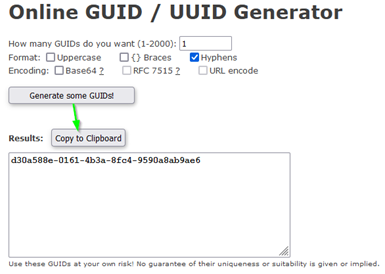

# Addin file
For an addin you minimum need 2 files. The first one is the .addin file. With that file, you tell Inventor that you want it to load an addin. The information in that file are presented in the addin screen within Inventor.

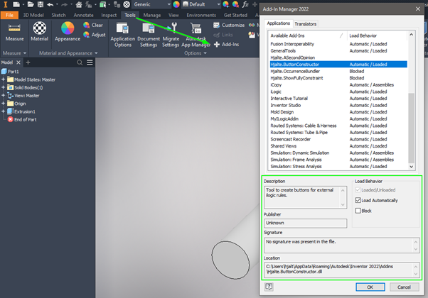

Add a new file to the project. The name is not important as long the extension is “.addin”. Usually, you give it the same name as your addin. I will use “MyILogicAddin.addin”

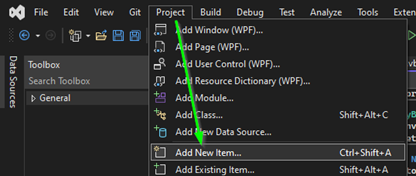

Change the file properties of the addin file. It needs to be copied to the output path when the project is compiled.

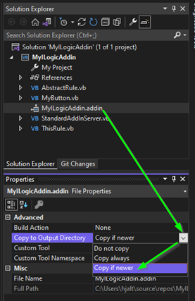

Add the following (XML) code to the file:

```xml
<Addin Type="Standard">
	<ClassId>{[GUID here]}</ClassId>
	<ClientId>{[GUID here]}</ClientId>
	<DisplayName>[Name]</DisplayName>
	<Description>[Description]</Description>
	<Assembly>[File name of the dll]</Assembly>	
	<SupportedSoftwareVersionGreaterThan>29..</SupportedSoftwareVersionGreaterThan>
</Addin>
```

 The .addin file is a XML file. XML files are simple text files often used to save settings. All settings are saved in nested tags. A tag always has the form

<[TagName] [Properties]>[TagValue]</ [TagName]>

In the XML replace the text between the square brackets (also remove the square brackets). Most tags are self-explanatory but the following tags need a bit more attention.

In the “ClassId” and “ClientId” tags you need to put the GUID that we create earlier. Make sure that you remove the square brackets but leave the curly brackets.

In the “Assembly” tag put the file name of your addin dll. (You can find the name in your Visual Studio project settings. Don’t forget to add the extension “.dll”)

Here I left out a lot of tags that are not needed. For the full list have a look here: [help.autodesk.com](https://help.autodesk.com/view/INVNTOR/2025/ENU/?guid=GUID-52422162-1784-4E8F-B495-CDB7BE9987AB)

# Create the class StandardAddInServer

The second essential file for every add-in is the DLL (Dynamic-Link Library), which contains your compiled code. This DLL must include at least one class named StandardAddInServer. This class acts as the main entry point for Inventor. When Inventor starts, it reads your .addin file, loads your DLL, and looks for the StandardAddInServer class. Once it finds it, Inventor begins calling specific methods within that class to initialize and manage your add-in.

Add a Class to your project and call it “StandardAddInServer”

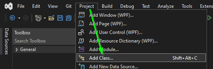

Add the following code to the file and change the GUID:

```vb
Imports System.Runtime.InteropServices
Imports Inventor

' Change the GUID here and use the same as in the addin file!
<GuidAttribute("[GUID here]"), ComVisible(True)>
Public Class StandardAddInServer
    Implements Inventor.ApplicationAddInServer

    Private _myButton As MyButton

    ''' <summary>
    '''     Invoked by Autodesk Inventor after creating the AddIn. 
    '''     AddIn should initialize within this call.
    ''' </summary>
    ''' <param name="AddInSiteObject">
    '''     Input argument that specifies the object, which provides 
    '''     access to the Autodesk Inventor Application object.
    ''' </param>
    ''' <param name="FirstTime">
    '''     The FirstTime flag, if True, indicates to the Addin that this is the 
    '''     first time it is being loaded and to take some specific action.
    ''' </param>
    Public Sub Activate(AddInSiteObject As ApplicationAddInSite, FirstTime As Boolean) Implements ApplicationAddInServer.Activate
        Try

            ' initialize the rule class
            _myButton = New MyButton(AddInSiteObject.Application)

        Catch ex As Exception

            ' Show a message if any thing goes wrong.
            MessageBox.Show(ex.Message)

        End Try
    End Sub

    ''' <summary>
    '''     Invoked by Autodesk Inventor to shut down the AddIn. 
    '''     AddIn should complete shutdown within this call.
    ''' </summary>
    Public Sub Deactivate() Implements ApplicationAddInServer.Deactivate

    End Sub

    ''' <summary>
    '''     Invoked by Autodesk Inventor in response to user requesting the execution 
    '''     of an AddIn-supplied command. AddIn must perform the command within this call.
    ''' </summary>
    Public Sub ExecuteCommand(CommandID As Integer) Implements ApplicationAddInServer.ExecuteCommand

    End Sub

    ''' <summary>
    '''     Gets the IUnknown of the object implemented inside the AddIn that supports AddIn-specific API.
    ''' </summary>
    Public ReadOnly Property Automation As Object Implements ApplicationAddInServer.Automation
        Get
            Throw New NotImplementedException()
        End Get
    End Property
End Class
```

ou see 4 functions/subs here (Activate(…), Deactivate(), ExecuteCommand(…), Automation()). We will only be using the “Activate” function. The others need to be there but don’t need to do anything.

Inside the Activate function, we initialize the button class. You’ll also notice a Try/Catch block around the code. This is important because Inventor doesn’t show any warnings if something goes wrong while loading your add-in. Without this block, errors could silently fail, making debugging difficult.
The Catch section helps you handle exceptions gracefully. In this example, we simply show a message box with basic error information. For production code, you might want to log the full exception details to a file instead. That way, when something inevitably breaks (and it will), you’ll have the information you need to track down the issue.

# Button class

The button class is responsible for creating a button in Inventor and defining what happens when it’s clicked. In this example, I’ve named the class MyButton, but you can choose any name you like. Just make sure the name you use matches the one referenced in the StandardAddInServer.Activate(...) function, so Inventor knows which class to initialize.

Create a class “MyButton” and add the following code:

```vb
Imports Inventor
Public Class MyButton
    Private _inventor As Inventor.Application
    Private _settingsButton As ButtonDefinition
    Public Sub New(inventor As Inventor.Application)
        _inventor = inventor

        SetupButtonDefinition()
        AddButtonDefinitionToRibbon()
    End Sub

    Private Sub SetupButtonDefinition()

        Dim conDefs As ControlDefinitions = _inventor.CommandManager.ControlDefinitions
        _settingsButton = conDefs.AddButtonDefinition(
            "MyButton DisplayName",
            "MyButton InternalName",
            CommandTypesEnum.kEditMaskCmdType,
            Guid.NewGuid().ToString(),
            "MyButton DescriptionText",
            "MyButton ToolTipText")
        AddHandler _settingsButton.OnExecute, AddressOf MyButton_OnExecute

    End Sub

    Private Sub AddButtonDefinitionToRibbon()

        Dim ribbon As Ribbon = _inventor.UserInterfaceManager.Ribbons.Item("Assembly")
        Dim ribbonTab As RibbonTab = ribbon.RibbonTabs.Item("id_TabManage")
        Dim ribbonPanel As RibbonPanel = ribbonTab.RibbonPanels.Item("iLogic.RibbonPanel")
        ribbonPanel.CommandControls.AddButton(_settingsButton)

    End Sub

    Private Sub MyButton_OnExecute(Context As NameValueMap)

        Try

            Dim rule As New ThisRule()
            rule.ThisApplication = _inventor
            rule.Main()

        Catch ex As Exception

            MsgBox("Something went wrong while runing rule. Message: " & ex.Message)

        End Try
    End Sub
End Class
```

When the button class is initialized, its New constructor is called automatically. Inside that constructor, we call two helper functions. You might notice these functions are very short—so short that they could have been written directly in the New function. However, breaking code into small, well-named functions makes it much easier to read and maintain, especially in larger projects. It also increases the chance you can reuse parts of the code elsewhere.

The SetupButtonDefinition function lets you configure the button’s properties, such as DisplayName, InternalName, DescriptionText, and ToolTipText. It also defines which function should be executed when the button is clicked—in this case, MyButton_OnExecute.

The AddButtonDefinitionToRibbon function determines where the button will appear in Inventor’s UI. First, we select a ribbon. I’ve chosen the “Part” ribbon, but you can also use: ZeroDoc, Assembly, Drawing, Presentation, iFeatures, or UnknownDocument. Next, you’ll need to specify the internal names of the RibbonTab and RibbonPanel. There are many options, so instead of listing them all here, you can use the following iLogic rule to print them to the iLogic log:

```vb
For Each ribbon As Ribbon In ThisApplication.UserInterfaceManager.Ribbons
    Logger.Info(vbTab & Ribbon.InternalName)
    For Each ribbonTab As RibbonTab In Ribbon.RibbonTabs
        Logger.Info(vbTab & vbTab & RibbonTab.DisplayName & " - " & RibbonTab.InternalName)
        For Each ribbonPanel As RibbonPanel In RibbonTab.RibbonPanels
            Logger.Info(vbTab & vbTab & vbTab & RibbonPanel.DisplayName & " - " & RibbonPanel.InternalName)
        Next
    Next
Next
Dim loggerWindow = ThisApplication.UserInterfaceManager.
	DockableWindows.
	Cast(Of DockableWindow).
	Where(Function(d) d.InternalName.Equals("ilogic.logwindow")).
	First()
loggerWindow.Visible = True
```

 In my case, my button is only visible in the assembly environment. The button is on the “Manage” tap in the “iLogic” panel.

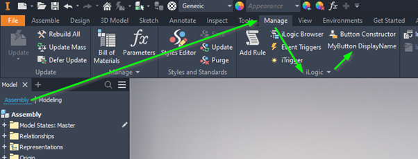

# Abstract rule class

We’re going to emulate iLogic behavior, which means we need some default iLogic-style functions available in our rule class. If you ever decide to add a second button, you probably won’t want to rewrite the same logic again. (I know I wouldn’t, repetition isn’t fun.)

To make things reusable and allow direct copying of iLogic code into the add-in, I’ve created an abstract base class. The rule class inherits from this base class, giving it access to shared functionality. For now, the base class is minimal and includes just two properties: ThisApplication and ThisDoc. In most cases, that’s enough to replicate typical iLogic behavior.

Create a class “AbstractRule” and add the following code:

```vb
Imports Autodesk.iLogic.Interfaces
Imports Autodesk.iLogic.Runtime
Imports Inventor

Public MustInherit Class AbstractRule

    Public Property ThisApplication As Inventor.Application
    Public ReadOnly Property ThisDoc As ICadDoc
        Get
            Return New CadDoc(ThisApplication.ActiveDocument)
        End Get
    End Property

End Class
```

# Rule class

This class is designed to hold the iLogic rule. In this example, you can copy and paste an iLogic rule directly from Inventor into the class. Just keep in mind that not all iLogic functions and properties are implemented yet. If your rule uses something that’s missing, you’ll need to add your own code to replicate that functionality.

Create a class “ThisRule” and add the following code:
```vb
Imports Inventor

Public Class ThisRule
    Inherits AbstractRule

    Public Sub Main()

        ' Your iLogic code goes here.

    End Sub

End Class
```

Notice line 4, this is where we tell the compiler to inherit the base class. In the more complicated rules, you will have more functions or even a whole class. Then you might need to add also code outside of the main function.

To end this tutorial with a functional/working addin we will replace the class code with the rule “[One Rule to Search Them All](http://hjalte.nl/22-one-rule-to-search-them-all)”. The class “ThisRule” will then look like this.

```vb
Imports Inventor

Public Class ThisRule
    Inherits AbstractRule

    Private searchText As String
    Private iLogicAddinGuid As String = "{3BDD8D79-2179-4B11-8A5A-257B1C0263AC}"
    Private iLogicAddin As ApplicationAddIn = Nothing
    Private iLogicAutomation = Nothing
    Private outputFile As String = "c:\TEMP\seachedRules.txt"

    Sub Main()
        If (IO.File.Exists(outputFile)) Then
            IO.File.Delete(outputFile)
        End If
        searchText = InputBox("Text to search for", "Search")

        iLogicAddin = ThisApplication.ApplicationAddIns.ItemById(
            "{3bdd8d79-2179-4b11-8a5a-257b1c0263ac}")
        iLogicAutomation = iLogicAddin.Automation
        Dim doc As AssemblyDocument = ThisDoc.Document

        searchDoc(doc)
        For Each refDoc As Document In doc.AllReferencedDocuments
            searchDoc(refDoc)
        Next

        Process.Start("notepad.exe", outputFile)
    End Sub

    Private Sub searchDoc(doc As Document)
        Dim rules = iLogicAutomation.Rules(doc)
        If (rules Is Nothing) Then Return
        For Each rule In rules
            Dim strReader As IO.StringReader = New IO.StringReader(rule.Text)
            Dim i As Integer = 1

            Do While (True)
                Dim line As String
                line = strReader.ReadLine()
                If line Is Nothing Then Exit Do
                If (line.ToUpper().Contains(searchText.ToUpper())) Then
                    Dim nl = System.Environment.NewLine
                    IO.File.AppendAllText(outputFile,
                        "Doc name : " & doc.DisplayName & nl &
                        "Rule name: " & rule.Name & nl &
                        "line " & i & "  : " & line.Trim() & nl & nl)
                End If
                i = i + 1
            Loop
        Next
    End Sub
End Class
```
Now press "Run" (or press F5)  in Visual Studio and try your addin!