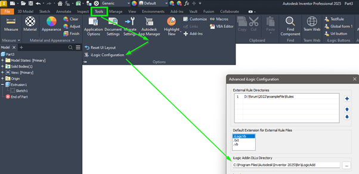

# Extending iLogic functions with a dll

## Using a DLL with iLogic

iLogic can access the full .NET Framework, which gives you a lot of power—but that power can quickly make your rules complex and hard to manage. Advanced tasks like file access, database operations often result in long, messy code inside your rule.

Debugging also becomes more difficult when everything is packed into a single iLogic rule.

To keep things clean and maintainable, it's better to move complex or reusable logic into a separate DLL (a compiled .NET class library). You can write and test this DLL in Visual Studio using a language like **VB.NET** or **C#**, then call it from your iLogic rule. This keeps your rule short, focused, and easier to understand.

Using a DLL also lets you create more advanced user interfaces than iLogic forms allow. Visual Studio gives you full control over layout, behavior, and data handling—perfect for guiding users or showing complex data clearly.

Another benefit: DLLs are reusable. You can use the same logic across multiple parts, assemblies, or even projects. When something changes, you only need to update the DLL once.

> 💡 In short: move the heavy lifting out of iLogic and into a DLL to write cleaner, smarter, and more reusable automation code.

## What Is a DLL / Class Library?

A **DLL** (Dynamic Link Library) is a compiled file that contains reusable code—such as functions, classes, or user interfaces—that can be used by other programs.

In .NET, a **Class Library** is a type of project that builds into a DLL. It doesn't run on its own but is meant to be referenced by other applications.

Key points:
- A DLL can contain logic, UI elements, and other resources
- It can be written in any .NET language (e.g. VB.NET, C#)
- It is compiled and then used by another executable or script
- Code in a DLL is organized into classes and methods

## When Should You Use an Add-In Instead of a DLL Called from iLogic?

External DLLs called by iLogic are great for organizing complex logic—but in some cases, building a full **Inventor add-in** is the better choice.

### Custom UI Integration

An add-in can create custom interface elements like new ribbon tabs, buttons, or menus that blend naturally into Inventor’s interface. This allows you to build tools that feel like a native part of the software, giving users a more seamless and professional experience.

### Responding to Events

Add-ins can listen for and react to global events—like when documents are opened, saved, or modified—anywhere in Inventor. This gives you far more control than iLogic, which only runs when a rule is manually triggered.

### Always Running in the Background

Unlike DLLs called by iLogic (which only run when a rule is executed), add-ins stay active the entire time Inventor is open. This lets them perform background tasks, monitor activity, or enforce rules in real time without user intervention.

> 💡 In short:  
> Use an **add-in** when you need continuous background logic, event handling, or deep integration with Inventor’s UI.  
> Use an **external DLL** with iLogic when you want to simplify rules without needing a full add-in structure.

## Visual Studio project

### Create a New Project

> 💡 Need help creating the project with the correct template?  
> See: [Create a Project](./CreatNewProject.md) 


### Add a Reference

Add a reference to the following file:

C:\Program Files\Autodesk\Inventor [VERSION]\Bin\Autodesk.Inventor.Interop.dll
> ⚠️ Replace `[VERSION]` with the Inventor version you are using (e.g. `2025`).

> 💡 Not sure how to add a reference?  
> See: [Add a Reference](./AddProjectReference.md)

### Set Up Automated Copy to the Correct Folder

After compiling, Visual Studio can automatically place your DLL in the folder where iLogic looks for external libraries. To do this, you need to configure the output path using a **post-build event**.

### Set Up Automated Copy to the Correct Folder

After compiling, Visual Studio can automatically place your DLL in the folder that iLogic uses to find external libraries.  
To do this, you need to configure your project to copy the file to the folder defined in the iLogic settings.



The default folder for iLogic DLLs is:  
`C:\Program Files\Autodesk\Inventor 2025\Bin\iLogicAdd\`  
(unless you've changed it)

In most cases, you won’t have permission to write to this folder. To fix this, you can either:

- Grant yourself write access to that folder  
- Change the DLL folder path in Inventor’s iLogic settings

> ⚠️ If you change the DLL folder path, you’ll need to make the same change for all users who use your iLogic rule/DLL.

To copy your DLL to the correct location, set up a **post-build event** using this command:

`xcopy "$(TargetDir)$(TargetFileName)" "[Your folder here]" /Y`

> ⚠️ Replace `[Your folder here]` with the folder path from the iLogic settings.

> 💡 Not sure how to setup the "Post-build events."?  
> See: [Set Inventor as a Startup Program for Debugging](./SetupDebugApplication.md)

**Important**  
Visual Studio will now try to copy the DLL to the target folder after each build. However, if **Inventor is running**, the DLL will be **in use** and cannot be overwritten. To avoid errors, always **close Inventor before compiling or debugging** your code.

## Create the Class "MyEntryPoint"

Now that Visual Studio is set up, we can start with the real work. First, we’ll create a **class**.

> ❓ **What is a Class?**  
> A *class* is a container for your code. It holds your functions, properties, and data.  

In this case, the class will act as the **entry point**—the place where iLogic calls into your DLL.

Add a new class to your project and name it `MyEntryPoint`.

> 💡 You may use a different name—just make sure to use the same name in your iLogic rule when calling this class.


Now replace the contents of the new file with the following code:

```vb
Imports Inventor
Public Class MyEntryPoint

    Private _inventor As Inventor.Application

    Public Sub New(inventor As Inventor.Application)
        _inventor = inventor
    End Sub

    Public Sub ShowDocumentName()
        ' Get the active document.
        Dim document = _inventor.ActiveDocument
        ' Cretae a message that we want to show
        Dim messageText = $"The name of the active document: {document.DisplayName}"
        ' Show the message
        System.Windows.MessageBox.Show(messageText)
    End Sub

    Public Function GetDocumentSubType(document As Document) As String
        'get the document sub-type
        Dim documentSubType As String = document.SubType
        Dim readableType As String = "Unknown"
        Select Case documentSubType
            Case "{4D29B490-49B2-11D0-93C3-7E0706000000}"
                readableType = "Part"
            Case "{9C464203-9BAE-11D3-8BAD-0060B0CE6BB4}"
                readableType = "Sheet metal"
            Case "{92055419-B3FA-11D3-A479-00C04F6B9531}"
                readableType = "generic proxy"
            Case "{9C464204-9BAE-11D3-8BAD-0060B0CE6BB4}"
                readableType = "Compatibility proxy"
            Case "{9C88D3AF-C3EB-11D3-B79E-0060B0F159EF}"
                readableType = "Catalog proxy"
            Case "{E60F81E1-49B3-11D0-93C3-7E0706000000}"
                readableType = "Assembly"
            Case "{BBF9FDF1-52DC-11D0-8C04-0800090BE8EC}"
                readableType = "Drawing"
            Case "{62FBB030-24C7-11D3-B78D-0060B0F159EF}"
                readableType = "Design element"
            Case "{76283A80-50DD-11D3-A7E3-00C04F79D7BC}"
                readableType = "Presentation"
        End Select
        Return readableType
    End Function
End Class
```

In this simple code example, you’ll see several important concepts. Let’s walk through it step by step:

- **Line 1**: Imports the Inventor API namespace. This makes classes like `Application` and `Document` available without needing to write the full namespace each time.
- **Line 3**: Begins the definition of the class `MyEntryPoint`. A *class* is a blueprint for creating objects—it defines their structure and behavior.
- **Lines 6–8**: Defines the *constructor*. A constructor is a special method that runs when you create a new object from a class. Here, it takes the Inventor `Application` object and stores it in the private field `_inventor` for use throughout the class.
- **Lines 10–19**: Defines a `Sub` called `ShowDocumentName()`. A *Sub* is a procedure that performs an action but does not return a value. This one doesn’t take any input parameters, though you could add them, as in the next function.
- **Line 15**: The `$` at the start of the string enables *string interpolation* in VB.NET. This allows you to insert variables directly inside the string (like `document.DisplayName`) without concatenation.
- **Lines 21–49**: Defines a `Function` called `GetDocumentSubType(document As Document)`. Unlike a `Sub`, a *Function* returns a value—in this case, a `String`. It takes a `Document` as input and returns a readable subtype name, which you can use elsewhere, such as in iLogic rules.

## Creating a rule that uses your DLL

Now, press **Run** (or press **F5**) in Visual Studio. Inventor will start automatically.

Open a test part.  
> ⚠️ If you create a new part, make sure to save it first.

Next, create a new iLogic rule and add the following code:

```vb
AddReference "Hjalte.MyILogicExtension.dll"
Imports Hjalte.MyILogicExtension

Dim myEntryPoint As New MyEntryPoint(ThisApplication)
myEntryPoint.ShowDocumentName()

Dim subType = myEntryPoint.GetDocumentSubType(ThisDoc.Document)
msgbox(subType)
```

Let’s go through the rule step by step.

First, it uses `AddReference "Hjalte.MyILogicExtension.dll"`
to load your custom DLL into the iLogic environment. This allows iLogic to recognize and use the functions from the DLL.

> ⚠️ IntelliSense will only show those functions after the rule has been run at least once.


Next, the rule uses `Imports Hjalte.MyILogicExtension` to bring the namespace from the DLL into scope. This lets you use its classes without typing the full name each time.

Then, it creates a new object called `myEntryPoint` from the class `MyEntryPoint` defined in the DLL. Here, `ThisApplication` is Inventor’s main application object. Passing it to the constructor connects your class to the current Inventor session, giving it access to documents, properties, and other API features.

After that, the rule calls `ShowDocumentName()` on the `myEntryPoint` object. This method displays a message box, as defined in the DLL. It will look something like this:


Next, the rule calls `GetDocumentSubType(ThisDoc.Document)`, passing in the current document. This function returns a string describing the document’s subtype, such as sheet metal part, assembly, or drawing. Finally, the rule displays the result in a message box using `MsgBox(subType)`, so the user can see what type of document is currently open.


Click **Save and Run** to execute the rule (if you haven’t already).  
Depending on your security settings, Inventor may show a warning. Since you wrote and understand the code yourself, it’s safe to accept and run it.

## creating a user interface

Add a window (wPF) to your project. Name it "MyPropertyEditor"


Open the form and the toolbox panel. 


Now recreate the window shown below.


The **MyPropertyEditor.xaml** should now look like this:

```xml
<Window x:Class="MyPropertyEditor"
        xmlns="http://schemas.microsoft.com/winfx/2006/xaml/presentation"
        xmlns:x="http://schemas.microsoft.com/winfx/2006/xaml"
        xmlns:d="http://schemas.microsoft.com/expression/blend/2008"
        xmlns:mc="http://schemas.openxmlformats.org/markup-compatibility/2006"
        xmlns:local="clr-namespace:Hjalte.MyILogicExtension"
        mc:Ignorable="d"
        Title="My property editor" Height="200" Width="345">
    <Grid>
        <Label Content="Project number:" HorizontalAlignment="Left" Height="18" Margin="10,10,0,0" Padding="0" VerticalAlignment="Top" Width="98"/>
        <Label Content="Description:" HorizontalAlignment="Left" Height="18" Margin="10,33,0,0" Padding="0" VerticalAlignment="Top" Width="98"/>
        <TextBox x:Name="TextBoxProjectNumber" Margin="108,10,10,0" TextWrapping="Wrap" Text="" VerticalAlignment="Top" Height="18"/>
        <TextBox x:Name="TextBoxDescription" Margin="108,33,10,35" TextWrapping="Wrap" Text=""/>
        <Button x:Name="ButtonOk" Content="Ok" HorizontalAlignment="Right" Margin="0,0,10,10" VerticalAlignment="Bottom" Width="55" Click="ButtonOk_Click"/>
        <Button x:Name="ButtonCancel" Content="Cancel" HorizontalAlignment="Right" Margin="0,0,70,10" VerticalAlignment="Bottom" Width="55" Click="ButtonCancel_Click"/>
    </Grid>
</Window>
```
> ⚠️ Notic that the textboxes did get a name. (TextBoxProjectNumber and TextBoxDescription).

Now you can add the following code to the file **MyPropertyEditor.xaml.vb**

> 💡this file is a bit hidden. It's a sub tree item of the file **MyPropertyEditor.xaml** in your **Solution explorer** 

```vb
Imports Inventor

Public Class MyPropertyEditor

    Public Sub New(document As Document)
        InitializeComponent()

        Me.Title = $"My property editor: {document.DisplayName}"

        ' if the form is closed in any other way then clicking on the "Ok" button the result should be false.
        DialogResult = False
    End Sub

    ' This public property can be used to set the TextBox (form for example an iLogic rule.)
    ' It also works the other way around. From an iLogic rule you get the content of an TextBox. 
    Public Property PartNumber() As String
        Get
            Return TextBoxProjectNumber.Text
        End Get
        Set(ByVal value As String)
            TextBoxProjectNumber.Text = value
        End Set
    End Property

    Public Property Description() As String
        Get
            Return TextBoxDescription.Text
        End Get
        Set(ByVal value As String)
            TextBoxDescription.Text = value
        End Set
    End Property

    ' This function is called when the "Ok" button is clicked. 
    ' If it's clicked the result should be set to 'True' and then the form should be closed
    Private Sub ButtonOk_Click(sender As Object, e As Windows.RoutedEventArgs)
        DialogResult = True
        Me.Close()
    End Sub

    ' This function is called when the "Ok" button is clicked. 
    ' If it's clicked the form should be closed. (The result is already set in the constructor.
    Private Sub ButtonCancel_Click(sender As Object, e As Windows.RoutedEventArgs)
        Me.Close()
    End Sub
End Class
```
> 💡Code explanation is added in the code as comment. 

When you are ready. Start Inventor by pressing "Run" (or press F5)  in Visual Studio. Inventor will start. Open the test part. Create a new iLogic rule and add the following code: 

```vb
' we add references and import our namespace. As you can see we now need
' to add more reference. These references are needed to show the form.
AddReference "PresentationFramework"
AddReference "PresentationCore"
AddReference "WindowsBase"
AddReference "Hjalte.MyILogicExtension.dll"

Imports Hjalte.MyILogicExtension

' we initialize the form “MyPropertyEditor”. (Just like the MyEntryPoint
' class we can pass an object to the constructor. In this case we pass the 
' document to the form.)
Dim editor As New MyPropertyEditor(ThisDoc.Document)
' we set 2 properties which on there turn will fill the text boxes on the form.
editor.ProjectNumber = iProperties.Value("Project", "Project")
editor.Description = iProperties.Value("Project", "Description")

' we show the form and await the result. The result is always a Boolean.
Dim result = editor.ShowDialog()
' we check the result. If the result is True then we set the iProperties.
If (result = True) Then	
	iProperties.Value("Project", "Project") = editor.ProjectNumber
	iProperties.Value("Project", "Description") = editor.Description
End If
```

Now when you run the rule you will see the form and you will be able to change the iProperties of the active document.

## Summary
In this tutorial, we learned how to extend iLogic in Autodesk Inventor by creating an external .NET DLL using Visual Studio. While iLogic can access the full .NET framework, complex logic and UI elements can quickly clutter your rules. By moving reusable or advanced functionality into a DLL, you keep your iLogic rules clean, readable, and easier to maintain.

We started by creating a WPF class library in Visual Studio using VB.NET, as that aligns best with Inventor’s API and iLogic syntax. After setting up the project to target .NET 8.0 (compatible with Inventor 2025+), we referenced the Autodesk.Inventor.Interop.dll and configured the project to automatically copy the compiled DLL to the appropriate folder for iLogic to find it.

Next, we built a simple entry point class (MyEntryPoint) that demonstrates key concepts like constructors, functions, and working with Inventor's API. We showed how to call this DLL from an iLogic rule using AddReference, and how to pass in the Inventor application object to interact with the current document.

We also introduced how to add a WPF form to the DLL to collect user input in a more advanced and user-friendly way than iLogic’s built-in forms allow. Using a form class like MyPropertyEditor, we can pass data into the form and retrieve results once the user interacts with it—making iLogic rules more dynamic and interactive.

By the end, you’ve created a working setup where your DLL acts as an extension to iLogic, making it easier to manage, reuse, and expand your Inventor automation.


