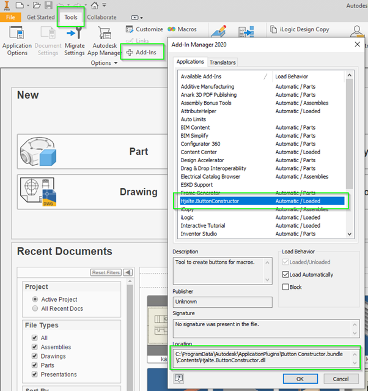
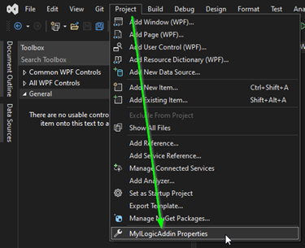
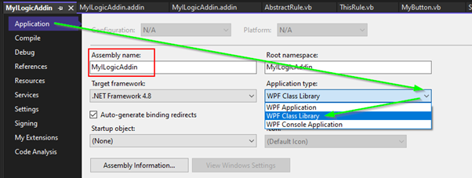
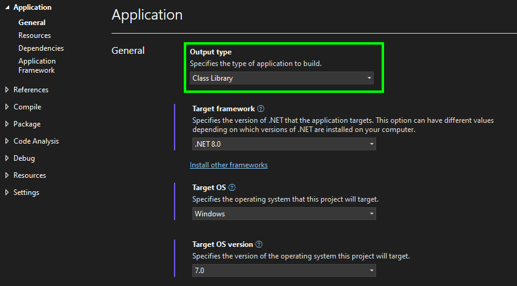
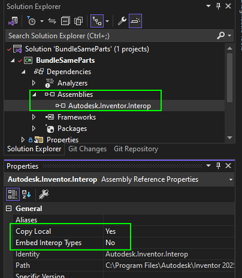
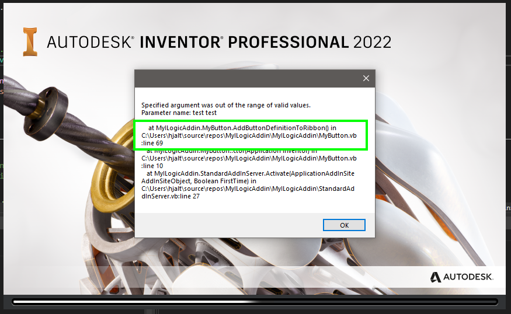

# Help: My addin won't load

Every once and a while someone comes to the forum with the same problem: "**My addin will not load.**" Figuring out what the problem is without the code is hard. But this is the checklist that I use to figure out what the problem is. 

## Addin file
### File Location
If your addin is not visible in the "Addin manager" then probably your addin file is not in the correct location. Check that it is in one of the following locations.


| Acces | version dependicy | Path | 
|---|---|---| 
| All Users | Independent | %ALLUSERSPROFILE%\Autodesk\Inventor Addins\ | 
| All Users | Dependent (< 2025) | %ALLUSERSPROFILE%\Autodesk\Inventor 20xx\Addins\  | 
| All Users | Dependent (> 2025) | %PROGRAMFILES%\Autodesk\Inventor 20xx\Bin\Addins\ **(*)** | 
| User-specific | Independent | %APPDATA%\Autodesk\ApplicationPlugins | 
| User-specific | Dependent | %APPDATA%\Autodesk\Inventor 20xx\Addins\ |

> (*) I noticed that you need local admin rights on your computer to write to this folder. If you don't have those "rights" then Visual Studio will stop the building process when you try to debug your addin!

### Check "ClassId" en "ClientId"
In the code of your addin, you have a class that implements the interface "ApplicationAddInServer". Most likely the class is called "StandardAddInServer". That class has a "GuidAttribute". It will probably look something like this:
```vb
Imports System.Runtime.InteropServices
Imports Inventor
<GuidAttribute("a7558ed7-8d2d-41bb-9295-4f3c9fe5d902"), ComVisible(True)>
Public Class StandardAddInServer
    Implements Inventor.ApplicationAddInServer
```
The string of random characters between the quotes is your GUID. Check and make sure that your GUID is exactly the same as in your .addin file between the tags ClassId and ClientId. 

### Check "Assembly"
in your *.addin file, between the tags "Assembly" you should have the file name of your addin dll. This may be a relative path from your addin file or a full path. The easiest way to check if your settings are correct is by having a look in the "Addin manager". There Inventor will show where it expects your dll file. If your addin file is not there Inventor will not be able to find your dll file.



### Check "SupportedSoftwareVersionGreaterThan"
In the addin file, it's possible to tell Inventor not to load your addin in some versions. Those versions are not the year numbers are are the numbers below:

| Inventor name | Version number |
|---|---|
| Inventor 2018 | 22 |
| Inventor 2019 | 23 |
| Inventor 2020 | 24 |
| Inventor 2021 | 25 |
| Inventor 2022 | 26 |
| Inventor 2023 | 27 |
| Inventor 2024 | 28 |
| Inventor 2025 | 29 |
| Inventor 2026 | 30 |

Check that your addin isn't excluded from loading based on the settings between the tags "SupportedSoftwareVersionGreaterThan"

## Project settings
These settings are often hard to debug. And are often a problem when you finished creating your addin and it works perfectly on your PC but won't load on other computers. Al the checks in this chapter are related to the project settings. You can find the projects settings here:



### Check the “Application type” is set to “Class Library”.

This is maybe a bit too obvious but just to be sure. Check that you are creating an assembly/dll instead of an application.

| .Net Framework 4.8 | .Net Core 8.0 | 
|---|---|
|  |  |

### Check target framework
In the same tab, you will also find the Target framework. Depending on the inventor version you need other targets.
In versions prior to Inventor 2025 you could use ".NET Framework 4.7.2" but in all prior versions, you could use ".NET Framework 4.8". 

From inventor 2025 and later you need ".Net Core 8.0"

### Check: “Embedding Interop Types” is set to False
Check the properties of the reference to the "Autodesk.Inventor.Interop.dll". If this property is set to true most likely your code will run as expected. Except for some functions and events.



[Set “Embed Interop Types” to False to avoid problems with event](https://modthemachine.typepad.com/my_weblog/2012/07/set-embed-interop-types-to-false-to-avoid-problems-with-events.html)  

### Check version: Autodesk.Inventor.Interop.dll
Check the properties of the reference to the "Autodesk.Inventor.Interop.dll". An addin is always created with one specific version of the "Autodesk.Inventor.Interop.dll". Your users might use an older version of the dll. This might lead to problems. Especially if you did set the "Specific version" to true.

## Code checks
### Add messagebox to Activate methode
In the code of your addin, you have a class that implements the interface "ApplicationAddInServer". Most likely the class is called "StandardAddInServer". That class has a method "Activate". This is the first method that is called by Inventor. For debugging reasons, you could add a message box to the first line of that method. If your addin gets loaded then you should see that messagebox while starting Inventor or when you load the addin using the "Addin manager". If you don't see the messagebox then there are problems with loading the dll. In that case, you don't have to look at your code (as long as it builds correctly.) You better check all your project settings again.

### Add Try/Catch block to Activate method.
If you have seen the messagebox then there is probably something wrong with your code. It is good practice to have an exception handler in your "Active" method. it should look something like this:

```vb
Public Sub Activate(AddInSiteObject As ApplicationAddInSite, FirstTime As Boolean) Implements ApplicationAddInServer.Activate
    Try

        ' All your activation code should be here

    Catch ex As Exception

        ' Show a message if anything goes wrong.
        MessageBox.Show($"{ex.Message}{System.Environment.NewLine}{System.Environment.NewLine} {ex.StackTrace}")

        If (ex.InnerException IsNot Nothing) Then
            MessageBox.Show($"Inner exception message: {ex.InnerException.Message}")
        End If

    End Try
End Sub
```

The message will probably tell you something about what is going wrong. And if you have added the stack trace to your message then you will also see where the exception was thrown. (All this information is not something you want to show your users but for debugging this is very useful)

 
