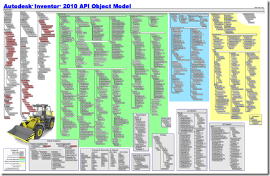
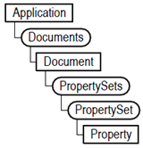
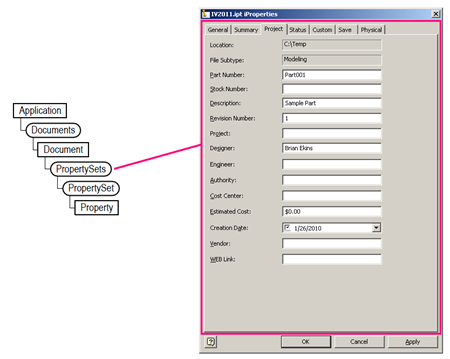
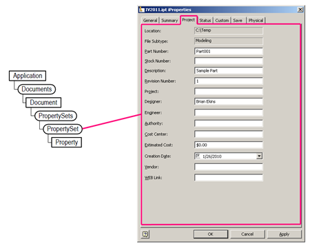
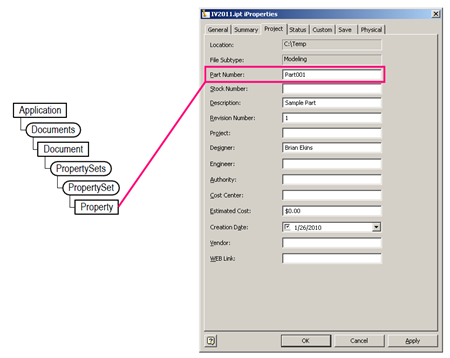

# Accessing iProperties

Probably the most used area of Inventor’s API is iProperties and because of that it generates more questions than any other single area.  I wanted to try and eliminate some of those questions by giving a brief overview of how to access iProperties that I hope will answer most questions.  Because iProperties is relatively simple it’s also a very good introduction to Inventor’s API.  In the example below we’ll look at what it takes to edit the value of the Part Number property.

## iProperty Object Model
When working with Inventor’s API you need to be aware of the Object Model.  The object model describes the relationship between the various API objects and is used to understand how to gain access to a particular object.  Inventor’s entire object model is quite large and can be a bit overwhelming, which can be seen below.  (Click the picture to access the pdf file of the entire chart.)



However, when programming with Inventor you don’t need to understand the entire object model, but just the portion of the model that you’re currently using.  When working with iProperties you’ll be using a maximum of only six different objects.  A simplified version of the object model for these six objects is shown below.



The Application object is the top-level object and represents Inventor.  From it you can get the Documents object which provides the ability to access any open documents and also to open documents and create new documents.  The Document object represents any of the various Inventor documents, i.e. part, assembly, drawing, etc.  From the object model chart we learn that the PropertySets object is accessed from a document.  This implies that properties are owned by a document and each document has its own unique set.

## Accessing a Document
There are several ways to access a specific document but for this example I’ll keep it simple by accessing the document that’s currently open for edit.  This is also the most common way of accessing a document.  You do this by using the ActiveDocument property of the Application object.  Looking at the object model chart above, using this property takes you from the Application object and jumps directly to the Document object, bypassing the Documents object.  The code for this is shown below.

```vb
' Get the active document.
Dim doc As Document = ThisApplication.ActiveDocument
```

## Accessing iProperties
From each document you can access its associated iProperties.  iProperties are organized in groups and the API provides access to these groups.  The first iProperty related object is the PropertySets object.  You can think of the PropertySets object as the equivalent to the iProperties dialog.  It’s the top level that provides access to all iProperty information.



The code below shows how to get the PropertySets object.

```vb
' Get the active document.
Dim doc As Document = ThisApplication.ActiveDocument

' Get the PropertySets object.
Dim propSets As PropertySets = doc.PropertySets
```

The next object in the object model is the PropertySet object.  You can think of this object as being equivalent to a tab in the iProperties dialog.  



There’s a little more to worry about when accessing the PropertySet object because you have to specify which of the existing PropertySet objects you want.  There are a few different ways to do this but I would recommend using the name of the PropertySet.  This makes your code easier to read later.  The names of the standard property sets are:

 - Inventor Document Summary Information
 - Inventor Summary Information
 - Design Tracking Properties
 - Inventor User Defined Properties

For this sample I want to get the value of the Part Number property.  This is in the “Design Tracking Properties” property set (as determined by looking at the chart at the end of this post).  The code below illustrates getting this property set by name.

```vb
' Get the active document.
Dim doc As Document = ThisApplication.ActiveDocument

' Get the PropertySets object.
Dim propSets As PropertySets = doc.PropertySets

' Get the design tracking property set.
Dim propSet As PropertySet = propSets.Item("Design Tracking Properties")
```

The next object is the Property object.  This represents a specific property, as illustrated below.



Properties are also identified by name.  The code below demonstrates accessing the part number property.

```vb
' Get the active document.
Dim doc As Document = ThisApplication.ActiveDocument

' Get the PropertySets object.
Dim propSets As PropertySets = doc.PropertySets

' Get the design tracking property set.
Dim propSet As PropertySet = propSets.Item("Design Tracking Properties")

' Get the part number iProperty.
Dim partNumiProp As Property = propSet.Item("Part Number")
```

Once you have a Property object you can use its Value property to get its current value and to also set the value is you want to change the iProperty.  The code below displays the part number of the active document in a message box.

```vb
' Get the active document.
Dim doc As Document = ThisApplication.ActiveDocument

' Get the PropertySets object.
Dim propSets As PropertySets = doc.PropertySets

' Get the design tracking property set.
Dim propSet As PropertySet = propSets.Item("Design Tracking Properties")

' Get the part number iProperty.
Dim partNumiProp As Property = propSet.Item("Part Number")

' Display the value.
MsgBox("The part number is: " & partNumiProp.Value)
```

This code changes the value of the part number property.

```vb
' Get the active document.
Dim doc As Document = ThisApplication.ActiveDocument

' Get the PropertySets object.
Dim propSets As PropertySets = doc.PropertySets

' Get the design tracking property set.
Dim propSet As PropertySet = propSets.Item("Design Tracking Properties")

' Get the part number iProperty.
Dim partNumiProp As Property = propSet.Item("Part Number")

' Set the part number.
partNumiProp.Value = "SamplePart001"
```

Accessing an iProperty is simply of a matter of navigating down the object model to get to a specific Property object.  The tricky parts is knowing which property set the property you want is located in, and knowing the name of that property set and the name of the property.  The table below lists all of the standard property sets and the names of the properties they contain.  This should provide all you need to access existing properties.  In addition to the names, the chart also lists the type of each property.  This is important when setting the value of a property so you know what type is expected.

### Inventor Summary Information
|Property Name|Type|
|---|---|
|Title|String|
|Subject|String|
|Author|String|
|Keywords|String|
|Comments|String|
|Last Saved By|String|
|Revision Number|String|
|Thumbnail|IPictureDisp|

### Inventor Document Summary Information
|Property Name|Type|
|---|---|
|Category|String|
|Manager|String|
|Company|String|
### Design Tracking Properties
|Property Name|Type|
|---|---|
|Creation Time|DateTime|
|Part Number|String|
|Project|String|
|Cost Center|String|
|Checked By|String|
|Date Checked|DateTime|
|Engr Approved By|String|
|Engr Date Approved|DateTime|
|User Status|String|
|Material|String|
|Part Property Revision Id|String|
|Catalog Web Link|String|
|Part Icon|IPictureDisp|
|Description|String|
|Vendor|String|
|Document SubType|String|
|Document SubType Name|String|
|Proxy Refresh Date|DateTime|
|Mfg Approved By|String|
|Mfg Date Approved|DateTime|
|Cost|Decimal|
|Standard|String|
|Design Status|Int32|
|Designer|String|
|Engineer|String|
|Authority|String|
|Parameterized Template|Boolean|
|Template Row|String|
|External Property Revision Id|String|
|Standard Revision|String|
|Manufacturer|String|
|Standards Organization|String|
|Language|String|
|Defer Updates|Boolean|
|Size Designation|String|
|Categories|String|
|Stock Number|String|
|Weld Material|String|
|Mass|Double|
|SurfaceArea|Double|
|Volume|Double|
|Density|Double|
|Valid MassProps|Int32|
|Flat Pattern Width|Double|
|Flat Pattern Length|Double|
|Flat Pattern Area|Double|
|Sheet Metal Rule|String|
|Last Updated With|String|
|Sheet Metal Width|String|
|Sheet Metal Length|String|
|Sheet Metal Area|String|
|Material Identifier|String|
|Appearance|String|
|Flat Pattern Defer Update|Boolean|
|Revit Category|Int32|
### Inventor User Defined Properties
