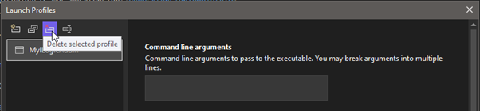
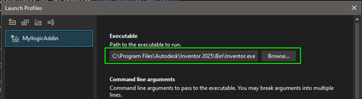

# Set Inventor as a Startup Program for Debugging

Setting up Inventor for debugging usually consists of two parts:

- Creating one or more **debug profiles**
- Setting up **post-build events**

Post-build events are often needed to copy the compiled files (DLLs or others) to the correct location, such as Inventor’s add-in folder.

In most cases, this can be done with a [**Basic Setup**](#basic-setup).  
But if you need more control (e.g. testing against multiple Inventor versions), see the [**Advanced Setup**](#advanced-setup).

## Basic setup

### Creating a Debug Profile

In Visual Studio, go to the **Debug** menu and select **"[Your Project] Debug Properties"**.

Usually, you only need **one** profile. You can delete any existing ones.

Next, add a new **Executable Debug Profile**:

In the new profile, set the path to the Inventor executable:

`C:\Program Files\Autodesk\Inventor [VERSION]]\Bin\Inventor.exe`

> 💡 Replace `[VERSION]` with your actual Inventor version.  
> For example: `C:\Program Files\Autodesk\Inventor 2025\Bin\Inventor.exe`

### Setup post-build events

This section shows **how** to configure post-build events in Visual Studio—but **not** what commands to use.  
What you need to do depends on the tutorial you're following. Each tutorial will tell you exactly which post-build steps are needed.

To add post-build events:

1. Open **Project Properties**

2. Scroll down to the **Post-build event** section

3. Add your batch/script commands to run after compilation (e.g. copy DLLs)

## Advanced setup
 
 **Work in progress**

### creating a debug profile
### Setup post-build events